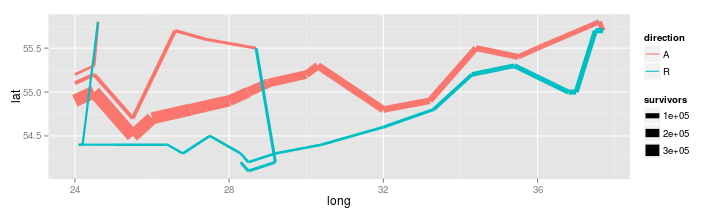

 
Đây là 1 phần sơ đồ hành quân của Napoleon tới Mạc Tư Khoa vào năm 1812 của [Minard](http://en.wikipedia.org/wiki/Charles_Joseph_Minard).
 
Sơ đồ được vẽ bằng R như sau:
 


libs <- c("ggplot2", "HistData", "scales")
lapply(libs, require, character.only = TRUE)



## Loading required package: ggplot2
## Loading required package: HistData
## Loading required package: scales



## [[1]]
## [1] TRUE
## 
## [[2]]
## [1] TRUE
## 
## [[3]]
## [1] TRUE



(plot_troops <- ggplot(Minard.troops, aes(long, lat)) +
  geom_path(aes(size = survivors, color = direction,
                group = group)))


 


(plot_both <- plot_troops +
  geom_text(aes(label = city), size = 4, data = Minard.cities))


 


(plot_polished <- plot_both +
  scale_size(range = c(1, 10),
             breaks = c(1, 2, 3) * 10^5,
             labels = comma(c(1, 2, 3) * 10^5)) +
  scale_color_manual(values = c("grey50","red")) +
  xlab(NULL) +
  ylab(NULL))


 
  
Xem bản đồ đầy đủ trên [Wikipedia](http://en.wikipedia.org/wiki/File:Minard.png).
