 
## 1. Mô tả vấn đề và Mục tiêu cần đạt
 
Sự tập trung cao độ của một số loài tảo độc trên các dòng sông là một vấn đề sinh thái học nghiêm trọng, không chỉ ảnh hưởng tới các thực thể sống trên sông mà còn ảnh hưởng tới chất lượng nguồn nước. Vì vậy tính chủ động trong việc theo dõi và thực hiện những dự báo sớm về sự phát triển của tảo là rất cần thiết trong việc nâng cao chất lượng các dòng sông.
 
Để làm được điều này, các mẫu nước khác nhau đã được thu thập trên các dòng sông khác nhau ở châu Âu vào các thời điểm khác nhau trong khoảng thời gian xấp xỉ 1 năm. Với mỗi mẫu nước, người ta đo lường các thuộc tính hóa học khác nhau cũng như tần suất xuất hiện của 7 loại tảo độc. Một số thuộc tính khác của quá trình thu thập cũng đồng thời được ghi chép, chẳng hạn như mùa trong năm, kích thước dòng sông và tốc độ dòng chảy.
 
Lý do chính của việc lấy mẫu này dựa trên thực tế rằng các xét nghiệm hóa học thường có giá thành rẻ và dễ dàng tự động hóa, trong khi các phân tích sinh học để xác định loài tảo nào có mặt trong nước liên quan tới các xét nghiệm vi sinh, yêu cầu nhân lực chất lượng cao và do đó đòi hỏi chi phí và thời gian nhiều hơn. Do vậy, việc lập các mô hình có khả năng dự báo chính xác tần suất xuất hiện của các loài tảo dựa trên các thuộc tính hóa học sẽ đơn giản hóa việc tạo ra các hệ thống rẻ và tự động trong việc theo dõi sự sinh trưởng của các loài tảo độc.
 
Một mục đích khác của nghiên cứu này là để cung cấp hiểu biết rõ ràng hơn về các yếu tố tác động tới tần suất xuất hiện của tảo. Nói cách khác, chúng tôi muốn hiểu được những tần suất này liên quan như thế nào tới các thuộc tính hóa học của các mẫu nước cũng như với các thuộc tính khác của mẫu như mùa trong năm, loại sông,...
 
## 2. Mô tả dữ liệu
 
Dữ liệu có sẵn cho nghiên cúu này được thu thập trên mạng nghiên cứu [ERUDIT](http://www.erudit.org/) và đã được sử dụng cho cuộc thi quốc tế về phân tích dữ liệu COIL năm 1999. Dữ liệu này có sẵn ở một vài nguồn, chẳng hạn như dữ liệu của [UCI](http://archive.ics.uci.edu/ml/).
 
Có 2 bộ dữ liệu chính trong nghiên cứu này. Bộ đầu tiên bao gồm dữ liệu của 200 mẫu nước. Chính xác hơn, mỗi quan sát trong các bộ dữ liệu thực tế là tập hợp của một số mẫu nước được thu thập từ cùng 1 dòng sông trong khoảng thời gian 3 tháng, trong cùng một mùa trong năm.
 
Mỗi quan sát chứa thông tin về 11 biến số. 3 trong số đó là biến danh nghĩa, mô tả mùa trong năm, kích cỡ và tốc độ dòng chảy của dòng sông. 8 biến còn lại là các giá trị của các tham số hóa học khác nhau đo lường được trong các mẫu nước, gồm:
 
- Giá trị pH lớn nhất
- Giá trị O2 nhỏ nhất
- Giá trị Cl trung bình
- Giá trị trung bình của NO3-
- Giá trị trung bình của NH4+
- Giá trị trung bình của PO43-
- Giá trị trung bình của PO4
- Giá trị trung bình của chlorophyll
 
Đi kèm với mỗi tham số trên là tần số của 7 loài tảo độc khác nhau tìm thấy tương ứng trong mỗi mẫu nước. Không có thông tin nào về tên của loại tảo được tìm thấy.
 
Bố dữ liệu thứ hai chứa thông tin về 140 quan sát bổ sung. Nó có cấu trúc tương tự bộ dữ liệu thứ nhất, tuy nhiên không bao gồm thông tin về tần suất xuất hiện của 7 loại tảo độc. Những quan sát bổ sung này có thể xem như một bộ kiểm thử. Mục tiêu chính của nghiên cứu này là dự đoán tần suất của 7 loại tảo cho 140 mẫu nước. Điều này có nghĩa chúng ta đang phải giải quyết một nhiệm vụ dự báo trong khai thác dữ liệu (Data Mining).
 
## 3. Nạp dữ liệu vào R
 
Có 2 cách để nạp dữ liệu cho nghiên cứu này: sử dụng thư viện `DMwR` hoặc tệp dữ liệu `Analysis.txt`.
 


# Sử dụng thư viện có sẵn
library(DMwR)



## Loading required package: lattice
## Loading required package: grid



head(algae)



##   season  size  speed mxPH mnO2     Cl    NO3     NH4    oPO4     PO4 Chla
## 1 winter small medium 8.00  9.8 60.800  6.238 578.000 105.000 170.000 50.0
## 2 spring small medium 8.35  8.0 57.750  1.288 370.000 428.750 558.750  1.3
## 3 autumn small medium 8.10 11.4 40.020  5.330 346.667 125.667 187.057 15.6
## 4 spring small medium 8.07  4.8 77.364  2.302  98.182  61.182 138.700  1.4
## 5 autumn small medium 8.06  9.0 55.350 10.416 233.700  58.222  97.580 10.5
## 6 winter small   high 8.25 13.1 65.750  9.248 430.000  18.250  56.667 28.4
##     a1   a2   a3  a4   a5   a6  a7
## 1  0.0  0.0  0.0 0.0 34.2  8.3 0.0
## 2  1.4  7.6  4.8 1.9  6.7  0.0 2.1
## 3  3.3 53.6  1.9 0.0  0.0  0.0 9.7
## 4  3.1 41.0 18.9 0.0  1.4  0.0 1.4
## 5  9.2  2.9  7.5 0.0  7.5  4.1 1.0
## 6 15.1 14.6  1.4 0.0 22.5 12.6 2.9

 


# Nạp dữ liệu từ tệp Analysis.txt
algae <- read.table('Analysis.txt',
          header=F,
          dec='.',
          col.names=c('season','size','speed','mxPH','mnO2','Cl',
          'NO3','NH4','oPO4','PO4','Chla','a1','a2','a3','a4',
          'a5','a6','a7'),
          na.strings=c('XXXXXXX'))

 
## 4. Tổng hợp và phác họa dữ liệu
 


# Sử dụng thư viện graphics
summary(algae)



##     season       size       speed         mxPH            mnO2       
##  autumn:40   large :45   high  :84   Min.   :5.600   Min.   : 1.500  
##  spring:53   medium:84   low   :33   1st Qu.:7.700   1st Qu.: 7.725  
##  summer:45   small :71   medium:83   Median :8.060   Median : 9.800  
##  winter:62                           Mean   :8.012   Mean   : 9.118  
##                                      3rd Qu.:8.400   3rd Qu.:10.800  
##                                      Max.   :9.700   Max.   :13.400  
##                                      NA's   :1       NA's   :2       
##        Cl               NO3              NH4                oPO4       
##  Min.   :  0.222   Min.   : 0.050   Min.   :    5.00   Min.   :  1.00  
##  1st Qu.: 10.981   1st Qu.: 1.296   1st Qu.:   38.33   1st Qu.: 15.70  
##  Median : 32.730   Median : 2.675   Median :  103.17   Median : 40.15  
##  Mean   : 43.636   Mean   : 3.282   Mean   :  501.30   Mean   : 73.59  
##  3rd Qu.: 57.824   3rd Qu.: 4.446   3rd Qu.:  226.95   3rd Qu.: 99.33  
##  Max.   :391.500   Max.   :45.650   Max.   :24064.00   Max.   :564.60  
##  NA's   :10        NA's   :2        NA's   :2          NA's   :2       
##       PO4              Chla               a1              a2        
##  Min.   :  1.00   Min.   :  0.200   Min.   : 0.00   Min.   : 0.000  
##  1st Qu.: 41.38   1st Qu.:  2.000   1st Qu.: 1.50   1st Qu.: 0.000  
##  Median :103.29   Median :  5.475   Median : 6.95   Median : 3.000  
##  Mean   :137.88   Mean   : 13.971   Mean   :16.92   Mean   : 7.458  
##  3rd Qu.:213.75   3rd Qu.: 18.308   3rd Qu.:24.80   3rd Qu.:11.375  
##  Max.   :771.60   Max.   :110.456   Max.   :89.80   Max.   :72.600  
##  NA's   :2        NA's   :12                                        
##        a3               a4               a5               a6        
##  Min.   : 0.000   Min.   : 0.000   Min.   : 0.000   Min.   : 0.000  
##  1st Qu.: 0.000   1st Qu.: 0.000   1st Qu.: 0.000   1st Qu.: 0.000  
##  Median : 1.550   Median : 0.000   Median : 1.900   Median : 0.000  
##  Mean   : 4.309   Mean   : 1.992   Mean   : 5.064   Mean   : 5.964  
##  3rd Qu.: 4.925   3rd Qu.: 2.400   3rd Qu.: 7.500   3rd Qu.: 6.925  
##  Max.   :42.800   Max.   :44.600   Max.   :44.400   Max.   :77.600  
##                                                                     
##        a7        
##  Min.   : 0.000  
##  1st Qu.: 0.000  
##  Median : 1.000  
##  Mean   : 2.495  
##  3rd Qu.: 2.400  
##  Max.   :31.600  
## 



hist(algae$mxPH, prob=T)


 


# Sử dụng thư viện ggvis
# Tương tác
library(ggvis)



## The ggvis API is currently rapidly evolving. We strongly recommend that you do not rely on this for production, but feel free to explore. If you encounter a clear bug, please file a minimal reproducible example at https://github.com/rstudio/ggvis/issues. For questions and other discussion, please use https://groups.google.com/group/ggvis.



algae %>%
  ggvis(~mxPH) %>%
  layer_histograms(width=input_slider(0.1,2,1))



## The `format` argument to sliderInput is deprecated. Use `sep`, `pre`, and `post` instead. (Last used in version 0.10.2.2)
## The `locale` argument to sliderInput is deprecated. Use `sep`, `pre`, and `post` instead. (Last used in version 0.10.2.2)



## Warning: Can't output dynamic/interactive ggvis plots in a knitr document.
## Generating a static (non-dynamic, non-interactive) version of the plot.


<!--html_preserve-->

<nav class="ggvis-control">

<ul class="ggvis-dropdown">
<li>
Renderer: 
<a id="plot_id831999863_renderer_svg" class="ggvis-renderer-button" onclick="return false;" data-plot-id="plot_id831999863" data-renderer="svg">SVG</a>
 | 
<a id="plot_id831999863_renderer_canvas" class="ggvis-renderer-button" onclick="return false;" data-plot-id="plot_id831999863" data-renderer="canvas">Canvas</a>
</li>
<li>
<a id="plot_id831999863_download" class="ggvis-download" data-plot-id="plot_id831999863">Download</a>
</li>
</ul>
</nav>

<!--/html_preserve-->


# Không tương tác
algae %>%
  ggvis(~mxPH) %>%
  layer_densities(density_args = list(na.rm = T))


<!--html_preserve-->

<nav class="ggvis-control">

<ul class="ggvis-dropdown">
<li>
Renderer: 
<a id="plot_id646194082_renderer_svg" class="ggvis-renderer-button" onclick="return false;" data-plot-id="plot_id646194082" data-renderer="svg">SVG</a>
 | 
<a id="plot_id646194082_renderer_canvas" class="ggvis-renderer-button" onclick="return false;" data-plot-id="plot_id646194082" data-renderer="canvas">Canvas</a>
</li>
<li>
<a id="plot_id646194082_download" class="ggvis-download" data-plot-id="plot_id646194082">Download</a>
</li>
</ul>
</nav>

<!--/html_preserve-->


# Sử dụng qqplot của thư viện car
library(car)
par(mfrow=c(1,2))
hist(algae$mxPH, prob=T, xlab='',
      main='Histogram of maximum pH value',ylim=0:1)
lines(density(algae$mxPH,na.rm=T))
rug(jitter(algae$mxPH))
qqPlot(algae$mxPH,main='Normal QQ plot of maximum pH')


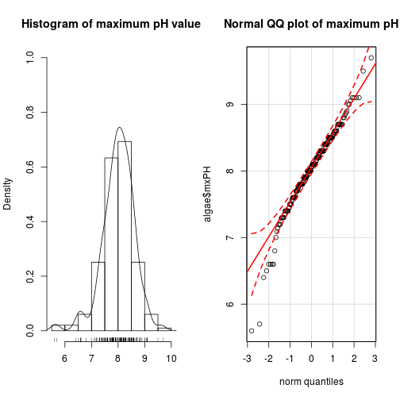 


par(mfrow=c(1,1))
 
# Sử dụng thư viện ggplot2
library(ggplot2)



## Use suppressPackageStartupMessages to eliminate package startup messages.
## 
## Attaching package: 'ggplot2'
## 
## The following object is masked from 'package:ggvis':
## 
##     resolution



library(gridExtra)
plot1 <- ggplot(algae, aes(mxPH)) + 
  geom_histogram(binwidth=0.5, aes(y=..density..), fill="white", color="black") + 
  geom_density(alpha=0.2) + 
  geom_rug()
plot2 <- ggplot(algae, aes(sample = mxPH)) + stat_qq()
grid.arrange(plot1, plot2, ncol=2)



## Warning: Removed 1 rows containing non-finite values (stat_density).



## Warning: Removed 1 rows containing missing values (stat_qq).


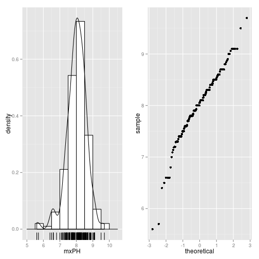 
 


# Sử dụng thư viện graphics
boxplot(algae$oPO4,ylab='Orthophosphate (oPO4)')
rug(jitter(algae$oPO4),side=2)
abline(h=mean(algae$oPO4,na.rm=T),lty=2)


 


# Sử dụng thư viện ggplot2
ggplot(algae, aes(x = factor(0), y = oPO4)) + 
  geom_boxplot(varwidth=T) + xlab("") + 
  geom_rug() + 
  geom_abline(intercept=mean(algae$oPO4,na.rm=T), linetype=2)



## Warning: Removed 2 rows containing non-finite values (stat_boxplot).


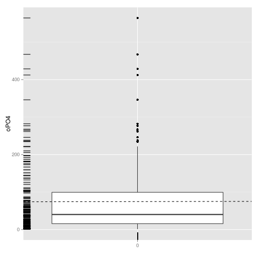 
 


# Sử dụng thư viện graphic
plot(algae$NH4,xlab='')
abline(h=mean(algae$NH4,na.rm=T),lty=1)
abline(h=mean(algae$NH4,na.rm=T)+sd(algae$NH4,na.rm=T),lty=2)
abline(h=median(algae$NH4,na.rm=T),lty=3)
identify(algae$NH4)


 


## integer(0)



plot(algae$NH4,xlab='')
clicked.lines <- identify(algae$NH4)


 


algae[clicked.lines,]



##  [1] season size   speed  mxPH   mnO2   Cl     NO3    NH4    oPO4   PO4   
## [11] Chla   a1     a2     a3     a4     a5     a6     a7    
## <0 rows> (or 0-length row.names)



algae[algae$NH4 > 19000,]



##      season   size speed mxPH mnO2     Cl   NO3   NH4 oPO4 PO4 Chla  a1 a2
## NA     <NA>   <NA>  <NA>   NA   NA     NA    NA    NA   NA  NA   NA  NA NA
## 153  autumn medium  high  7.3 11.8 44.205 45.65 24064   44  34 53.1 2.2  0
## NA.1   <NA>   <NA>  <NA>   NA   NA     NA    NA    NA   NA  NA   NA  NA NA
##      a3  a4  a5   a6 a7
## NA   NA  NA  NA   NA NA
## 153   0 1.2 5.9 77.6  0
## NA.1 NA  NA  NA   NA NA



# Sử dụng thư viện ggplot2
ggplot(algae, aes(y=NH4,x=seq_along(NH4))) + geom_point()



## Warning: Removed 2 rows containing missing values (geom_point).


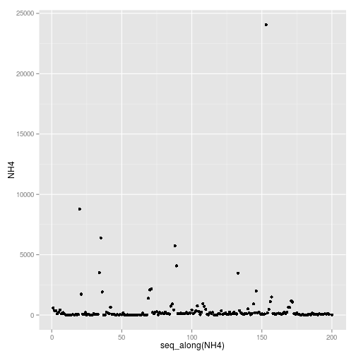 


# Sử dụng thư viện ggvis
all_values <- function(x) {
  if(is.null(x)) return(NULL)
  paste0(names(x), ": ", format(x), collapse = " ")
}
algae %>%
  ggvis(x=~seq_along(NH4), y = ~NH4) %>%
  layer_points() %>%
  add_tooltip(all_values, "hover")



## Warning: Can't output dynamic/interactive ggvis plots in a knitr document.
## Generating a static (non-dynamic, non-interactive) version of the plot.


<!--html_preserve-->

<nav class="ggvis-control">

<ul class="ggvis-dropdown">
<li>
Renderer: 
<a id="plot_id326805403_renderer_svg" class="ggvis-renderer-button" onclick="return false;" data-plot-id="plot_id326805403" data-renderer="svg">SVG</a>
 | 
<a id="plot_id326805403_renderer_canvas" class="ggvis-renderer-button" onclick="return false;" data-plot-id="plot_id326805403" data-renderer="canvas">Canvas</a>
</li>
<li>
<a id="plot_id326805403_download" class="ggvis-download" data-plot-id="plot_id326805403">Download</a>
</li>
</ul>
</nav>

<!--/html_preserve-->
 


# Sử dụng thư viện lattice
library(lattice)
print(bwplot(size ~ a1, data=algae,ylab='River Size',xlab='Algal A1'))


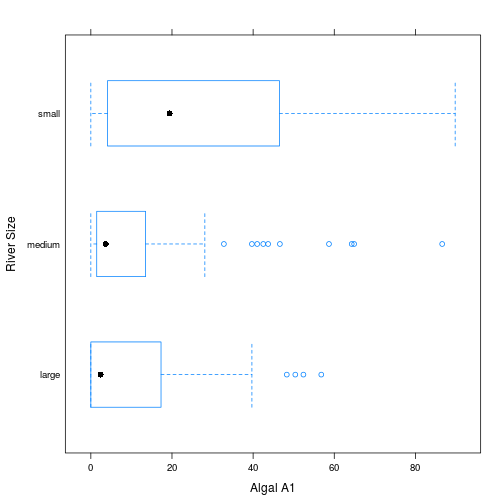 


# Sử dụng ggplot2
ggplot(algae) + 
  geom_boxplot(aes(y = a1, x = size)) + 
  ylab("Algal A1") + xlab("River Size") +
  coord_flip()


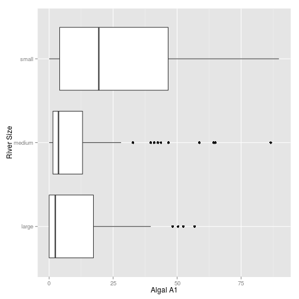 


# Sử dụng Hmisc
library(Hmisc)



## Loading required package: survival
## Loading required package: splines
## Loading required package: Formula
## 
## Attaching package: 'Hmisc'
## 
## The following objects are masked from 'package:base':
## 
##     format.pval, round.POSIXt, trunc.POSIXt, units



print(bwplot(size ~ a1, data=algae, panel=panel.bpplot, 
        probs=seq(.01,.49,by=.01), datadensity=TRUE,
        ylab='River Size',xlab='Algal A1'))


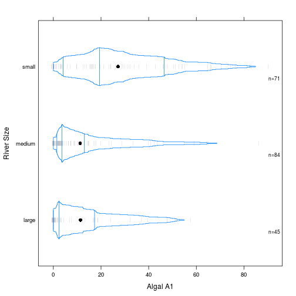 


# Sử dụng ggplot2
ggplot(algae) +
  geom_violin(aes(y = a1, x = size)) + 
  ylab("Algal A1") + xlab("River Size") +
  coord_flip()


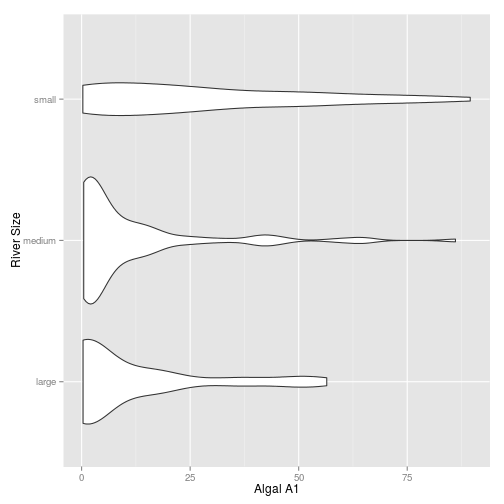 


# Sử dụng lattice
minO2 <- equal.count(na.omit(algae$mnO2),
                     number=4,overlap=1/5)
stripplot(season ~ a3|minO2,
          data=algae[!is.na(algae$mnO2),])


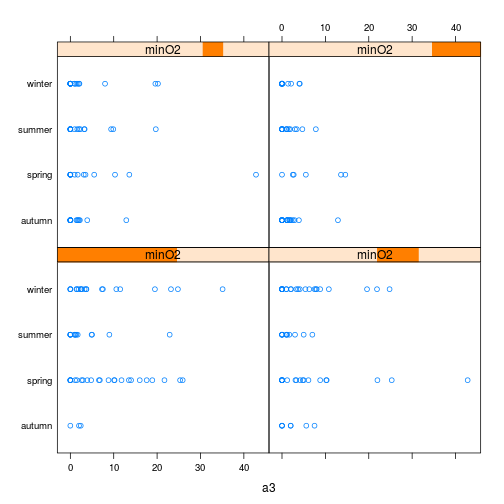 


# Sử dụng ggplot2
qplot(a3, mnO2, data=algae) + facet_grid(season ~ .)



## Warning: Removed 1 rows containing missing values (geom_point).



## Warning: Removed 1 rows containing missing values (geom_point).


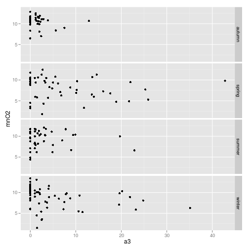 
 
## 5. Giá trị không xác định
 
Khi gặp các bộ dữ liệu có chứa các giá trị không xác định chúng ta có thể giải quyết theo một trong các hướng sau:
 
- Loại bỏ các trường hợp có chứa các giá trị chưa biết
- Tính các giá trị chưa biết bằng cách tìm mối tương quan giữa các biến
- Tính các giá trị chưa biết bằng cách tìm sự tương tự giữa các biến
- Sử dụng công cụ có khả năng xử lý được các giá trị này
 
### Loại bỏ các trường hợp chứa các giá trị không xác định
 


library(DMwR)
data(algae)
 
algae[!complete.cases(algae),]
 
 
nrow(algae[!complete.cases(algae),])
 
 
algae <- na.omit(algae)
 
 
algae <- algae[-c(62,199),]
 
 
apply(algae,1,function(x) sum(is.na(x)))
 
 
data(algae)
manyNAs(algae,0.2)
 
 
algae <- algae[-manyNAs(algae),]

 
### Thay các giá trị chưa biết bằng trung bình, trung vị, hoặc mốt
 


# Trung bình
algae[48,'mxPH'] <- mean(algae$mxPH,na.rm=T)
 
# Trung vị
algae[is.na(algae$Chla),'Chla'] <- median(algae$Chla,na.rm=T)
 
# Trung vị & mốt
data(algae)
algae <- algae[-manyNAs(algae),]
algae <- centralImputation(algae)

 
### Thay các giá trị chưa biết bằng tìm mối tương quan
 


# Tìm hệ số tương quan
cor(algae[,4:18],use="complete.obs")
 
# Ma trận tương quan
symnum(cor(algae[,4:18],use="complete.obs"))
 
# Xét riêng PO4 và oPO4
data(algae)
algae <- algae[-manyNAs(algae),]
lm(PO4 ~ oPO4,data=algae)
 
# Thay thế
algae[28,'PO4'] <- 42.897 + 1.293 * algae[28,'oPO4']
 
# Thay thế đồng loạt
data(algae)
algae <- algae[-manyNAs(algae),]
fillPO4 <- function(oP) {
   if (is.na(oP)) return(NA)
   else return(42.897 + 1.293 * oP)
}
algae[is.na(algae$PO4),'PO4'] <- 
    sapply(algae[is.na(algae$PO4),'oPO4'],fillPO4)

 
Tìm mối tương quan giữa các biến chứa các đại lượng chưa biến và các biến danh nghĩa
 


# Sử dụng lattice
histogram(~ mxPH | season,data=algae)


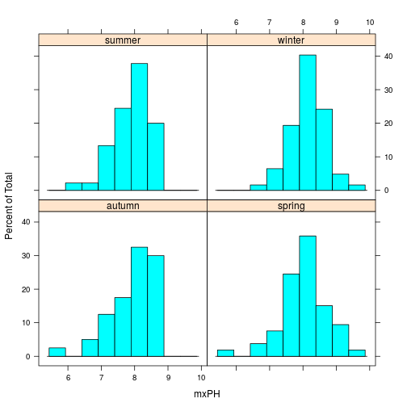 


# ggplto2
ggplot(algae) +
  geom_histogram(aes(x=mxPH, y=..density..), binwidth=0.4, color="white") +
  facet_grid(. ~ season)


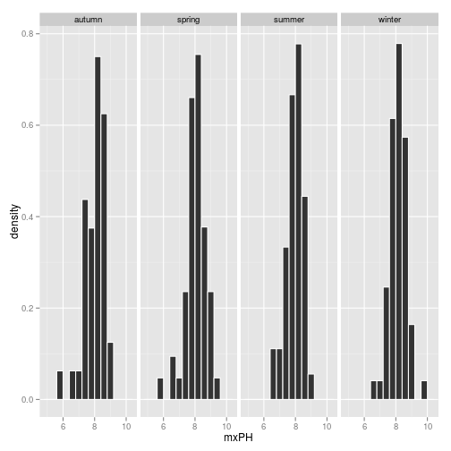 
 


# Chuyển sang lớp factor
algae$season <- factor(algae$season,levels=c('spring','summer','autumn','winter'))

 


# lattice
histogram(~ mxPH | size*speed,data=algae)


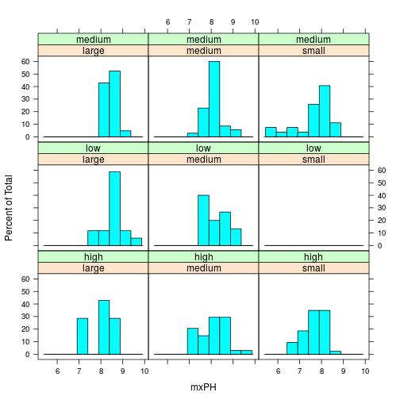 


# ggplot2
ggplot(algae) +
  geom_histogram(aes(x=mxPH, y=..density..), binwidth=0.4, color="white") +
  facet_grid(size ~ speed)


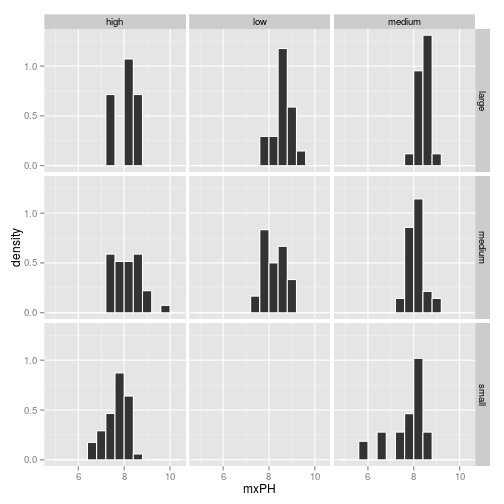 


# lattice
stripplot(size ~ mxPH | speed, data=algae, jitter=T)


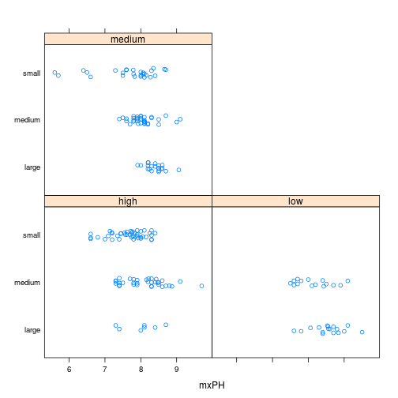 


#ggplot2
ggplot(algae) +
  geom_point(aes(x=mxPH, y=seq_along(mxPH)), binwidth=0.4, size=3) +
  facet_grid(size ~ speed)



## Warning: Removed 1 rows containing missing values (geom_point).


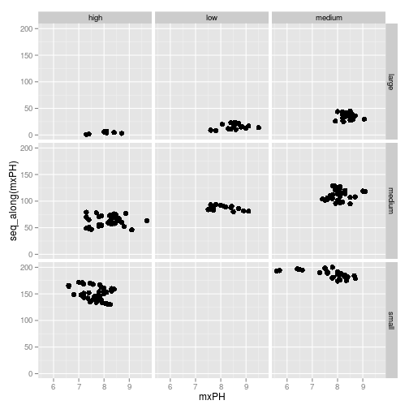 
 
### Thay thế các giá trị chưa biết bằng cách tìm sự tương tự giữa các biến
 


data(algae)
algae <- algae[-manyNAs(algae),]
 
# Hàng xóm gần nhất trung bình có trọng số
algae <- knnImputation(algae,k=10)
 
# Phương pháp trung vị
algae <- knnImputation(algae,k=10,meth='median')

 
## 6. Xây dựng mô hình dự đoán
 
Trong nghiên cứu này chúng tôi sẽ áp dụng 2 mô hình dự đoán khác nhau có thể áp dụng cho các nghiên cứu về tảo: hồi quy tuyến tính đa biến và cây hồi quy. Lựa chọn này là do mục đích trình diễn trong khuôn khổ cuốn sách và chưa phải là kết quả của một bước lựa chọn mô hình tiêu chuẩn.
 
### Hồi quy tuyến tính đa biến
 


# Loại bỏ các giá trị chưa biết
data(algae)
algae <- algae[-manyNAs(algae), ]
clean.algae <- knnImputation(algae, k = 10)
 
# Chạy mô hình cho 1 biến
lm.a1 <- lm(a1 ~ ., data=clean.algae[,1:12])
 
# Các thông số của mô hình
summary(lm.a1)



## 
## Call:
## lm(formula = a1 ~ ., data = clean.algae[, 1:12])
## 
## Residuals:
##     Min      1Q  Median      3Q     Max 
## -37.699 -11.899  -2.553   7.411  62.185 
## 
## Coefficients:
##               Estimate Std. Error t value Pr(>|t|)   
## (Intercept)  46.749310  23.518066   1.988  0.04833 * 
## seasonsummer -2.986220   3.743563  -0.798  0.42609   
## seasonautumn -3.702680   4.136646  -0.895  0.37192   
## seasonwinter -0.018635   3.394557  -0.005  0.99563   
## sizemedium    3.260202   3.801478   0.858  0.39223   
## sizesmall     9.674317   4.179509   2.315  0.02175 * 
## speedlow      3.928730   4.702385   0.835  0.40455   
## speedmedium   0.240118   3.240419   0.074  0.94101   
## mxPH         -3.594709   2.701250  -1.331  0.18493   
## mnO2          1.052234   0.704937   1.493  0.13726   
## Cl           -0.040375   0.033654  -1.200  0.23181   
## NO3          -1.511363   0.551089  -2.743  0.00671 **
## NH4           0.001633   0.001003   1.628  0.10522   
## oPO4         -0.005288   0.039865  -0.133  0.89463   
## PO4          -0.052346   0.030735  -1.703  0.09025 . 
## Chla         -0.088835   0.079893  -1.112  0.26764   
## ---
## Signif. codes:  0 '***' 0.001 '**' 0.01 '*' 0.05 '.' 0.1 ' ' 1
## 
## Residual standard error: 17.64 on 182 degrees of freedom
## Multiple R-squared:  0.3734,	Adjusted R-squared:  0.3217 
## F-statistic:  7.23 on 15 and 182 DF,  p-value: 2.371e-12



# Phân tích phương sai để loại bỏ dần các biến
anova(lm.a1)



## Analysis of Variance Table
## 
## Response: a1
##            Df Sum Sq Mean Sq F value    Pr(>F)    
## season      3     85    28.2  0.0905  0.965176    
## size        2  11401  5700.7 18.3157 5.658e-08 ***
## speed       2   3934  1967.2  6.3203  0.002219 ** 
## mxPH        1   1329  1329.5  4.2714  0.040175 *  
## mnO2        1   2286  2286.4  7.3458  0.007365 ** 
## Cl          1   4317  4317.3 13.8709  0.000261 ***
## NO3         1   3416  3415.7 10.9742  0.001114 ** 
## NH4         1    403   402.6  1.2936  0.256884    
## oPO4        1   4784  4783.9 15.3702  0.000125 ***
## PO4         1   1414  1413.6  4.5418  0.034420 *  
## Chla        1    385   384.8  1.2364  0.267638    
## Residuals 182  56647   311.2                      
## ---
## Signif. codes:  0 '***' 0.001 '**' 0.01 '*' 0.05 '.' 0.1 ' ' 1



# Loại bỏ biến season ra khỏi mô hình 1
lm2.a1 <- update(lm.a1, . ~ . - season)
 
# Các thông số của mô hình 2
summary(lm2.a1)



## 
## Call:
## lm(formula = a1 ~ size + speed + mxPH + mnO2 + Cl + NO3 + NH4 + 
##     oPO4 + PO4 + Chla, data = clean.algae[, 1:12])
## 
## Residuals:
##     Min      1Q  Median      3Q     Max 
## -36.478 -11.743  -3.036   7.449  63.719 
## 
## Coefficients:
##               Estimate Std. Error t value Pr(>|t|)   
## (Intercept) 45.0180864 23.2268397   1.938  0.05412 . 
## sizemedium   3.3082723  3.7818883   0.875  0.38283   
## sizesmall   10.2685155  4.1217771   2.491  0.01361 * 
## speedlow     3.0665309  4.6076756   0.666  0.50654   
## speedmedium -0.3010598  3.1805504  -0.095  0.92469   
## mxPH        -3.2726316  2.6559391  -1.232  0.21944   
## mnO2         0.8016549  0.6588092   1.217  0.22522   
## Cl          -0.0383513  0.0333720  -1.149  0.25195   
## NO3         -1.5334364  0.5474276  -2.801  0.00563 **
## NH4          0.0015778  0.0009949   1.586  0.11448   
## oPO4        -0.0060570  0.0394914  -0.153  0.87827   
## PO4         -0.0511060  0.0305023  -1.675  0.09553 . 
## Chla        -0.0848708  0.0793461  -1.070  0.28618   
## ---
## Signif. codes:  0 '***' 0.001 '**' 0.01 '*' 0.05 '.' 0.1 ' ' 1
## 
## Residual standard error: 17.57 on 185 degrees of freedom
## Multiple R-squared:  0.3684,	Adjusted R-squared:  0.3275 
## F-statistic: 8.993 on 12 and 185 DF,  p-value: 1.706e-13



# So sánh 2 mô hình
anova(lm.a1,lm2.a1)



## Analysis of Variance Table
## 
## Model 1: a1 ~ season + size + speed + mxPH + mnO2 + Cl + NO3 + NH4 + oPO4 + 
##     PO4 + Chla
## Model 2: a1 ~ size + speed + mxPH + mnO2 + Cl + NO3 + NH4 + oPO4 + PO4 + 
##     Chla
##   Res.Df   RSS Df Sum of Sq      F Pr(>F)
## 1    182 56647                           
## 2    185 57095 -3    -447.4 0.4791 0.6972



# Sử dụng hàm step để lặp lại việc đơn giản hóa mô hình
# sử dụng AIC (Akaike Information Criterion)
final.lm <- step(lm.a1)



## Start:  AIC=1151.95
## a1 ~ season + size + speed + mxPH + mnO2 + Cl + NO3 + NH4 + oPO4 + 
##     PO4 + Chla
## 
##          Df Sum of Sq   RSS    AIC
## - season  3    447.40 57095 1147.5
## - speed   2    271.43 56919 1148.9
## - oPO4    1      5.48 56653 1150.0
## - Chla    1    384.82 57032 1151.3
## - Cl      1    447.99 57095 1151.5
## - mxPH    1    551.19 57198 1151.9
## <none>                56647 1152.0
## - mnO2    1    693.47 57341 1152.4
## - NH4     1    825.10 57472 1152.8
## - PO4     1    902.85 57550 1153.1
## - size    2   1854.23 58501 1154.3
## - NO3     1   2340.99 58988 1158.0
## 
## Step:  AIC=1147.51
## a1 ~ size + speed + mxPH + mnO2 + Cl + NO3 + NH4 + oPO4 + PO4 + 
##     Chla
## 
##         Df Sum of Sq   RSS    AIC
## - speed  2    212.65 57307 1144.2
## - oPO4   1      7.26 57102 1145.5
## - Chla   1    353.09 57448 1146.7
## - Cl     1    407.59 57502 1146.9
## - mnO2   1    456.96 57551 1147.1
## - mxPH   1    468.58 57563 1147.1
## <none>               57095 1147.5
## - NH4    1    776.16 57871 1148.2
## - PO4    1    866.37 57961 1148.5
## - size   2   2173.46 59268 1150.9
## - NO3    1   2421.59 59516 1153.7
## 
## Step:  AIC=1144.25
## a1 ~ size + mxPH + mnO2 + Cl + NO3 + NH4 + oPO4 + PO4 + Chla
## 
##        Df Sum of Sq   RSS    AIC
## - oPO4  1     15.78 57323 1142.3
## - Chla  1    228.68 57536 1143.0
## - mnO2  1    413.83 57721 1143.7
## - Cl    1    476.58 57784 1143.9
## - mxPH  1    484.70 57792 1143.9
## <none>              57307 1144.2
## - NH4   1    719.82 58027 1144.7
## - PO4   1    813.99 58121 1145.0
## - size  2   2057.77 59365 1147.2
## - NO3   1   2379.88 59687 1150.3
## 
## Step:  AIC=1142.3
## a1 ~ size + mxPH + mnO2 + Cl + NO3 + NH4 + PO4 + Chla
## 
##        Df Sum of Sq   RSS    AIC
## - Chla  1     213.9 57537 1141.0
## - mnO2  1     402.8 57726 1141.7
## - Cl    1     474.5 57797 1141.9
## - mxPH  1     520.8 57844 1142.1
## <none>              57323 1142.3
## - NH4   1     704.5 58027 1142.7
## - size  2    2047.9 59371 1145.2
## - NO3   1    2370.8 59694 1148.3
## - PO4   1    5823.8 63147 1159.5
## 
## Step:  AIC=1141.04
## a1 ~ size + mxPH + mnO2 + Cl + NO3 + NH4 + PO4
## 
##        Df Sum of Sq   RSS    AIC
## - mnO2  1     434.5 57971 1140.5
## - Cl    1     440.8 57978 1140.5
## <none>              57537 1141.0
## - NH4   1     746.9 58284 1141.6
## - mxPH  1     836.9 58374 1141.9
## - size  2    2217.3 59754 1144.5
## - NO3   1    2667.6 60204 1148.0
## - PO4   1    6315.4 63852 1159.7
## 
## Step:  AIC=1140.53
## a1 ~ size + mxPH + Cl + NO3 + NH4 + PO4
## 
##        Df Sum of Sq   RSS    AIC
## - NH4   1     531.3 58503 1140.3
## - Cl    1     588.1 58559 1140.5
## <none>              57971 1140.5
## - mxPH  1     823.4 58795 1141.3
## - size  2    2477.8 60449 1144.8
## - NO3   1    2252.7 60224 1146.1
## - PO4   1    9101.3 67073 1167.4
## 
## Step:  AIC=1140.33
## a1 ~ size + mxPH + Cl + NO3 + PO4
## 
##        Df Sum of Sq   RSS    AIC
## <none>              58503 1140.3
## - mxPH  1     788.3 59291 1141.0
## - Cl    1     839.8 59342 1141.2
## - NO3   1    1989.2 60492 1145.0
## - size  2    2663.9 61167 1145.2
## - PO4   1    8578.8 67081 1165.4



# Thông số của mô hình cuối
summary(final.lm)



## 
## Call:
## lm(formula = a1 ~ size + mxPH + Cl + NO3 + PO4, data = clean.algae[, 
##     1:12])
## 
## Residuals:
##     Min      1Q  Median      3Q     Max 
## -28.884 -12.733  -3.739   8.423  62.914 
## 
## Coefficients:
##             Estimate Std. Error t value Pr(>|t|)    
## (Intercept) 57.37988   20.95697   2.738  0.00677 ** 
## sizemedium   2.79956    3.40145   0.823  0.41151    
## sizesmall   10.40537    3.82205   2.722  0.00708 ** 
## mxPH        -3.98096    2.48142  -1.604  0.11030    
## Cl          -0.05241    0.03165  -1.656  0.09939 .  
## NO3         -0.89555    0.35142  -2.548  0.01161 *  
## PO4         -0.05912    0.01117  -5.292  3.3e-07 ***
## ---
## Signif. codes:  0 '***' 0.001 '**' 0.01 '*' 0.05 '.' 0.1 ' ' 1
## 
## Residual standard error: 17.5 on 191 degrees of freedom
## Multiple R-squared:  0.3529,	Adjusted R-squared:  0.3325 
## F-statistic: 17.36 on 6 and 191 DF,  p-value: 5.429e-16

 
Tỉ lệ phương sai giải thích bằng mô hình tuyến tính trên đây vẫn chưa đáng kể, chứng tỏ mô hình tuyến tính không phù hợp với phân tích sự phát triển của tảo.
 
### Cây hồi quy
 


# Phân tích sử dụng thư viện rpart
library(rpart)
data(algae)
algae <- algae[-manyNAs(algae), ]



## Warning in manyNAs(algae): Empty index generated, no rows with many NAs.
## Undesirable effects may be caused if indexing a data frame with this.



rt.a1 <- rpart(a1 ~ ., data=algae[,1:12])
 
# Xem cây dạng chữ
rt.a1



## n= 0 
## 
## node), split, n, deviance, yval
##       * denotes terminal node
## 
## 1) root 0 0 NaN *



# # Xem cây dạng đồ thị
# prettyTree(rt.a1)
 
## Xem thông số của mô hình 
# sumarry(rt.a1)

 
Hàm `rpart()` phát triển cây hồi quy cho đến khi đạt được các tiêu chuẩn:
 
- Mức giảm độ lệch nhỏ hơn một mức tiêu chuẩn (`cp`)
- Số lượng mẫu trong một nút nhỏ hơn một mức tiêu chuẩn (`minsplit`)
- Độ sâu của cây vượt quá một mức tiêu chuẩn (`maxdepth`)
 
Mặc định giá trị của chúng lần lượt là 0.01, 20 và 30.
 


# Xem tham số phức tạp của mô hình (cp)
printcp(rt.a1)



## 
## Regression tree:
## rpart(formula = a1 ~ ., data = algae[, 1:12])
## 
## Variables actually used in tree construction:
## character(0)
## 
## Root node error: 0/0 = NaN
## 
## n= 0 
## 
##    CP nsplit rel error xerror xstd
## 1 NaN      0       NaN    NaN  NaN



# # Đồ thị
# plotcp(rt.a1)
 
# Chọn mô hình có xerror + xstd nhỏ nhất
rt2.a1 <- prune(rt.a1,cp=0.08)
rt2.a1



## n= 0 
## 
## node), split, n, deviance, yval
##       * denotes terminal node
## 
## 1) root 0 0 NaN *



# Chọn tự động
set.seed(1234) # Just to ensure  same results as in the book
(rt.a1 <- rpartXse(a1 ~ .,data=algae[,1:12]))



## n= 0 
## 
## node), split, n, deviance, yval
##       * denotes terminal node
## 
## 1) root 0 0 NaN *



# Tạo một phiên bản cắt của cây hồi quy
# sử dụng hàm snip.part()
first.tree <- rpart(a1 ~ .,data=algae[,1:12])
snip.rpart(first.tree,c(4,7))



## Warning in snip.rpart(first.tree, c(4, 7)): c("Nodes %s are not in this
## tree", "4", "7")



## n= 0 
## 
## node), split, n, deviance, yval
##       * denotes terminal node
## 
## 1) root 0 0 NaN *



# # Sử dụng hàm snip.part() trên đồ thị
# prettyTree(first.tree)
# snip.rpart(first.tree)

 
## 7. Đánh giá và lựa chọn mô hình
 
Hiệu suất dự báo của các mô hình hồi quy được thực hiện bằng cách so sánh các giá trị dự đoán của mô hình với các giá trị thực tế và tính toán một số trung bình về sai số từ so sánh này. Một trong các số trung bình đó là sai số trung bình tuyệt đối (MAE - the mean absolute error).
 


# Dự báo bằng mô hình
lm.predictions.a1 <- predict(final.lm,clean.algae)
rt.predictions.a1 <- predict(rt.a1,algae)
 
# Tính toán sai số trung bình tuyệt đối
(mae.a1.lm <- mean(abs(lm.predictions.a1-algae[,'a1'])))



## [1] NaN



(mae.a1.rt <- mean(abs(rt.predictions.a1-algae[,'a1'])))



## [1] NaN

 
Một số trung bình khác là sai số bình phương trung bình (MSE - the mean squared error).
 


(mse.a1.lm <- mean((lm.predictions.a1-algae[,'a1'])^2))



## [1] NaN



(mse.a1.rt <- mean((rt.predictions.a1-algae[,'a1'])^2))



## [1] NaN

 
Sai số bình phương trung bình chuẩn hóa (NMSE - the nỏmalized mean squared error)
 


(nmse.a1.lm <- mean((lm.predictions.a1-algae[,'a1'])^2)/
                mean((mean(algae[,'a1'])-algae[,'a1'])^2))



## [1] NaN



(nmse.a1.rt <- mean((rt.predictions.a1-algae[,'a1'])^2)/
                mean((mean(algae[,'a1'])-algae[,'a1'])^2))



## [1] NaN

 
Tính 3 số trung bình cùng lúc
 


regr.eval(algae[,'a1'],lm.predictions.a1,train.y=algae[,'a1'])



##  mae  mse rmse mape nmse nmae 
##  NaN  NaN  NaN  NaN  NaN  NaN



regr.eval(algae[,'a1'],rt.predictions.a1,train.y=algae[,'a1'])



##  mae  mse rmse mape nmse nmae 
##  NaN  NaN  NaN  NaN  NaN  NaN

 
Biểu diễn sai số lên đồ thị
 


old.par <- par(mfrow=c(1,2))
plot(lm.predictions.a1,algae[,'a1'],main="Linear Model",
     xlab="Predictions",ylab="True Values")
abline(0,1,lty=2)
plot(rt.predictions.a1,algae[,'a1'],main="Regression Tree",
     xlab="Predictions",ylab="True Values")
abline(0,1,lty=2)
par(old.par)

 
Đồ thị tương tác
 


plot(lm.predictions.a1,algae[,'a1'],main="Linear Model",
     xlab="Predictions",ylab="True Values")
abline(0,1,lty=2)
algae[identify(lm.predictions.a1,algae[,'a1']),]

 
Loại bỏ các dự báo âm (-) trong mô hình tuyến tính
 


sensible.lm.predictions.a1 <- ifelse(lm.predictions.a1 < 0,0,lm.predictions.a1)
regr.eval(algae[,'a1'],lm.predictions.a1,stats=c('mae','mse'))



## mae mse 
## NaN NaN



regr.eval(algae[,'a1'],sensible.lm.predictions.a1,stats=c('mae','mse'))



## mae mse 
## NaN NaN

 
 
Nói chung, khi giải quyết các vấn đề dự báo, chúng ta cần phải đưa ra quyết định về:
 
- Lựa chọn mô hình thay thế cho vấn đề dự báo đang giải quyết
- Lựa chọn tiêu chí đánh giá sử dụng để đánh giá mô hình
- Lựa chọn phương pháp thực nghiệm để có được các ước tính hợp lý cho các tiêu chí này
 
Hàm `experimentalComparison()` cung cấp một giải pháp để thực hiện công đoạn này.
 


cv.rpart <- function(form,train,test,...) {
  m <- rpartXse(form,train,...)
  p <- predict(m,test)
  mse <- mean((p-resp(form,test))^2)
  c(nmse=mse/mean((mean(resp(form,train))-resp(form,test))^2))
}
cv.lm <- function(form,train,test,...) {
  m <- lm(form,train,...)
  p <- predict(m,test)
  p <- ifelse(p < 0,0,p)
  mse <- mean((p-resp(form,test))^2)
  c(nmse=mse/mean((mean(resp(form,train))-resp(form,test))^2))
}
 
res <- experimentalComparison(
            c(dataset(a1 ~ .,clean.algae[,1:12],'a1')),
            c(variants('cv.lm'), 
              variants('cv.rpart',se=c(0,0.5,1))),
            cvSettings(3,10,1234))
 
 
summary(res)
 
 
plot(res)
 
 
getVariant('cv.rpart.v1',res)

 
Sử dụng `experimentalComparison()` cho 7 biến cùng lúc
 


DSs <- sapply(names(clean.algae)[12:18],
         function(x,names.attrs) { 
           f <- as.formula(paste(x,"~ ."))
           dataset(f,clean.algae[,c(names.attrs,x)],x) 
         },
         names(clean.algae)[1:11])
 
res.all <- experimentalComparison(
                  DSs,
                  c(variants('cv.lm'),
                    variants('cv.rpart',se=c(0,0.5,1))
                   ),
                  cvSettings(5,10,1234))
 
 
plot(res.all)
 
 
bestScores(res.all)

 
Sử dụng `randomForest()` cho `experimentalComparison()`
 


library(randomForest)
cv.rf <- function(form,train,test,...) {
  m <- randomForest(form,train,...)
  p <- predict(m,test)
  mse <- mean((p-resp(form,test))^2)
  c(nmse=mse/mean((mean(resp(form,train))-resp(form,test))^2))
}
res.all <- experimentalComparison(
                  DSs,
                  c(variants('cv.lm'),
                    variants('cv.rpart',se=c(0,0.5,1)),
                    variants('cv.rf',ntree=c(200,500,700))
                   ),
                  cvSettings(5,10,1234))
 
 
bestScores(res.all)
 
 
compAnalysis(res.all,against='cv.rf.v3',
               datasets=c('a1','a2','a4','a6'))

 
## 8. Dự báo cho 7 loại tảo
 
Trong phần này chúng tôi sẽ chỉ ra cách để dự báo sự phát triển của 7 loại tảo trong 140 mẫu thử. Phân Đánh giá và lựa chọn mô hình ở trên đã cho thấy cách thức chọn mô hình dự báo tốt nhất bằng cách sử dụng ước tính sai số trung bình bình phương chuẩn hóa (NMSE) cho một nhóm các mô hình trong cả 7 nhiệm vụ dự báo, trên cơ sở quá trình kiểm tra chéo (CV - cross-validation).
 
Mục tiêu chính của nghiên cứu này là thu được 7 dự báo cho 140 quan sát trong bộ dữ liệu kiểm thử. Mỗi một dự báo sẽ được tính ra từ mô hình mà quá trình kiểm tra chéo đã chỉ ra là tốt nhất. Đó là những mô hình thu được từ việc chạy hàm `bestScores()`.
 


bestModelsNames <- sapply(bestScores(res.all),
                          function(x) x['nmse','system'])
learners <- c(rf='randomForest',rpart='rpartXse') 
funcs <- learners[sapply(strsplit(bestModelsNames,'\\.'),
                        function(x) x[2])]
parSetts <- lapply(bestModelsNames,
                   function(x) getVariant(x,res.all)@pars)
 
bestModels <- list()
for(a in 1:7) {
  form <- as.formula(paste(names(clean.algae)[11+a],'~ .'))
  bestModels[[a]] <- do.call(funcs[a],
          c(list(form,clean.algae[,c(1:11,11+a)]),parSetts[[a]]))
}
 
# Thay thế các giá trị chưa biết trong bộ dữ liệu kiểm thử
# bằng knn
clean.test.algae <- knnImputation(test.algae,k=10,distData=algae[,1:11])
 
 
preds <- matrix(ncol=7,nrow=140)
for(i in 1:nrow(clean.test.algae)) 
  preds[i,] <- sapply(1:7,
                      function(x) 
                        predict(bestModels[[x]],clean.test.algae[i,])
                     )
 
 
avg.preds <- apply(algae[,12:18],2,mean)
apply( ((algae.sols-preds)^2),           2,mean) / 
apply( (scale(algae.sols,avg.preds,F)^2),2,mean)

 
Những báo cáo khoa học của những nhóm thắng cuộc tại cuộc thi COIL năm 1999.
 
- [Bontempi, G., Birattari, M., and Bersini, H. (1999). Lazy learners at work: The lazy learning toolbox. In Proceedings of the 7th European Congress on Intelligent Tecnhiques & Soft Computing (EUFIT’99)](http://raw.githubusercontent.com/hochanh/rblog/gh-pages/_knitr/files/EUFIT-BonBirBer1999eufit.pdf).
 
- [Chan, R. (1999). Protecting rivers & streams by monitoring chemical concentrations and algae communities. In Proceedings of the 7th European Congress on Intelligent Tecnhiques & Soft Computing (EUFIT’99)](http://raw.githubusercontent.com/hochanh/rblog/gh-pages/_knitr/files/EUFIT-10.1.1.131.4618-libre.pdf).
 
- [Devogelaere, D., Rijckaert, M., and Embrechts, M. J. (1999). 3rd international competition: Protecting rivers and streams by monitoring chemical concentrations and algae communities solved with the use of gadc. In Proceedings of the 7th European Congress on Intelligent Tecnhiques & Soft Computing (EUFIT’99)](http://raw.githubusercontent.com/hochanh/rblog/gh-pages/_knitr/files/EUFIT-supervised.pdf).
 
- [Torgo, L. (1999b). Predicting the density of algae communities using local regression trees. In Proceedings of the 7th European Congress on Intelligent Tecnhiques & Soft Computing (EUFIT’99)](http://raw.githubusercontent.com/hochanh/rblog/gh-pages/_knitr/files/EUFIT-PDACLRT.pdf).
