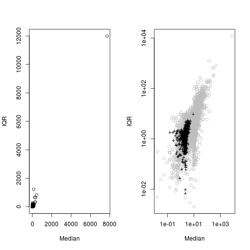

 
## 1. Mô tả vấn đề và Mục tiêu
 
Từ quan điểm phân tích dữ liệu, gian lận thường đi kèm với các quan sát bất thường. 
 
Dữ liệu chúng tôi sẽ sử dụng trong trường hợp này có liên quan tới các giao dịch báo cáo bởi các nhân viên kinh doanh ở một doanh nghiệp. Những nhân viên này bán một dòng sản phẩm của công ty và báo cáo doanh thu theo những chu kỳ nhất định. Những nhân viên kinh doanh này được tự do đặt mức giá bán tùy theo chính sách riêng của họ và thị trường. Vào cuối mỗi tháng, họ báo cáo lại cho công ty những giao dịch đã thực hiện.
 
Mục tiêu của nghiên cứu này là để giúp cho hoạt động xác nhận tính trung thực của những báo cáo này trên cơ sở dữ liệu có sẵn của công ty về những gian lận và sai sót đã được phát hiện trong các báo cáo trước đây. Chúng tôi sẽ cung cấp một bảng xếp hạng các báo cáo theo khả năng tồn tại gian lận. Bảng xếp hạng này sẽ cho phép phân bổ nguồn lực thanh tra hạn chế của công ty vào những báo cáo có khả năng gian lận cao.
 
## 2. Dữ liệu có sẵn
 
Dữ liệu có sẵn là một bảng gồm 401.146 hàng, mỗi hàng chứa thông tin về một báo cáo lập bởi một nhân viên kinh doanh. Thông tin này bao gồm mã nhân viên, mã sản phẩm, số lượng và tổng giá trị báo cáo. Các cột thông tin bao gồm:
 
- ID: mã nhân viên
- Prod: mã sản phẩm
- Quant: số đơn vị sản phẩm bán được
- Val: tổng số tiền thu được từ giao dịch
- Insp: biến phân loại với 3 giá trị khả dụng: **ok** nếu giao dịch đã được xác nhận, **fraud** nếu có gian lận, **unkn** nếu giao dịch chưa được kiểm tra.
 
### 2.1 Nạp dữ liệu vào R
 


# Nạp từ tệp bên ngoài
# load('sales.Rdata')
 
# Từ thư viện của sách
library(DMwR)



## Loading required package: lattice
## Loading required package: grid



data(sales)
head(sales)



##   ID Prod Quant   Val Insp
## 1 v1   p1   182  1665 unkn
## 2 v2   p1  3072  8780 unkn
## 3 v3   p1 20393 76990 unkn
## 4 v4   p1   112  1100 unkn
## 5 v3   p1  6164 20260 unkn
## 6 v5   p2   104  1155 unkn

 
### Khám phá dữ liệu
 


# Dùng thư viện Hmisc
library(Hmisc)



## Loading required package: survival
## Loading required package: splines
## Loading required package: Formula
## 
## Attaching package: 'Hmisc'
## 
## The following objects are masked from 'package:base':
## 
##     format.pval, round.POSIXt, trunc.POSIXt, units



describe(sales)



## sales 
## 
##  5  Variables      401146  Observations
## ---------------------------------------------------------------------------
## ID 
##       n missing  unique 
##  401146       0    6016 
## 
## lowest : v1    v2    v3    v4    v5   
## highest: v6066 v6067 v6068 v6069 v6070 
## ---------------------------------------------------------------------------
## Prod 
##       n missing  unique 
##  401146       0    4548 
## 
## lowest : p1    p2    p3    p4    p5   
## highest: p4544 p4545 p4546 p4547 p4548 
## ---------------------------------------------------------------------------
## Quant 
##       n missing  unique    Info    Mean     .05     .10     .25     .50 
##  387304   13842   20956       1    8442     100     101     107     168 
##     .75     .90     .95 
##     738    4877   12916 
## 
## lowest :       100       101       102       103       104
## highest:  56590926 164244544 173844544 194044544 473883883 
## ---------------------------------------------------------------------------
## Val 
##       n missing  unique    Info    Mean     .05     .10     .25     .50 
##  399964    1182   21821       1   14617    1040    1085    1345    2675 
##     .75     .90     .95 
##    8680   27250   52995 
## 
## lowest :    1005    1010    1015    1020    1025
## highest: 4161740 4308620 4475360 4616735 4642955 
## ---------------------------------------------------------------------------
## Insp 
##       n missing  unique 
##  401146       0       3 
## 
## ok (14462, 4%), unkn (385414, 96%), fraud (1270, 0%) 
## ---------------------------------------------------------------------------



summary(sales)



##        ID              Prod            Quant                Val         
##  v431   : 10159   p1125  :  3923   Min.   :      100   Min.   :   1005  
##  v54    :  6017   p3774  :  1824   1st Qu.:      107   1st Qu.:   1345  
##  v426   :  3902   p1437  :  1720   Median :      168   Median :   2675  
##  v1679  :  3016   p1917  :  1702   Mean   :     8442   Mean   :  14617  
##  v1085  :  3001   p4089  :  1598   3rd Qu.:      738   3rd Qu.:   8680  
##  v1183  :  2642   p2742  :  1519   Max.   :473883883   Max.   :4642955  
##  (Other):372409   (Other):388860   NA's   :13842       NA's   :1182     
##     Insp       
##  ok   : 14462  
##  unkn :385414  
##  fraud:  1270  
##                
##                
##                
## 



# Đếm số trường duy nhất
nlevels(sales$ID)



## [1] 6016



nlevels(sales$Prod)



## [1] 4548



# Đếm những giao dịch thiếu cả Quant và Val
length(which(is.na(sales$Quant) & is.na(sales$Val)))



## [1] 888



# hoặc nhanh hơn
sum(is.na(sales$Quant) & is.na(sales$Val))



## [1] 888



# Tính tỉ lệ phát hiện gian lận
table(sales$Insp)/nrow(sales)*100



## 
##        ok      unkn     fraud 
##  3.605171 96.078236  0.316593



# Số lượng báo cáo trên từng nhân viên
totS <- table(sales$ID)
barplot(totS,main='Transactions per salespeople',names.arg='',xlab='Salespeople',ylab='Amount')


 


# Số lượng báo cáo với mỗi sản phẩm
totP <- table(sales$Prod)
barplot(totP,main='Transactions per product',names.arg='',xlab='Products',ylab='Amount')


 


# Xem xét giá mỗi đơn vị sản phẩm
sales$Uprice <- sales$Val/sales$Quant
summary(sales$Uprice)



##     Min.  1st Qu.   Median     Mean  3rd Qu.     Max.     NA's 
##     0.00     8.46    11.89    20.30    19.11 26460.00    14136



# Tốp 5 sản phẩm có giá đơn vị rẻ nhất/đắt nhất (theo trung vị)
attach(sales)
upp <- aggregate(Uprice,list(Prod),median,na.rm=T)
topP <- sapply(c(T,F),function(o) 
               upp[order(upp[,2],decreasing=o)[1:5],1])
colnames(topP) <- c('Expensive','Cheap')
topP



##      Expensive Cheap  
## [1,] "p3689"   "p560" 
## [2,] "p2453"   "p559" 
## [3,] "p2452"   "p4195"
## [4,] "p2456"   "p601" 
## [5,] "p2459"   "p563"



# Phân phối giá đối với sản phẩm có giá đơn vị rẻ nhất/đắt nhất
tops <- sales[Prod %in% topP[1,],c('Prod','Uprice')]
tops$Prod <- factor(tops$Prod)
boxplot(Uprice ~ Prod,data=tops,ylab='Uprice',log="y")


 


# Log y để giãn giá sản phẩm
 
# Thực hiện tương tự với doanh số của nhân viên
# Tốp 5 doanh số (tổng cộng)
vs <- aggregate(Val,list(ID),sum,na.rm=T)
scoresSs <- sapply(c(T,F),function(o) 
                   vs[order(vs$x,decreasing=o)[1:5],1])
colnames(scoresSs) <- c('Most','Least')
scoresSs



##      Most    Least  
## [1,] "v431"  "v3355"
## [2,] "v54"   "v6069"
## [3,] "v19"   "v5876"
## [4,] "v4520" "v6058"
## [5,] "v955"  "v4515"



# Tỉ lệ doanh thu của tốp 100 người đứng đầu
sum(vs[order(vs$x,decreasing=T)[1:100],2])/sum(Val,na.rm=T)*100



## [1] 38.33277



# Tỉ lệ doanh thu của 2000 người bét bảng
sum(vs[order(vs$x,decreasing=F)[1:2000],2])/sum(Val,na.rm=T)*100



## [1] 1.988716



# Tiếp tục với số lượng sản phẩm bán ra
# Tốp 5 sản phẩm bán ít nhất/nhiều nhất
qs <- aggregate(Quant,list(Prod),sum,na.rm=T)
scoresPs <- sapply(c(T,F),function(o) 
                   qs[order(qs$x,decreasing=o)[1:5],1])
colnames(scoresPs) <- c('Most','Least')
scoresPs



##      Most    Least  
## [1,] "p2516" "p2442"
## [2,] "p3599" "p2443"
## [3,] "p314"  "p1653"
## [4,] "p569"  "p4101"
## [5,] "p319"  "p3678"



# Tỉ lệ số lượng sản phẩm tốp 100
sum(as.double(qs[order(qs$x,decreasing=T)[1:100],2]))/
  sum(as.double(Quant),na.rm=T)*100



## [1] 74.63478



# Tỉ lệ số lượng sản phẩm bét 4000
sum(as.double(qs[order(qs$x,decreasing=F)[1:4000],2]))/
  sum(as.double(Quant),na.rm=T)*100



## [1] 8.944681



# Tìm những giá trị lạ bằng hàm boxplot.stats()
out <- tapply(Uprice,list(Prod=Prod),
              function(x) length(boxplot.stats(x)$out))
 
# Tốp 10 sản phẩm có nhiều giá trị lạ nhất
out[order(out,decreasing=T)[1:10]]



## Prod
## p1125 p1437 p2273 p1917 p1918 p4089  p538 p3774 p2742 p3338 
##   376   181   165   156   156   137   129   125   120   117



# Tổng sản phẩm lạ
sum(out)



## [1] 29446



# Tỉ lệ
sum(out)/nrow(sales)*100



## [1] 7.34047

 
Những phân tích trên đây bao gồm cả những giao dịch đã được phát hiện là gian lận và những giao dịch có thể có gian lận. Những giao dịch đã biết chắc là không gian lận chỉ chiếm 3,6% trong tổng số giao dịch dẫn tới cho dù phân tích là chính xác thì kết luận dựa trên một bộ dữ liệu chất lượng thấp sẽ không còn đáng tin cậy.
 
### 2.2 Các vấn đề về dữ liệu
 
#### 2.2.1 Giá trị không biết
 
Loại bỏ hoàn toàn 888 trường hợp có chứa **cả hai** giá trị chưa biết (Quant và Val) có thể gây ra vấn đề nếu việc loại bỏ này dẫn tới việc loại đi hầu hết những giao dịch của một vài nhân viên hay vài loại sản phẩm.
 


# Tổng giao dịch theo nhân viên và theo sản phẩm được tính bởi
totS <- table(ID)
totP <- table(Prod)
 
# Những nhân viên và sản phẩm liên quan tới giá trị không biết
nas <- sales[which(is.na(Quant) & is.na(Val)),c('ID','Prod')]
 
# Tốp 10 nhân viên có tỉ lệ giao dịch chưa biết lớn
propS <- 100*table(nas$ID)/totS
propS[order(propS,decreasing=T)[1:10]]



## 
##     v1237     v4254     v4038     v5248     v3666     v4433     v4170 
## 13.793103  9.523810  8.333333  8.333333  6.666667  6.250000  5.555556 
##     v4926     v4664     v4642 
##  5.555556  5.494505  4.761905



# Tốp 10 sản phẩm có tỉ lệ giao dịch chưa biết lớn
propP <- 100*table(nas$Prod)/totP
propP[order(propP,decreasing=T)[1:10]]



## 
##    p2689    p2675    p4061    p2780    p4351    p2686    p2707    p2690 
## 39.28571 35.41667 25.00000 22.72727 18.18182 16.66667 14.28571 14.08451 
##    p2691    p2670 
## 12.90323 12.76596



# Loại bỏ hoàn toàn những giao dịch có chứa cả 2 giá trị chưa biết
detach(sales)
sales <- sales[-which(is.na(sales$Quant) & is.na(sales$Val)),]
 
# Tính tỉ lệ giao dịch của những sản phẩm có số lượng chưa biết
nnasQp <- tapply(sales$Quant,list(sales$Prod),
                 function(x) sum(is.na(x)))
propNAsQp <- nnasQp/table(sales$Prod)
# Tốp 10
propNAsQp[order(propNAsQp,decreasing=T)[1:10]]



##     p2442     p2443     p1653     p4101     p4243      p903     p3678 
## 1.0000000 1.0000000 0.9090909 0.8571429 0.6842105 0.6666667 0.6666667 
##     p3955     p4464     p1261 
## 0.6428571 0.6363636 0.6333333



# Xóa 2 giao dịch có 100% số lượng không biết
sales <- sales[!sales$Prod %in% c('p2442','p2443'),]
 
# Cập nhật level cho cột Prod
nlevels(sales$Prod)



## [1] 4548



sales$Prod <- factor(sales$Prod)
nlevels(sales$Prod)



## [1] 4546



# Tìm nhân viên với toàn bộ giao dịch với số lương chưa biết
nnasQs <- tapply(sales$Quant,list(sales$ID), function(x) sum(is.na(x)))
propNAsQs <- nnasQs/table(sales$ID)
propNAsQs[order(propNAsQs,decreasing=T)[1:10]]



##     v2925     v5537     v5836     v6058     v6065     v4368     v2923 
## 1.0000000 1.0000000 1.0000000 1.0000000 1.0000000 0.8888889 0.8750000 
##     v2970     v4910     v4542 
## 0.8571429 0.8333333 0.8095238



# Tính tỉ lệ giao dịch của những sản phẩm có số lượng chưa biết
nnasVp <- tapply(sales$Val,list(sales$Prod),
                 function(x) sum(is.na(x)))
propNAsVp <- nnasVp/table(sales$Prod)
propNAsVp[order(propNAsVp,decreasing=T)[1:10]]



##      p1110      p1022      p4491      p1462        p80      p4307 
## 0.25000000 0.17647059 0.10000000 0.07500000 0.06250000 0.05882353 
##      p4471      p2821      p1017      p4287 
## 0.05882353 0.05389222 0.05263158 0.05263158



# Tỉ lệ giao dịch của những sản phẩm có doanh số chưa biết
nnasVs <- tapply(sales$Val,list(sales$ID),function(x) sum(is.na(x)))
propNAsVs <- nnasVs/table(sales$ID)
propNAsVs[order(propNAsVs,decreasing=T)[1:10]]



##      v5647        v74      v5946      v5290      v4472      v4022 
## 0.37500000 0.22222222 0.20000000 0.15384615 0.12500000 0.09756098 
##       v975      v2814      v2892      v3739 
## 0.09574468 0.09090909 0.09090909 0.08333333



# Tính mức giá đơn vị đại diện theo trung vị, trừ 'fraud' ra
tPrice <- tapply(sales[sales$Insp != 'fraud','Uprice'],list(sales[sales$Insp != 'fraud','Prod']),median,na.rm=T)
 
# Thay thế giá trị chưa biết sử dụng mức giá đơn vị đại diện
# Chưa biết số lượng
noQuant <- which(is.na(sales$Quant))
sales[noQuant,'Quant'] <- ceiling(sales[noQuant,'Val'] /
                                  tPrice[sales[noQuant,'Prod']])
# Chưa biết doanh số
noVal <- which(is.na(sales$Val))
sales[noVal,'Val'] <- sales[noVal,'Quant'] *
                      tPrice[sales[noVal,'Prod']]
 
# Tính lại giá đơn vị
sales$Uprice <- sales$Val/sales$Quant
 
# Lưu lại, nhở?
save(sales,file='Datasets/C4/salesClean.Rdata')



## Warning in gzfile(file, "wb"): cannot open compressed file
## 'Datasets/C4/salesClean.Rdata', probable reason 'No such file or
## directory'



## Error in gzfile(file, "wb"): cannot open the connection

 
#### 2.2.2 Những sản phẩm có ít giao dịch
 
Có nhiều sản phẩm với rất ít giao dịch. Đây là một vấn đề bởi chúng ta cần sử dụng thông tin của các giao dịch đó để quyết định xem chúng có bất thường hay không. Nếu có quá ít thông tin sẽ dẫn tới khó khăn trong việc ra quyết định với mức ý nghĩa thống kê yêu cầu. Trong tình huống này, cần phải đặt ra câu hỏi liệu có thể phân tích những giao dịch của các sản phẩm khác nhau cùng lúc để giải quyết vấn đề hay không.
 
Nếu chúng ta tìm ra những sản phẩm có mức giá tương tự thì có thể xem xét trộn các giao dịch tương ứng và phân tích chúng cùng lúc để tìm ra các giao dịch bất thường. Một cách để so sánh 2 phân phối là biểu diễn chúng lên đồ thị, nhưng với số lượng giao dịch lớn, việc này không khả thi. Một cách khác là so sánh một số thuộc tính thống kê đại diện cho từng phân phối. 2 thuộc tính quan trọng nhất của một phân phối là xu hướng trung tâm và độ trải rộng. Nếu giả sử các phân phối này là xấp xỉ chuẩn, chúng ta sẽ lấy số trung vị làm xu hướng trung tâm và khoảng tứ phân vị (inter-quartile range - IQR - khoảng cách từ điểm tứ phân vị thứ nhất tới điểm tứ phân vị thứ 3) làm số đo độ trải rộng. Những giá trị thống kê này ít bị ảnh hưởng bởi yếu tố bất thường hơn là những giá trị thống kê thường được dùng như trung bình và độ lệch chuẩn. 
 
Tính trung vị và khoảng tứ phân vị bằng R như sau
 


attach(sales)
# Tìm trung vị và khoảng tứ phân vị
notF <- which(Insp != 'fraud')
ms <- tapply(Uprice[notF],list(Prod=Prod[notF]),function(x) {
     bp <- boxplot.stats(x)$stats
     c(median=bp[3],iqr=bp[4]-bp[2])
   })
ms <- matrix(unlist(ms),
             length(ms),2,
             byrow=T,dimnames=list(names(ms),c('median','iqr')))
head(ms)



##       median      iqr
## p1 11.346154 8.575599
## p2 10.877863 5.609731
## p3 10.000000 4.809092
## p4  9.911243 5.998530
## p5 10.957447 7.136601
## p6 13.223684 6.685185



# Biểu diễn lên đồ thị
par(mfrow=c(1,2))
plot(ms[,1],ms[,2],xlab='Median',ylab='IQR',main='')
plot(ms[,1],ms[,2],xlab='Median',ylab='IQR',main='',col='grey',log="xy")



## Warning in xy.coords(x, y, xlabel, ylabel, log): 3 y values <= 0 omitted
## from logarithmic plot



# Những sản phẩm có ít hơn 20 giao dịch
smalls <- which(table(Prod) < 20)
points(log(ms[smalls,1]),log(ms[smalls,2]),pch='+')


 
 
Kiểm định Kolmogorov-Smirnov dùng để kiểm tra 2 mẫu có cùng một phân phối hay không. Chúng ta tìm kiếm trong những giao dịch có trung vị và khoảng tứ phân vị giống nhau nhất.
 


# Chuẩn hóa dữ liệu ms
dms <- scale(ms)
smalls <- which(table(Prod) < 20)
prods <- tapply(sales$Uprice,sales$Prod,list)
# Lập ma trận chứa giao dịch tương tự về trung vị và khoảng tứ phân vị
similar <- matrix(NA,length(smalls),7,
                  dimnames=list(names(smalls),
                                c('Simil','ks.stat','ks.p',
                                  'medP','iqrP','medS','iqrS')))
 
for(i in seq(along=smalls)) {
  # Tính khoảng cách giữa các thuộc tính thống kê của
  # sản phẩm i và các sản phẩm còn lại
  d <- scale(dms,dms[smalls[i],],FALSE)
  d <- sqrt(drop(d^2 %*% rep(1,ncol(d))))
  # Thực hiện kiểm định
  stat <- ks.test(prods[[smalls[i]]],prods[[order(d)[2]]])
  # Lưu vào ma trận
  similar[i,] <- c(order(d)[2],
                   stat$statistic,
                   stat$p.value,
                   ms[smalls[i],],
                   ms[order(d)[2],])
}



## Warning in ks.test(prods[[smalls[i]]], prods[[order(d)[2]]]): cannot
## compute exact p-value with ties



## Warning in ks.test(prods[[smalls[i]]], prods[[order(d)[2]]]): cannot
## compute exact p-value with ties



## Warning in ks.test(prods[[smalls[i]]], prods[[order(d)[2]]]): cannot
## compute exact p-value with ties



## Warning in ks.test(prods[[smalls[i]]], prods[[order(d)[2]]]): cannot
## compute exact p-value with ties



## Warning in ks.test(prods[[smalls[i]]], prods[[order(d)[2]]]): cannot
## compute exact p-value with ties



## Warning in ks.test(prods[[smalls[i]]], prods[[order(d)[2]]]): cannot
## compute exact p-value with ties



## Warning in ks.test(prods[[smalls[i]]], prods[[order(d)[2]]]): cannot
## compute exact p-value with ties



## Warning in ks.test(prods[[smalls[i]]], prods[[order(d)[2]]]): cannot
## compute exact p-value with ties



## Warning in ks.test(prods[[smalls[i]]], prods[[order(d)[2]]]): cannot
## compute exact p-value with ties



## Warning in ks.test(prods[[smalls[i]]], prods[[order(d)[2]]]): cannot
## compute exact p-value with ties



## Warning in ks.test(prods[[smalls[i]]], prods[[order(d)[2]]]): cannot
## compute exact p-value with ties



## Warning in ks.test(prods[[smalls[i]]], prods[[order(d)[2]]]): cannot
## compute exact p-value with ties



## Warning in ks.test(prods[[smalls[i]]], prods[[order(d)[2]]]): cannot
## compute exact p-value with ties



## Warning in ks.test(prods[[smalls[i]]], prods[[order(d)[2]]]): cannot
## compute exact p-value with ties



## Warning in ks.test(prods[[smalls[i]]], prods[[order(d)[2]]]): cannot
## compute exact p-value with ties



## Warning in ks.test(prods[[smalls[i]]], prods[[order(d)[2]]]): cannot
## compute exact p-value with ties



## Warning in ks.test(prods[[smalls[i]]], prods[[order(d)[2]]]): cannot
## compute exact p-value with ties



## Warning in ks.test(prods[[smalls[i]]], prods[[order(d)[2]]]): cannot
## compute exact p-value with ties



## Warning in ks.test(prods[[smalls[i]]], prods[[order(d)[2]]]): cannot
## compute exact p-value with ties



## Warning in ks.test(prods[[smalls[i]]], prods[[order(d)[2]]]): cannot
## compute exact p-value with ties



## Warning in ks.test(prods[[smalls[i]]], prods[[order(d)[2]]]): cannot
## compute exact p-value with ties



## Warning in ks.test(prods[[smalls[i]]], prods[[order(d)[2]]]): cannot
## compute exact p-value with ties



## Warning in ks.test(prods[[smalls[i]]], prods[[order(d)[2]]]): cannot
## compute exact p-value with ties



## Warning in ks.test(prods[[smalls[i]]], prods[[order(d)[2]]]): cannot
## compute exact p-value with ties



## Warning in ks.test(prods[[smalls[i]]], prods[[order(d)[2]]]): cannot
## compute exact p-value with ties



## Warning in ks.test(prods[[smalls[i]]], prods[[order(d)[2]]]): cannot
## compute exact p-value with ties



## Warning in ks.test(prods[[smalls[i]]], prods[[order(d)[2]]]): cannot
## compute exact p-value with ties



## Warning in ks.test(prods[[smalls[i]]], prods[[order(d)[2]]]): cannot
## compute exact p-value with ties



## Warning in ks.test(prods[[smalls[i]]], prods[[order(d)[2]]]): cannot
## compute exact p-value with ties



## Warning in ks.test(prods[[smalls[i]]], prods[[order(d)[2]]]): cannot
## compute exact p-value with ties



## Warning in ks.test(prods[[smalls[i]]], prods[[order(d)[2]]]): cannot
## compute exact p-value with ties



## Warning in ks.test(prods[[smalls[i]]], prods[[order(d)[2]]]): cannot
## compute exact p-value with ties



## Warning in ks.test(prods[[smalls[i]]], prods[[order(d)[2]]]): cannot
## compute exact p-value with ties



## Warning in ks.test(prods[[smalls[i]]], prods[[order(d)[2]]]): cannot
## compute exact p-value with ties



## Warning in ks.test(prods[[smalls[i]]], prods[[order(d)[2]]]): cannot
## compute exact p-value with ties



## Warning in ks.test(prods[[smalls[i]]], prods[[order(d)[2]]]): cannot
## compute exact p-value with ties



## Warning in ks.test(prods[[smalls[i]]], prods[[order(d)[2]]]): cannot
## compute exact p-value with ties



## Warning in ks.test(prods[[smalls[i]]], prods[[order(d)[2]]]): cannot
## compute exact p-value with ties



## Warning in ks.test(prods[[smalls[i]]], prods[[order(d)[2]]]): cannot
## compute exact p-value with ties



## Warning in ks.test(prods[[smalls[i]]], prods[[order(d)[2]]]): cannot
## compute exact p-value with ties



## Warning in ks.test(prods[[smalls[i]]], prods[[order(d)[2]]]): cannot
## compute exact p-value with ties



## Warning in ks.test(prods[[smalls[i]]], prods[[order(d)[2]]]): cannot
## compute exact p-value with ties



## Warning in ks.test(prods[[smalls[i]]], prods[[order(d)[2]]]): cannot
## compute exact p-value with ties



## Warning in ks.test(prods[[smalls[i]]], prods[[order(d)[2]]]): cannot
## compute exact p-value with ties



## Warning in ks.test(prods[[smalls[i]]], prods[[order(d)[2]]]): cannot
## compute exact p-value with ties



## Warning in ks.test(prods[[smalls[i]]], prods[[order(d)[2]]]): cannot
## compute exact p-value with ties



## Warning in ks.test(prods[[smalls[i]]], prods[[order(d)[2]]]): cannot
## compute exact p-value with ties



## Warning in ks.test(prods[[smalls[i]]], prods[[order(d)[2]]]): cannot
## compute exact p-value with ties



## Warning in ks.test(prods[[smalls[i]]], prods[[order(d)[2]]]): cannot
## compute exact p-value with ties



## Warning in ks.test(prods[[smalls[i]]], prods[[order(d)[2]]]): cannot
## compute exact p-value with ties



## Warning in ks.test(prods[[smalls[i]]], prods[[order(d)[2]]]): cannot
## compute exact p-value with ties



## Warning in ks.test(prods[[smalls[i]]], prods[[order(d)[2]]]): cannot
## compute exact p-value with ties



## Warning in ks.test(prods[[smalls[i]]], prods[[order(d)[2]]]): cannot
## compute exact p-value with ties



## Warning in ks.test(prods[[smalls[i]]], prods[[order(d)[2]]]): cannot
## compute exact p-value with ties



## Warning in ks.test(prods[[smalls[i]]], prods[[order(d)[2]]]): cannot
## compute exact p-value with ties



## Warning in ks.test(prods[[smalls[i]]], prods[[order(d)[2]]]): cannot
## compute exact p-value with ties



## Warning in ks.test(prods[[smalls[i]]], prods[[order(d)[2]]]): cannot
## compute exact p-value with ties



## Warning in ks.test(prods[[smalls[i]]], prods[[order(d)[2]]]): cannot
## compute exact p-value with ties



## Warning in ks.test(prods[[smalls[i]]], prods[[order(d)[2]]]): cannot
## compute exact p-value with ties



## Warning in ks.test(prods[[smalls[i]]], prods[[order(d)[2]]]): cannot
## compute exact p-value with ties



## Warning in ks.test(prods[[smalls[i]]], prods[[order(d)[2]]]): cannot
## compute exact p-value with ties



## Warning in ks.test(prods[[smalls[i]]], prods[[order(d)[2]]]): cannot
## compute exact p-value with ties



## Warning in ks.test(prods[[smalls[i]]], prods[[order(d)[2]]]): cannot
## compute exact p-value with ties



## Warning in ks.test(prods[[smalls[i]]], prods[[order(d)[2]]]): cannot
## compute exact p-value with ties



## Warning in ks.test(prods[[smalls[i]]], prods[[order(d)[2]]]): cannot
## compute exact p-value with ties



## Warning in ks.test(prods[[smalls[i]]], prods[[order(d)[2]]]): cannot
## compute exact p-value with ties



## Warning in ks.test(prods[[smalls[i]]], prods[[order(d)[2]]]): cannot
## compute exact p-value with ties



## Warning in ks.test(prods[[smalls[i]]], prods[[order(d)[2]]]): cannot
## compute exact p-value with ties



## Warning in ks.test(prods[[smalls[i]]], prods[[order(d)[2]]]): cannot
## compute exact p-value with ties



## Warning in ks.test(prods[[smalls[i]]], prods[[order(d)[2]]]): cannot
## compute exact p-value with ties



## Warning in ks.test(prods[[smalls[i]]], prods[[order(d)[2]]]): cannot
## compute exact p-value with ties



## Warning in ks.test(prods[[smalls[i]]], prods[[order(d)[2]]]): cannot
## compute exact p-value with ties



## Warning in ks.test(prods[[smalls[i]]], prods[[order(d)[2]]]): cannot
## compute exact p-value with ties



## Warning in ks.test(prods[[smalls[i]]], prods[[order(d)[2]]]): cannot
## compute exact p-value with ties



## Warning in ks.test(prods[[smalls[i]]], prods[[order(d)[2]]]): cannot
## compute exact p-value with ties



## Warning in ks.test(prods[[smalls[i]]], prods[[order(d)[2]]]): cannot
## compute exact p-value with ties



## Warning in ks.test(prods[[smalls[i]]], prods[[order(d)[2]]]): cannot
## compute exact p-value with ties



## Warning in ks.test(prods[[smalls[i]]], prods[[order(d)[2]]]): cannot
## compute exact p-value with ties



## Warning in ks.test(prods[[smalls[i]]], prods[[order(d)[2]]]): cannot
## compute exact p-value with ties



## Warning in ks.test(prods[[smalls[i]]], prods[[order(d)[2]]]): cannot
## compute exact p-value with ties



## Warning in ks.test(prods[[smalls[i]]], prods[[order(d)[2]]]): cannot
## compute exact p-value with ties



## Warning in ks.test(prods[[smalls[i]]], prods[[order(d)[2]]]): cannot
## compute exact p-value with ties



## Warning in ks.test(prods[[smalls[i]]], prods[[order(d)[2]]]): cannot
## compute exact p-value with ties



## Warning in ks.test(prods[[smalls[i]]], prods[[order(d)[2]]]): cannot
## compute exact p-value with ties



## Warning in ks.test(prods[[smalls[i]]], prods[[order(d)[2]]]): cannot
## compute exact p-value with ties



## Warning in ks.test(prods[[smalls[i]]], prods[[order(d)[2]]]): cannot
## compute exact p-value with ties



## Warning in ks.test(prods[[smalls[i]]], prods[[order(d)[2]]]): cannot
## compute exact p-value with ties



## Warning in ks.test(prods[[smalls[i]]], prods[[order(d)[2]]]): cannot
## compute exact p-value with ties



## Warning in ks.test(prods[[smalls[i]]], prods[[order(d)[2]]]): cannot
## compute exact p-value with ties



## Warning in ks.test(prods[[smalls[i]]], prods[[order(d)[2]]]): cannot
## compute exact p-value with ties



## Warning in ks.test(prods[[smalls[i]]], prods[[order(d)[2]]]): cannot
## compute exact p-value with ties



## Warning in ks.test(prods[[smalls[i]]], prods[[order(d)[2]]]): cannot
## compute exact p-value with ties



## Warning in ks.test(prods[[smalls[i]]], prods[[order(d)[2]]]): cannot
## compute exact p-value with ties



## Warning in ks.test(prods[[smalls[i]]], prods[[order(d)[2]]]): cannot
## compute exact p-value with ties



## Warning in ks.test(prods[[smalls[i]]], prods[[order(d)[2]]]): cannot
## compute exact p-value with ties



## Warning in ks.test(prods[[smalls[i]]], prods[[order(d)[2]]]): cannot
## compute exact p-value with ties



## Warning in ks.test(prods[[smalls[i]]], prods[[order(d)[2]]]): cannot
## compute exact p-value with ties



## Warning in ks.test(prods[[smalls[i]]], prods[[order(d)[2]]]): cannot
## compute exact p-value with ties



## Warning in ks.test(prods[[smalls[i]]], prods[[order(d)[2]]]): cannot
## compute exact p-value with ties



## Warning in ks.test(prods[[smalls[i]]], prods[[order(d)[2]]]): cannot
## compute exact p-value with ties



## Warning in ks.test(prods[[smalls[i]]], prods[[order(d)[2]]]): cannot
## compute exact p-value with ties



## Warning in ks.test(prods[[smalls[i]]], prods[[order(d)[2]]]): cannot
## compute exact p-value with ties



## Warning in ks.test(prods[[smalls[i]]], prods[[order(d)[2]]]): cannot
## compute exact p-value with ties



## Warning in ks.test(prods[[smalls[i]]], prods[[order(d)[2]]]): cannot
## compute exact p-value with ties



## Warning in ks.test(prods[[smalls[i]]], prods[[order(d)[2]]]): cannot
## compute exact p-value with ties



## Warning in ks.test(prods[[smalls[i]]], prods[[order(d)[2]]]): cannot
## compute exact p-value with ties



## Warning in ks.test(prods[[smalls[i]]], prods[[order(d)[2]]]): cannot
## compute exact p-value with ties



## Warning in ks.test(prods[[smalls[i]]], prods[[order(d)[2]]]): cannot
## compute exact p-value with ties



## Warning in ks.test(prods[[smalls[i]]], prods[[order(d)[2]]]): cannot
## compute exact p-value with ties



## Warning in ks.test(prods[[smalls[i]]], prods[[order(d)[2]]]): cannot
## compute exact p-value with ties



## Warning in ks.test(prods[[smalls[i]]], prods[[order(d)[2]]]): cannot
## compute exact p-value with ties



## Warning in ks.test(prods[[smalls[i]]], prods[[order(d)[2]]]): cannot
## compute exact p-value with ties



## Warning in ks.test(prods[[smalls[i]]], prods[[order(d)[2]]]): cannot
## compute exact p-value with ties



## Warning in ks.test(prods[[smalls[i]]], prods[[order(d)[2]]]): cannot
## compute exact p-value with ties



## Warning in ks.test(prods[[smalls[i]]], prods[[order(d)[2]]]): cannot
## compute exact p-value with ties



## Warning in ks.test(prods[[smalls[i]]], prods[[order(d)[2]]]): cannot
## compute exact p-value with ties



## Warning in ks.test(prods[[smalls[i]]], prods[[order(d)[2]]]): cannot
## compute exact p-value with ties



## Warning in ks.test(prods[[smalls[i]]], prods[[order(d)[2]]]): cannot
## compute exact p-value with ties



## Warning in ks.test(prods[[smalls[i]]], prods[[order(d)[2]]]): cannot
## compute exact p-value with ties



## Warning in ks.test(prods[[smalls[i]]], prods[[order(d)[2]]]): cannot
## compute exact p-value with ties



## Warning in ks.test(prods[[smalls[i]]], prods[[order(d)[2]]]): cannot
## compute exact p-value with ties



## Warning in ks.test(prods[[smalls[i]]], prods[[order(d)[2]]]): cannot
## compute exact p-value with ties



## Warning in ks.test(prods[[smalls[i]]], prods[[order(d)[2]]]): cannot
## compute exact p-value with ties



## Warning in ks.test(prods[[smalls[i]]], prods[[order(d)[2]]]): cannot
## compute exact p-value with ties



## Warning in ks.test(prods[[smalls[i]]], prods[[order(d)[2]]]): cannot
## compute exact p-value with ties



## Warning in ks.test(prods[[smalls[i]]], prods[[order(d)[2]]]): cannot
## compute exact p-value with ties



## Warning in ks.test(prods[[smalls[i]]], prods[[order(d)[2]]]): cannot
## compute exact p-value with ties



## Warning in ks.test(prods[[smalls[i]]], prods[[order(d)[2]]]): cannot
## compute exact p-value with ties



## Warning in ks.test(prods[[smalls[i]]], prods[[order(d)[2]]]): cannot
## compute exact p-value with ties



## Warning in ks.test(prods[[smalls[i]]], prods[[order(d)[2]]]): cannot
## compute exact p-value with ties



## Warning in ks.test(prods[[smalls[i]]], prods[[order(d)[2]]]): cannot
## compute exact p-value with ties



## Warning in ks.test(prods[[smalls[i]]], prods[[order(d)[2]]]): cannot
## compute exact p-value with ties



## Warning in ks.test(prods[[smalls[i]]], prods[[order(d)[2]]]): cannot
## compute exact p-value with ties



## Warning in ks.test(prods[[smalls[i]]], prods[[order(d)[2]]]): cannot
## compute exact p-value with ties



## Warning in ks.test(prods[[smalls[i]]], prods[[order(d)[2]]]): cannot
## compute exact p-value with ties



## Warning in ks.test(prods[[smalls[i]]], prods[[order(d)[2]]]): cannot
## compute exact p-value with ties



## Warning in ks.test(prods[[smalls[i]]], prods[[order(d)[2]]]): cannot
## compute exact p-value with ties



## Warning in ks.test(prods[[smalls[i]]], prods[[order(d)[2]]]): cannot
## compute exact p-value with ties



## Warning in ks.test(prods[[smalls[i]]], prods[[order(d)[2]]]): cannot
## compute exact p-value with ties



## Warning in ks.test(prods[[smalls[i]]], prods[[order(d)[2]]]): cannot
## compute exact p-value with ties



## Warning in ks.test(prods[[smalls[i]]], prods[[order(d)[2]]]): cannot
## compute exact p-value with ties



## Warning in ks.test(prods[[smalls[i]]], prods[[order(d)[2]]]): cannot
## compute exact p-value with ties



## Warning in ks.test(prods[[smalls[i]]], prods[[order(d)[2]]]): cannot
## compute exact p-value with ties



## Warning in ks.test(prods[[smalls[i]]], prods[[order(d)[2]]]): cannot
## compute exact p-value with ties



## Warning in ks.test(prods[[smalls[i]]], prods[[order(d)[2]]]): cannot
## compute exact p-value with ties



## Warning in ks.test(prods[[smalls[i]]], prods[[order(d)[2]]]): cannot
## compute exact p-value with ties



## Warning in ks.test(prods[[smalls[i]]], prods[[order(d)[2]]]): cannot
## compute exact p-value with ties



## Warning in ks.test(prods[[smalls[i]]], prods[[order(d)[2]]]): cannot
## compute exact p-value with ties



## Warning in ks.test(prods[[smalls[i]]], prods[[order(d)[2]]]): cannot
## compute exact p-value with ties



## Warning in ks.test(prods[[smalls[i]]], prods[[order(d)[2]]]): cannot
## compute exact p-value with ties



## Warning in ks.test(prods[[smalls[i]]], prods[[order(d)[2]]]): cannot
## compute exact p-value with ties



## Warning in ks.test(prods[[smalls[i]]], prods[[order(d)[2]]]): cannot
## compute exact p-value with ties



## Warning in ks.test(prods[[smalls[i]]], prods[[order(d)[2]]]): cannot
## compute exact p-value with ties



## Warning in ks.test(prods[[smalls[i]]], prods[[order(d)[2]]]): cannot
## compute exact p-value with ties



## Warning in ks.test(prods[[smalls[i]]], prods[[order(d)[2]]]): cannot
## compute exact p-value with ties



## Warning in ks.test(prods[[smalls[i]]], prods[[order(d)[2]]]): cannot
## compute exact p-value with ties



## Warning in ks.test(prods[[smalls[i]]], prods[[order(d)[2]]]): cannot
## compute exact p-value with ties



## Warning in ks.test(prods[[smalls[i]]], prods[[order(d)[2]]]): cannot
## compute exact p-value with ties



## Warning in ks.test(prods[[smalls[i]]], prods[[order(d)[2]]]): cannot
## compute exact p-value with ties



## Warning in ks.test(prods[[smalls[i]]], prods[[order(d)[2]]]): cannot
## compute exact p-value with ties



## Warning in ks.test(prods[[smalls[i]]], prods[[order(d)[2]]]): cannot
## compute exact p-value with ties



## Warning in ks.test(prods[[smalls[i]]], prods[[order(d)[2]]]): cannot
## compute exact p-value with ties



## Warning in ks.test(prods[[smalls[i]]], prods[[order(d)[2]]]): cannot
## compute exact p-value with ties



## Warning in ks.test(prods[[smalls[i]]], prods[[order(d)[2]]]): cannot
## compute exact p-value with ties



## Warning in ks.test(prods[[smalls[i]]], prods[[order(d)[2]]]): cannot
## compute exact p-value with ties



## Warning in ks.test(prods[[smalls[i]]], prods[[order(d)[2]]]): cannot
## compute exact p-value with ties



## Warning in ks.test(prods[[smalls[i]]], prods[[order(d)[2]]]): cannot
## compute exact p-value with ties



## Warning in ks.test(prods[[smalls[i]]], prods[[order(d)[2]]]): cannot
## compute exact p-value with ties



## Warning in ks.test(prods[[smalls[i]]], prods[[order(d)[2]]]): cannot
## compute exact p-value with ties



## Warning in ks.test(prods[[smalls[i]]], prods[[order(d)[2]]]): cannot
## compute exact p-value with ties



## Warning in ks.test(prods[[smalls[i]]], prods[[order(d)[2]]]): cannot
## compute exact p-value with ties



## Warning in ks.test(prods[[smalls[i]]], prods[[order(d)[2]]]): cannot
## compute exact p-value with ties



## Warning in ks.test(prods[[smalls[i]]], prods[[order(d)[2]]]): cannot
## compute exact p-value with ties



## Warning in ks.test(prods[[smalls[i]]], prods[[order(d)[2]]]): cannot
## compute exact p-value with ties



## Warning in ks.test(prods[[smalls[i]]], prods[[order(d)[2]]]): cannot
## compute exact p-value with ties



## Warning in ks.test(prods[[smalls[i]]], prods[[order(d)[2]]]): cannot
## compute exact p-value with ties



## Warning in ks.test(prods[[smalls[i]]], prods[[order(d)[2]]]): cannot
## compute exact p-value with ties



## Warning in ks.test(prods[[smalls[i]]], prods[[order(d)[2]]]): cannot
## compute exact p-value with ties



## Warning in ks.test(prods[[smalls[i]]], prods[[order(d)[2]]]): cannot
## compute exact p-value with ties



## Warning in ks.test(prods[[smalls[i]]], prods[[order(d)[2]]]): cannot
## compute exact p-value with ties



## Warning in ks.test(prods[[smalls[i]]], prods[[order(d)[2]]]): cannot
## compute exact p-value with ties



## Warning in ks.test(prods[[smalls[i]]], prods[[order(d)[2]]]): cannot
## compute exact p-value with ties



## Warning in ks.test(prods[[smalls[i]]], prods[[order(d)[2]]]): cannot
## compute exact p-value with ties



## Warning in ks.test(prods[[smalls[i]]], prods[[order(d)[2]]]): cannot
## compute exact p-value with ties



## Warning in ks.test(prods[[smalls[i]]], prods[[order(d)[2]]]): cannot
## compute exact p-value with ties



## Warning in ks.test(prods[[smalls[i]]], prods[[order(d)[2]]]): cannot
## compute exact p-value with ties



## Warning in ks.test(prods[[smalls[i]]], prods[[order(d)[2]]]): cannot
## compute exact p-value with ties



## Warning in ks.test(prods[[smalls[i]]], prods[[order(d)[2]]]): cannot
## compute exact p-value with ties



## Warning in ks.test(prods[[smalls[i]]], prods[[order(d)[2]]]): cannot
## compute exact p-value with ties



## Warning in ks.test(prods[[smalls[i]]], prods[[order(d)[2]]]): cannot
## compute exact p-value with ties



## Warning in ks.test(prods[[smalls[i]]], prods[[order(d)[2]]]): cannot
## compute exact p-value with ties



## Warning in ks.test(prods[[smalls[i]]], prods[[order(d)[2]]]): cannot
## compute exact p-value with ties



## Warning in ks.test(prods[[smalls[i]]], prods[[order(d)[2]]]): cannot
## compute exact p-value with ties



## Warning in ks.test(prods[[smalls[i]]], prods[[order(d)[2]]]): cannot
## compute exact p-value with ties



## Warning in ks.test(prods[[smalls[i]]], prods[[order(d)[2]]]): cannot
## compute exact p-value with ties



## Warning in ks.test(prods[[smalls[i]]], prods[[order(d)[2]]]): cannot
## compute exact p-value with ties



## Warning in ks.test(prods[[smalls[i]]], prods[[order(d)[2]]]): cannot
## compute exact p-value with ties



## Warning in ks.test(prods[[smalls[i]]], prods[[order(d)[2]]]): cannot
## compute exact p-value with ties



## Warning in ks.test(prods[[smalls[i]]], prods[[order(d)[2]]]): cannot
## compute exact p-value with ties



## Warning in ks.test(prods[[smalls[i]]], prods[[order(d)[2]]]): cannot
## compute exact p-value with ties



## Warning in ks.test(prods[[smalls[i]]], prods[[order(d)[2]]]): cannot
## compute exact p-value with ties



## Warning in ks.test(prods[[smalls[i]]], prods[[order(d)[2]]]): cannot
## compute exact p-value with ties



## Warning in ks.test(prods[[smalls[i]]], prods[[order(d)[2]]]): cannot
## compute exact p-value with ties



## Warning in ks.test(prods[[smalls[i]]], prods[[order(d)[2]]]): cannot
## compute exact p-value with ties



## Warning in ks.test(prods[[smalls[i]]], prods[[order(d)[2]]]): cannot
## compute exact p-value with ties



## Warning in ks.test(prods[[smalls[i]]], prods[[order(d)[2]]]): cannot
## compute exact p-value with ties



## Warning in ks.test(prods[[smalls[i]]], prods[[order(d)[2]]]): cannot
## compute exact p-value with ties



## Warning in ks.test(prods[[smalls[i]]], prods[[order(d)[2]]]): cannot
## compute exact p-value with ties



## Warning in ks.test(prods[[smalls[i]]], prods[[order(d)[2]]]): cannot
## compute exact p-value with ties



## Warning in ks.test(prods[[smalls[i]]], prods[[order(d)[2]]]): cannot
## compute exact p-value with ties



## Warning in ks.test(prods[[smalls[i]]], prods[[order(d)[2]]]): cannot
## compute exact p-value with ties



## Warning in ks.test(prods[[smalls[i]]], prods[[order(d)[2]]]): cannot
## compute exact p-value with ties



## Warning in ks.test(prods[[smalls[i]]], prods[[order(d)[2]]]): cannot
## compute exact p-value with ties



## Warning in ks.test(prods[[smalls[i]]], prods[[order(d)[2]]]): cannot
## compute exact p-value with ties



## Warning in ks.test(prods[[smalls[i]]], prods[[order(d)[2]]]): cannot
## compute exact p-value with ties



## Warning in ks.test(prods[[smalls[i]]], prods[[order(d)[2]]]): cannot
## compute exact p-value with ties



## Warning in ks.test(prods[[smalls[i]]], prods[[order(d)[2]]]): cannot
## compute exact p-value with ties



## Warning in ks.test(prods[[smalls[i]]], prods[[order(d)[2]]]): cannot
## compute exact p-value with ties



## Warning in ks.test(prods[[smalls[i]]], prods[[order(d)[2]]]): cannot
## compute exact p-value with ties



## Warning in ks.test(prods[[smalls[i]]], prods[[order(d)[2]]]): cannot
## compute exact p-value with ties



## Warning in ks.test(prods[[smalls[i]]], prods[[order(d)[2]]]): cannot
## compute exact p-value with ties



## Warning in ks.test(prods[[smalls[i]]], prods[[order(d)[2]]]): cannot
## compute exact p-value with ties



## Warning in ks.test(prods[[smalls[i]]], prods[[order(d)[2]]]): cannot
## compute exact p-value with ties



## Warning in ks.test(prods[[smalls[i]]], prods[[order(d)[2]]]): cannot
## compute exact p-value with ties



## Warning in ks.test(prods[[smalls[i]]], prods[[order(d)[2]]]): cannot
## compute exact p-value with ties



## Warning in ks.test(prods[[smalls[i]]], prods[[order(d)[2]]]): cannot
## compute exact p-value with ties



## Warning in ks.test(prods[[smalls[i]]], prods[[order(d)[2]]]): cannot
## compute exact p-value with ties



## Warning in ks.test(prods[[smalls[i]]], prods[[order(d)[2]]]): cannot
## compute exact p-value with ties



## Warning in ks.test(prods[[smalls[i]]], prods[[order(d)[2]]]): cannot
## compute exact p-value with ties



## Warning in ks.test(prods[[smalls[i]]], prods[[order(d)[2]]]): cannot
## compute exact p-value with ties



## Warning in ks.test(prods[[smalls[i]]], prods[[order(d)[2]]]): cannot
## compute exact p-value with ties



## Warning in ks.test(prods[[smalls[i]]], prods[[order(d)[2]]]): cannot
## compute exact p-value with ties



## Warning in ks.test(prods[[smalls[i]]], prods[[order(d)[2]]]): cannot
## compute exact p-value with ties



## Warning in ks.test(prods[[smalls[i]]], prods[[order(d)[2]]]): cannot
## compute exact p-value with ties



## Warning in ks.test(prods[[smalls[i]]], prods[[order(d)[2]]]): cannot
## compute exact p-value with ties



## Warning in ks.test(prods[[smalls[i]]], prods[[order(d)[2]]]): cannot
## compute exact p-value with ties



## Warning in ks.test(prods[[smalls[i]]], prods[[order(d)[2]]]): cannot
## compute exact p-value with ties



## Warning in ks.test(prods[[smalls[i]]], prods[[order(d)[2]]]): cannot
## compute exact p-value with ties



## Warning in ks.test(prods[[smalls[i]]], prods[[order(d)[2]]]): cannot
## compute exact p-value with ties



## Warning in ks.test(prods[[smalls[i]]], prods[[order(d)[2]]]): cannot
## compute exact p-value with ties



## Warning in ks.test(prods[[smalls[i]]], prods[[order(d)[2]]]): cannot
## compute exact p-value with ties



## Warning in ks.test(prods[[smalls[i]]], prods[[order(d)[2]]]): cannot
## compute exact p-value with ties



## Warning in ks.test(prods[[smalls[i]]], prods[[order(d)[2]]]): cannot
## compute exact p-value with ties



## Warning in ks.test(prods[[smalls[i]]], prods[[order(d)[2]]]): cannot
## compute exact p-value with ties



## Warning in ks.test(prods[[smalls[i]]], prods[[order(d)[2]]]): cannot
## compute exact p-value with ties



## Warning in ks.test(prods[[smalls[i]]], prods[[order(d)[2]]]): cannot
## compute exact p-value with ties



## Warning in ks.test(prods[[smalls[i]]], prods[[order(d)[2]]]): cannot
## compute exact p-value with ties



## Warning in ks.test(prods[[smalls[i]]], prods[[order(d)[2]]]): cannot
## compute exact p-value with ties



## Warning in ks.test(prods[[smalls[i]]], prods[[order(d)[2]]]): cannot
## compute exact p-value with ties



## Warning in ks.test(prods[[smalls[i]]], prods[[order(d)[2]]]): cannot
## compute exact p-value with ties



## Warning in ks.test(prods[[smalls[i]]], prods[[order(d)[2]]]): cannot
## compute exact p-value with ties



## Warning in ks.test(prods[[smalls[i]]], prods[[order(d)[2]]]): cannot
## compute exact p-value with ties



## Warning in ks.test(prods[[smalls[i]]], prods[[order(d)[2]]]): cannot
## compute exact p-value with ties



## Warning in ks.test(prods[[smalls[i]]], prods[[order(d)[2]]]): cannot
## compute exact p-value with ties



## Warning in ks.test(prods[[smalls[i]]], prods[[order(d)[2]]]): cannot
## compute exact p-value with ties



## Warning in ks.test(prods[[smalls[i]]], prods[[order(d)[2]]]): cannot
## compute exact p-value with ties



## Warning in ks.test(prods[[smalls[i]]], prods[[order(d)[2]]]): cannot
## compute exact p-value with ties



## Warning in ks.test(prods[[smalls[i]]], prods[[order(d)[2]]]): cannot
## compute exact p-value with ties



## Warning in ks.test(prods[[smalls[i]]], prods[[order(d)[2]]]): cannot
## compute exact p-value with ties



## Warning in ks.test(prods[[smalls[i]]], prods[[order(d)[2]]]): cannot
## compute exact p-value with ties



## Warning in ks.test(prods[[smalls[i]]], prods[[order(d)[2]]]): cannot
## compute exact p-value with ties



## Warning in ks.test(prods[[smalls[i]]], prods[[order(d)[2]]]): cannot
## compute exact p-value with ties



## Warning in ks.test(prods[[smalls[i]]], prods[[order(d)[2]]]): cannot
## compute exact p-value with ties



## Warning in ks.test(prods[[smalls[i]]], prods[[order(d)[2]]]): cannot
## compute exact p-value with ties



## Warning in ks.test(prods[[smalls[i]]], prods[[order(d)[2]]]): cannot
## compute exact p-value with ties



## Warning in ks.test(prods[[smalls[i]]], prods[[order(d)[2]]]): cannot
## compute exact p-value with ties



## Warning in ks.test(prods[[smalls[i]]], prods[[order(d)[2]]]): cannot
## compute exact p-value with ties



## Warning in ks.test(prods[[smalls[i]]], prods[[order(d)[2]]]): cannot
## compute exact p-value with ties



## Warning in ks.test(prods[[smalls[i]]], prods[[order(d)[2]]]): cannot
## compute exact p-value with ties



## Warning in ks.test(prods[[smalls[i]]], prods[[order(d)[2]]]): cannot
## compute exact p-value with ties



## Warning in ks.test(prods[[smalls[i]]], prods[[order(d)[2]]]): cannot
## compute exact p-value with ties



## Warning in ks.test(prods[[smalls[i]]], prods[[order(d)[2]]]): cannot
## compute exact p-value with ties



## Warning in ks.test(prods[[smalls[i]]], prods[[order(d)[2]]]): cannot
## compute exact p-value with ties



## Warning in ks.test(prods[[smalls[i]]], prods[[order(d)[2]]]): cannot
## compute exact p-value with ties



## Warning in ks.test(prods[[smalls[i]]], prods[[order(d)[2]]]): cannot
## compute exact p-value with ties



## Warning in ks.test(prods[[smalls[i]]], prods[[order(d)[2]]]): cannot
## compute exact p-value with ties



## Warning in ks.test(prods[[smalls[i]]], prods[[order(d)[2]]]): cannot
## compute exact p-value with ties



## Warning in ks.test(prods[[smalls[i]]], prods[[order(d)[2]]]): cannot
## compute exact p-value with ties



## Warning in ks.test(prods[[smalls[i]]], prods[[order(d)[2]]]): cannot
## compute exact p-value with ties



## Warning in ks.test(prods[[smalls[i]]], prods[[order(d)[2]]]): cannot
## compute exact p-value with ties



## Warning in ks.test(prods[[smalls[i]]], prods[[order(d)[2]]]): cannot
## compute exact p-value with ties



## Warning in ks.test(prods[[smalls[i]]], prods[[order(d)[2]]]): cannot
## compute exact p-value with ties



## Warning in ks.test(prods[[smalls[i]]], prods[[order(d)[2]]]): cannot
## compute exact p-value with ties



## Warning in ks.test(prods[[smalls[i]]], prods[[order(d)[2]]]): cannot
## compute exact p-value with ties



## Warning in ks.test(prods[[smalls[i]]], prods[[order(d)[2]]]): cannot
## compute exact p-value with ties



## Warning in ks.test(prods[[smalls[i]]], prods[[order(d)[2]]]): cannot
## compute exact p-value with ties



## Warning in ks.test(prods[[smalls[i]]], prods[[order(d)[2]]]): cannot
## compute exact p-value with ties



## Warning in ks.test(prods[[smalls[i]]], prods[[order(d)[2]]]): cannot
## compute exact p-value with ties



## Warning in ks.test(prods[[smalls[i]]], prods[[order(d)[2]]]): cannot
## compute exact p-value with ties



## Warning in ks.test(prods[[smalls[i]]], prods[[order(d)[2]]]): cannot
## compute exact p-value with ties



## Warning in ks.test(prods[[smalls[i]]], prods[[order(d)[2]]]): cannot
## compute exact p-value with ties



## Warning in ks.test(prods[[smalls[i]]], prods[[order(d)[2]]]): cannot
## compute exact p-value with ties



## Warning in ks.test(prods[[smalls[i]]], prods[[order(d)[2]]]): cannot
## compute exact p-value with ties



## Warning in ks.test(prods[[smalls[i]]], prods[[order(d)[2]]]): cannot
## compute exact p-value with ties



## Warning in ks.test(prods[[smalls[i]]], prods[[order(d)[2]]]): cannot
## compute exact p-value with ties



## Warning in ks.test(prods[[smalls[i]]], prods[[order(d)[2]]]): cannot
## compute exact p-value with ties



## Warning in ks.test(prods[[smalls[i]]], prods[[order(d)[2]]]): cannot
## compute exact p-value with ties



## Warning in ks.test(prods[[smalls[i]]], prods[[order(d)[2]]]): cannot
## compute exact p-value with ties



## Warning in ks.test(prods[[smalls[i]]], prods[[order(d)[2]]]): cannot
## compute exact p-value with ties



## Warning in ks.test(prods[[smalls[i]]], prods[[order(d)[2]]]): cannot
## compute exact p-value with ties



## Warning in ks.test(prods[[smalls[i]]], prods[[order(d)[2]]]): cannot
## compute exact p-value with ties



## Warning in ks.test(prods[[smalls[i]]], prods[[order(d)[2]]]): cannot
## compute exact p-value with ties



## Warning in ks.test(prods[[smalls[i]]], prods[[order(d)[2]]]): cannot
## compute exact p-value with ties



## Warning in ks.test(prods[[smalls[i]]], prods[[order(d)[2]]]): cannot
## compute exact p-value with ties



## Warning in ks.test(prods[[smalls[i]]], prods[[order(d)[2]]]): cannot
## compute exact p-value with ties



## Warning in ks.test(prods[[smalls[i]]], prods[[order(d)[2]]]): cannot
## compute exact p-value with ties



## Warning in ks.test(prods[[smalls[i]]], prods[[order(d)[2]]]): cannot
## compute exact p-value with ties



## Warning in ks.test(prods[[smalls[i]]], prods[[order(d)[2]]]): cannot
## compute exact p-value with ties



## Warning in ks.test(prods[[smalls[i]]], prods[[order(d)[2]]]): cannot
## compute exact p-value with ties



## Warning in ks.test(prods[[smalls[i]]], prods[[order(d)[2]]]): cannot
## compute exact p-value with ties



## Warning in ks.test(prods[[smalls[i]]], prods[[order(d)[2]]]): cannot
## compute exact p-value with ties



## Warning in ks.test(prods[[smalls[i]]], prods[[order(d)[2]]]): cannot
## compute exact p-value with ties



## Warning in ks.test(prods[[smalls[i]]], prods[[order(d)[2]]]): cannot
## compute exact p-value with ties



## Warning in ks.test(prods[[smalls[i]]], prods[[order(d)[2]]]): cannot
## compute exact p-value with ties



## Warning in ks.test(prods[[smalls[i]]], prods[[order(d)[2]]]): cannot
## compute exact p-value with ties



## Warning in ks.test(prods[[smalls[i]]], prods[[order(d)[2]]]): cannot
## compute exact p-value with ties



## Warning in ks.test(prods[[smalls[i]]], prods[[order(d)[2]]]): cannot
## compute exact p-value with ties



## Warning in ks.test(prods[[smalls[i]]], prods[[order(d)[2]]]): cannot
## compute exact p-value with ties



## Warning in ks.test(prods[[smalls[i]]], prods[[order(d)[2]]]): cannot
## compute exact p-value with ties



## Warning in ks.test(prods[[smalls[i]]], prods[[order(d)[2]]]): cannot
## compute exact p-value with ties



## Warning in ks.test(prods[[smalls[i]]], prods[[order(d)[2]]]): cannot
## compute exact p-value with ties



## Warning in ks.test(prods[[smalls[i]]], prods[[order(d)[2]]]): cannot
## compute exact p-value with ties



## Warning in ks.test(prods[[smalls[i]]], prods[[order(d)[2]]]): cannot
## compute exact p-value with ties



## Warning in ks.test(prods[[smalls[i]]], prods[[order(d)[2]]]): cannot
## compute exact p-value with ties



## Warning in ks.test(prods[[smalls[i]]], prods[[order(d)[2]]]): cannot
## compute exact p-value with ties



## Warning in ks.test(prods[[smalls[i]]], prods[[order(d)[2]]]): cannot
## compute exact p-value with ties



## Warning in ks.test(prods[[smalls[i]]], prods[[order(d)[2]]]): cannot
## compute exact p-value with ties



## Warning in ks.test(prods[[smalls[i]]], prods[[order(d)[2]]]): cannot
## compute exact p-value with ties



## Warning in ks.test(prods[[smalls[i]]], prods[[order(d)[2]]]): cannot
## compute exact p-value with ties



## Warning in ks.test(prods[[smalls[i]]], prods[[order(d)[2]]]): cannot
## compute exact p-value with ties



## Warning in ks.test(prods[[smalls[i]]], prods[[order(d)[2]]]): cannot
## compute exact p-value with ties



## Warning in ks.test(prods[[smalls[i]]], prods[[order(d)[2]]]): cannot
## compute exact p-value with ties



## Warning in ks.test(prods[[smalls[i]]], prods[[order(d)[2]]]): cannot
## compute exact p-value with ties



## Warning in ks.test(prods[[smalls[i]]], prods[[order(d)[2]]]): cannot
## compute exact p-value with ties



## Warning in ks.test(prods[[smalls[i]]], prods[[order(d)[2]]]): cannot
## compute exact p-value with ties



## Warning in ks.test(prods[[smalls[i]]], prods[[order(d)[2]]]): cannot
## compute exact p-value with ties



## Warning in ks.test(prods[[smalls[i]]], prods[[order(d)[2]]]): cannot
## compute exact p-value with ties



## Warning in ks.test(prods[[smalls[i]]], prods[[order(d)[2]]]): cannot
## compute exact p-value with ties



## Warning in ks.test(prods[[smalls[i]]], prods[[order(d)[2]]]): cannot
## compute exact p-value with ties



## Warning in ks.test(prods[[smalls[i]]], prods[[order(d)[2]]]): cannot
## compute exact p-value with ties



## Warning in ks.test(prods[[smalls[i]]], prods[[order(d)[2]]]): cannot
## compute exact p-value with ties



## Warning in ks.test(prods[[smalls[i]]], prods[[order(d)[2]]]): cannot
## compute exact p-value with ties



## Warning in ks.test(prods[[smalls[i]]], prods[[order(d)[2]]]): cannot
## compute exact p-value with ties



## Warning in ks.test(prods[[smalls[i]]], prods[[order(d)[2]]]): cannot
## compute exact p-value with ties



## Warning in ks.test(prods[[smalls[i]]], prods[[order(d)[2]]]): cannot
## compute exact p-value with ties



## Warning in ks.test(prods[[smalls[i]]], prods[[order(d)[2]]]): cannot
## compute exact p-value with ties



## Warning in ks.test(prods[[smalls[i]]], prods[[order(d)[2]]]): cannot
## compute exact p-value with ties



## Warning in ks.test(prods[[smalls[i]]], prods[[order(d)[2]]]): cannot
## compute exact p-value with ties



## Warning in ks.test(prods[[smalls[i]]], prods[[order(d)[2]]]): cannot
## compute exact p-value with ties



## Warning in ks.test(prods[[smalls[i]]], prods[[order(d)[2]]]): cannot
## compute exact p-value with ties



## Warning in ks.test(prods[[smalls[i]]], prods[[order(d)[2]]]): cannot
## compute exact p-value with ties



## Warning in ks.test(prods[[smalls[i]]], prods[[order(d)[2]]]): cannot
## compute exact p-value with ties



## Warning in ks.test(prods[[smalls[i]]], prods[[order(d)[2]]]): cannot
## compute exact p-value with ties



## Warning in ks.test(prods[[smalls[i]]], prods[[order(d)[2]]]): cannot
## compute exact p-value with ties



## Warning in ks.test(prods[[smalls[i]]], prods[[order(d)[2]]]): cannot
## compute exact p-value with ties



## Warning in ks.test(prods[[smalls[i]]], prods[[order(d)[2]]]): cannot
## compute exact p-value with ties



## Warning in ks.test(prods[[smalls[i]]], prods[[order(d)[2]]]): cannot
## compute exact p-value with ties



## Warning in ks.test(prods[[smalls[i]]], prods[[order(d)[2]]]): cannot
## compute exact p-value with ties



## Warning in ks.test(prods[[smalls[i]]], prods[[order(d)[2]]]): cannot
## compute exact p-value with ties



## Warning in ks.test(prods[[smalls[i]]], prods[[order(d)[2]]]): cannot
## compute exact p-value with ties



## Warning in ks.test(prods[[smalls[i]]], prods[[order(d)[2]]]): cannot
## compute exact p-value with ties



## Warning in ks.test(prods[[smalls[i]]], prods[[order(d)[2]]]): cannot
## compute exact p-value with ties



## Warning in ks.test(prods[[smalls[i]]], prods[[order(d)[2]]]): cannot
## compute exact p-value with ties



## Warning in ks.test(prods[[smalls[i]]], prods[[order(d)[2]]]): cannot
## compute exact p-value with ties



## Warning in ks.test(prods[[smalls[i]]], prods[[order(d)[2]]]): cannot
## compute exact p-value with ties



## Warning in ks.test(prods[[smalls[i]]], prods[[order(d)[2]]]): cannot
## compute exact p-value with ties



## Warning in ks.test(prods[[smalls[i]]], prods[[order(d)[2]]]): cannot
## compute exact p-value with ties



## Warning in ks.test(prods[[smalls[i]]], prods[[order(d)[2]]]): cannot
## compute exact p-value with ties



## Warning in ks.test(prods[[smalls[i]]], prods[[order(d)[2]]]): cannot
## compute exact p-value with ties



## Warning in ks.test(prods[[smalls[i]]], prods[[order(d)[2]]]): cannot
## compute exact p-value with ties



## Warning in ks.test(prods[[smalls[i]]], prods[[order(d)[2]]]): cannot
## compute exact p-value with ties



## Warning in ks.test(prods[[smalls[i]]], prods[[order(d)[2]]]): cannot
## compute exact p-value with ties



## Warning in ks.test(prods[[smalls[i]]], prods[[order(d)[2]]]): cannot
## compute exact p-value with ties



## Warning in ks.test(prods[[smalls[i]]], prods[[order(d)[2]]]): cannot
## compute exact p-value with ties



## Warning in ks.test(prods[[smalls[i]]], prods[[order(d)[2]]]): cannot
## compute exact p-value with ties



## Warning in ks.test(prods[[smalls[i]]], prods[[order(d)[2]]]): cannot
## compute exact p-value with ties



## Warning in ks.test(prods[[smalls[i]]], prods[[order(d)[2]]]): cannot
## compute exact p-value with ties



## Warning in ks.test(prods[[smalls[i]]], prods[[order(d)[2]]]): cannot
## compute exact p-value with ties



## Warning in ks.test(prods[[smalls[i]]], prods[[order(d)[2]]]): cannot
## compute exact p-value with ties



## Warning in ks.test(prods[[smalls[i]]], prods[[order(d)[2]]]): cannot
## compute exact p-value with ties



## Warning in ks.test(prods[[smalls[i]]], prods[[order(d)[2]]]): cannot
## compute exact p-value with ties



## Warning in ks.test(prods[[smalls[i]]], prods[[order(d)[2]]]): cannot
## compute exact p-value with ties



## Warning in ks.test(prods[[smalls[i]]], prods[[order(d)[2]]]): cannot
## compute exact p-value with ties



## Warning in ks.test(prods[[smalls[i]]], prods[[order(d)[2]]]): cannot
## compute exact p-value with ties



## Warning in ks.test(prods[[smalls[i]]], prods[[order(d)[2]]]): cannot
## compute exact p-value with ties



## Warning in ks.test(prods[[smalls[i]]], prods[[order(d)[2]]]): cannot
## compute exact p-value with ties



## Warning in ks.test(prods[[smalls[i]]], prods[[order(d)[2]]]): cannot
## compute exact p-value with ties



## Warning in ks.test(prods[[smalls[i]]], prods[[order(d)[2]]]): cannot
## compute exact p-value with ties



## Warning in ks.test(prods[[smalls[i]]], prods[[order(d)[2]]]): cannot
## compute exact p-value with ties



## Warning in ks.test(prods[[smalls[i]]], prods[[order(d)[2]]]): cannot
## compute exact p-value with ties



## Warning in ks.test(prods[[smalls[i]]], prods[[order(d)[2]]]): cannot
## compute exact p-value with ties



## Warning in ks.test(prods[[smalls[i]]], prods[[order(d)[2]]]): cannot
## compute exact p-value with ties



## Warning in ks.test(prods[[smalls[i]]], prods[[order(d)[2]]]): cannot
## compute exact p-value with ties



## Warning in ks.test(prods[[smalls[i]]], prods[[order(d)[2]]]): cannot
## compute exact p-value with ties



## Warning in ks.test(prods[[smalls[i]]], prods[[order(d)[2]]]): cannot
## compute exact p-value with ties



## Warning in ks.test(prods[[smalls[i]]], prods[[order(d)[2]]]): cannot
## compute exact p-value with ties



## Warning in ks.test(prods[[smalls[i]]], prods[[order(d)[2]]]): cannot
## compute exact p-value with ties



## Warning in ks.test(prods[[smalls[i]]], prods[[order(d)[2]]]): cannot
## compute exact p-value with ties



## Warning in ks.test(prods[[smalls[i]]], prods[[order(d)[2]]]): cannot
## compute exact p-value with ties



## Warning in ks.test(prods[[smalls[i]]], prods[[order(d)[2]]]): cannot
## compute exact p-value with ties



## Warning in ks.test(prods[[smalls[i]]], prods[[order(d)[2]]]): cannot
## compute exact p-value with ties



## Warning in ks.test(prods[[smalls[i]]], prods[[order(d)[2]]]): cannot
## compute exact p-value with ties



## Warning in ks.test(prods[[smalls[i]]], prods[[order(d)[2]]]): cannot
## compute exact p-value with ties



## Warning in ks.test(prods[[smalls[i]]], prods[[order(d)[2]]]): cannot
## compute exact p-value with ties



## Warning in ks.test(prods[[smalls[i]]], prods[[order(d)[2]]]): cannot
## compute exact p-value with ties



## Warning in ks.test(prods[[smalls[i]]], prods[[order(d)[2]]]): cannot
## compute exact p-value with ties



## Warning in ks.test(prods[[smalls[i]]], prods[[order(d)[2]]]): cannot
## compute exact p-value with ties



## Warning in ks.test(prods[[smalls[i]]], prods[[order(d)[2]]]): cannot
## compute exact p-value with ties



## Warning in ks.test(prods[[smalls[i]]], prods[[order(d)[2]]]): cannot
## compute exact p-value with ties



## Warning in ks.test(prods[[smalls[i]]], prods[[order(d)[2]]]): cannot
## compute exact p-value with ties



## Warning in ks.test(prods[[smalls[i]]], prods[[order(d)[2]]]): cannot
## compute exact p-value with ties



## Warning in ks.test(prods[[smalls[i]]], prods[[order(d)[2]]]): cannot
## compute exact p-value with ties



## Warning in ks.test(prods[[smalls[i]]], prods[[order(d)[2]]]): cannot
## compute exact p-value with ties



## Warning in ks.test(prods[[smalls[i]]], prods[[order(d)[2]]]): cannot
## compute exact p-value with ties



## Warning in ks.test(prods[[smalls[i]]], prods[[order(d)[2]]]): cannot
## compute exact p-value with ties



## Warning in ks.test(prods[[smalls[i]]], prods[[order(d)[2]]]): cannot
## compute exact p-value with ties



## Warning in ks.test(prods[[smalls[i]]], prods[[order(d)[2]]]): cannot
## compute exact p-value with ties



## Warning in ks.test(prods[[smalls[i]]], prods[[order(d)[2]]]): cannot
## compute exact p-value with ties



## Warning in ks.test(prods[[smalls[i]]], prods[[order(d)[2]]]): cannot
## compute exact p-value with ties



## Warning in ks.test(prods[[smalls[i]]], prods[[order(d)[2]]]): cannot
## compute exact p-value with ties



## Warning in ks.test(prods[[smalls[i]]], prods[[order(d)[2]]]): cannot
## compute exact p-value with ties



## Warning in ks.test(prods[[smalls[i]]], prods[[order(d)[2]]]): cannot
## compute exact p-value with ties



## Warning in ks.test(prods[[smalls[i]]], prods[[order(d)[2]]]): cannot
## compute exact p-value with ties



## Warning in ks.test(prods[[smalls[i]]], prods[[order(d)[2]]]): cannot
## compute exact p-value with ties



## Warning in ks.test(prods[[smalls[i]]], prods[[order(d)[2]]]): cannot
## compute exact p-value with ties



## Warning in ks.test(prods[[smalls[i]]], prods[[order(d)[2]]]): cannot
## compute exact p-value with ties



## Warning in ks.test(prods[[smalls[i]]], prods[[order(d)[2]]]): cannot
## compute exact p-value with ties



## Warning in ks.test(prods[[smalls[i]]], prods[[order(d)[2]]]): cannot
## compute exact p-value with ties



## Warning in ks.test(prods[[smalls[i]]], prods[[order(d)[2]]]): cannot
## compute exact p-value with ties



## Warning in ks.test(prods[[smalls[i]]], prods[[order(d)[2]]]): cannot
## compute exact p-value with ties



## Warning in ks.test(prods[[smalls[i]]], prods[[order(d)[2]]]): cannot
## compute exact p-value with ties



## Warning in ks.test(prods[[smalls[i]]], prods[[order(d)[2]]]): cannot
## compute exact p-value with ties



## Warning in ks.test(prods[[smalls[i]]], prods[[order(d)[2]]]): cannot
## compute exact p-value with ties



## Warning in ks.test(prods[[smalls[i]]], prods[[order(d)[2]]]): cannot
## compute exact p-value with ties



## Warning in ks.test(prods[[smalls[i]]], prods[[order(d)[2]]]): cannot
## compute exact p-value with ties



## Warning in ks.test(prods[[smalls[i]]], prods[[order(d)[2]]]): cannot
## compute exact p-value with ties



## Warning in ks.test(prods[[smalls[i]]], prods[[order(d)[2]]]): cannot
## compute exact p-value with ties



## Warning in ks.test(prods[[smalls[i]]], prods[[order(d)[2]]]): cannot
## compute exact p-value with ties



## Warning in ks.test(prods[[smalls[i]]], prods[[order(d)[2]]]): cannot
## compute exact p-value with ties



## Warning in ks.test(prods[[smalls[i]]], prods[[order(d)[2]]]): cannot
## compute exact p-value with ties



## Warning in ks.test(prods[[smalls[i]]], prods[[order(d)[2]]]): cannot
## compute exact p-value with ties



## Warning in ks.test(prods[[smalls[i]]], prods[[order(d)[2]]]): cannot
## compute exact p-value with ties



## Warning in ks.test(prods[[smalls[i]]], prods[[order(d)[2]]]): cannot
## compute exact p-value with ties



## Warning in ks.test(prods[[smalls[i]]], prods[[order(d)[2]]]): cannot
## compute exact p-value with ties



## Warning in ks.test(prods[[smalls[i]]], prods[[order(d)[2]]]): cannot
## compute exact p-value with ties



## Warning in ks.test(prods[[smalls[i]]], prods[[order(d)[2]]]): cannot
## compute exact p-value with ties



## Warning in ks.test(prods[[smalls[i]]], prods[[order(d)[2]]]): cannot
## compute exact p-value with ties



## Warning in ks.test(prods[[smalls[i]]], prods[[order(d)[2]]]): cannot
## compute exact p-value with ties



## Warning in ks.test(prods[[smalls[i]]], prods[[order(d)[2]]]): cannot
## compute exact p-value with ties



## Warning in ks.test(prods[[smalls[i]]], prods[[order(d)[2]]]): cannot
## compute exact p-value with ties



## Warning in ks.test(prods[[smalls[i]]], prods[[order(d)[2]]]): cannot
## compute exact p-value with ties



## Warning in ks.test(prods[[smalls[i]]], prods[[order(d)[2]]]): cannot
## compute exact p-value with ties



## Warning in ks.test(prods[[smalls[i]]], prods[[order(d)[2]]]): cannot
## compute exact p-value with ties



## Warning in ks.test(prods[[smalls[i]]], prods[[order(d)[2]]]): cannot
## compute exact p-value with ties



## Warning in ks.test(prods[[smalls[i]]], prods[[order(d)[2]]]): cannot
## compute exact p-value with ties



## Warning in ks.test(prods[[smalls[i]]], prods[[order(d)[2]]]): cannot
## compute exact p-value with ties



## Warning in ks.test(prods[[smalls[i]]], prods[[order(d)[2]]]): cannot
## compute exact p-value with ties



## Warning in ks.test(prods[[smalls[i]]], prods[[order(d)[2]]]): cannot
## compute exact p-value with ties



## Warning in ks.test(prods[[smalls[i]]], prods[[order(d)[2]]]): cannot
## compute exact p-value with ties



## Warning in ks.test(prods[[smalls[i]]], prods[[order(d)[2]]]): cannot
## compute exact p-value with ties



## Warning in ks.test(prods[[smalls[i]]], prods[[order(d)[2]]]): p-value will
## be approximate in the presence of ties



## Warning in ks.test(prods[[smalls[i]]], prods[[order(d)[2]]]): cannot
## compute exact p-value with ties



## Warning in ks.test(prods[[smalls[i]]], prods[[order(d)[2]]]): cannot
## compute exact p-value with ties



## Warning in ks.test(prods[[smalls[i]]], prods[[order(d)[2]]]): cannot
## compute exact p-value with ties



## Warning in ks.test(prods[[smalls[i]]], prods[[order(d)[2]]]): cannot
## compute exact p-value with ties



## Warning in ks.test(prods[[smalls[i]]], prods[[order(d)[2]]]): cannot
## compute exact p-value with ties



## Warning in ks.test(prods[[smalls[i]]], prods[[order(d)[2]]]): cannot
## compute exact p-value with ties



## Warning in ks.test(prods[[smalls[i]]], prods[[order(d)[2]]]): cannot
## compute exact p-value with ties



## Warning in ks.test(prods[[smalls[i]]], prods[[order(d)[2]]]): cannot
## compute exact p-value with ties



## Warning in ks.test(prods[[smalls[i]]], prods[[order(d)[2]]]): cannot
## compute exact p-value with ties



## Warning in ks.test(prods[[smalls[i]]], prods[[order(d)[2]]]): cannot
## compute exact p-value with ties



## Warning in ks.test(prods[[smalls[i]]], prods[[order(d)[2]]]): cannot
## compute exact p-value with ties



## Warning in ks.test(prods[[smalls[i]]], prods[[order(d)[2]]]): cannot
## compute exact p-value with ties



## Warning in ks.test(prods[[smalls[i]]], prods[[order(d)[2]]]): cannot
## compute exact p-value with ties



## Warning in ks.test(prods[[smalls[i]]], prods[[order(d)[2]]]): cannot
## compute exact p-value with ties



## Warning in ks.test(prods[[smalls[i]]], prods[[order(d)[2]]]): cannot
## compute exact p-value with ties



## Warning in ks.test(prods[[smalls[i]]], prods[[order(d)[2]]]): cannot
## compute exact p-value with ties



## Warning in ks.test(prods[[smalls[i]]], prods[[order(d)[2]]]): cannot
## compute exact p-value with ties



## Warning in ks.test(prods[[smalls[i]]], prods[[order(d)[2]]]): cannot
## compute exact p-value with ties



## Warning in ks.test(prods[[smalls[i]]], prods[[order(d)[2]]]): cannot
## compute exact p-value with ties



## Warning in ks.test(prods[[smalls[i]]], prods[[order(d)[2]]]): cannot
## compute exact p-value with ties



## Warning in ks.test(prods[[smalls[i]]], prods[[order(d)[2]]]): cannot
## compute exact p-value with ties



## Warning in ks.test(prods[[smalls[i]]], prods[[order(d)[2]]]): cannot
## compute exact p-value with ties



## Warning in ks.test(prods[[smalls[i]]], prods[[order(d)[2]]]): cannot
## compute exact p-value with ties



## Warning in ks.test(prods[[smalls[i]]], prods[[order(d)[2]]]): cannot
## compute exact p-value with ties



## Warning in ks.test(prods[[smalls[i]]], prods[[order(d)[2]]]): cannot
## compute exact p-value with ties



## Warning in ks.test(prods[[smalls[i]]], prods[[order(d)[2]]]): cannot
## compute exact p-value with ties



## Warning in ks.test(prods[[smalls[i]]], prods[[order(d)[2]]]): cannot
## compute exact p-value with ties



## Warning in ks.test(prods[[smalls[i]]], prods[[order(d)[2]]]): cannot
## compute exact p-value with ties



## Warning in ks.test(prods[[smalls[i]]], prods[[order(d)[2]]]): cannot
## compute exact p-value with ties



## Warning in ks.test(prods[[smalls[i]]], prods[[order(d)[2]]]): cannot
## compute exact p-value with ties



## Warning in ks.test(prods[[smalls[i]]], prods[[order(d)[2]]]): cannot
## compute exact p-value with ties



## Warning in ks.test(prods[[smalls[i]]], prods[[order(d)[2]]]): cannot
## compute exact p-value with ties



## Warning in ks.test(prods[[smalls[i]]], prods[[order(d)[2]]]): cannot
## compute exact p-value with ties



## Warning in ks.test(prods[[smalls[i]]], prods[[order(d)[2]]]): cannot
## compute exact p-value with ties



## Warning in ks.test(prods[[smalls[i]]], prods[[order(d)[2]]]): cannot
## compute exact p-value with ties



## Warning in ks.test(prods[[smalls[i]]], prods[[order(d)[2]]]): cannot
## compute exact p-value with ties



## Warning in ks.test(prods[[smalls[i]]], prods[[order(d)[2]]]): p-value will
## be approximate in the presence of ties



## Warning in ks.test(prods[[smalls[i]]], prods[[order(d)[2]]]): cannot
## compute exact p-value with ties



## Warning in ks.test(prods[[smalls[i]]], prods[[order(d)[2]]]): cannot
## compute exact p-value with ties



## Warning in ks.test(prods[[smalls[i]]], prods[[order(d)[2]]]): cannot
## compute exact p-value with ties



## Warning in ks.test(prods[[smalls[i]]], prods[[order(d)[2]]]): cannot
## compute exact p-value with ties



## Warning in ks.test(prods[[smalls[i]]], prods[[order(d)[2]]]): cannot
## compute exact p-value with ties



## Warning in ks.test(prods[[smalls[i]]], prods[[order(d)[2]]]): cannot
## compute exact p-value with ties



## Warning in ks.test(prods[[smalls[i]]], prods[[order(d)[2]]]): cannot
## compute exact p-value with ties



## Warning in ks.test(prods[[smalls[i]]], prods[[order(d)[2]]]): cannot
## compute exact p-value with ties



## Warning in ks.test(prods[[smalls[i]]], prods[[order(d)[2]]]): cannot
## compute exact p-value with ties



## Warning in ks.test(prods[[smalls[i]]], prods[[order(d)[2]]]): cannot
## compute exact p-value with ties



## Warning in ks.test(prods[[smalls[i]]], prods[[order(d)[2]]]): cannot
## compute exact p-value with ties



## Warning in ks.test(prods[[smalls[i]]], prods[[order(d)[2]]]): cannot
## compute exact p-value with ties



## Warning in ks.test(prods[[smalls[i]]], prods[[order(d)[2]]]): cannot
## compute exact p-value with ties



## Warning in ks.test(prods[[smalls[i]]], prods[[order(d)[2]]]): cannot
## compute exact p-value with ties



## Warning in ks.test(prods[[smalls[i]]], prods[[order(d)[2]]]): cannot
## compute exact p-value with ties



## Warning in ks.test(prods[[smalls[i]]], prods[[order(d)[2]]]): cannot
## compute exact p-value with ties



## Warning in ks.test(prods[[smalls[i]]], prods[[order(d)[2]]]): cannot
## compute exact p-value with ties



## Warning in ks.test(prods[[smalls[i]]], prods[[order(d)[2]]]): cannot
## compute exact p-value with ties



## Warning in ks.test(prods[[smalls[i]]], prods[[order(d)[2]]]): cannot
## compute exact p-value with ties



## Warning in ks.test(prods[[smalls[i]]], prods[[order(d)[2]]]): cannot
## compute exact p-value with ties



## Warning in ks.test(prods[[smalls[i]]], prods[[order(d)[2]]]): cannot
## compute exact p-value with ties



## Warning in ks.test(prods[[smalls[i]]], prods[[order(d)[2]]]): cannot
## compute exact p-value with ties



## Warning in ks.test(prods[[smalls[i]]], prods[[order(d)[2]]]): cannot
## compute exact p-value with ties



## Warning in ks.test(prods[[smalls[i]]], prods[[order(d)[2]]]): cannot
## compute exact p-value with ties



## Warning in ks.test(prods[[smalls[i]]], prods[[order(d)[2]]]): cannot
## compute exact p-value with ties



## Warning in ks.test(prods[[smalls[i]]], prods[[order(d)[2]]]): cannot
## compute exact p-value with ties



## Warning in ks.test(prods[[smalls[i]]], prods[[order(d)[2]]]): cannot
## compute exact p-value with ties



## Warning in ks.test(prods[[smalls[i]]], prods[[order(d)[2]]]): cannot
## compute exact p-value with ties



## Warning in ks.test(prods[[smalls[i]]], prods[[order(d)[2]]]): cannot
## compute exact p-value with ties



## Warning in ks.test(prods[[smalls[i]]], prods[[order(d)[2]]]): cannot
## compute exact p-value with ties



## Warning in ks.test(prods[[smalls[i]]], prods[[order(d)[2]]]): cannot
## compute exact p-value with ties



## Warning in ks.test(prods[[smalls[i]]], prods[[order(d)[2]]]): cannot
## compute exact p-value with ties



## Warning in ks.test(prods[[smalls[i]]], prods[[order(d)[2]]]): cannot
## compute exact p-value with ties



## Warning in ks.test(prods[[smalls[i]]], prods[[order(d)[2]]]): cannot
## compute exact p-value with ties



## Warning in ks.test(prods[[smalls[i]]], prods[[order(d)[2]]]): cannot
## compute exact p-value with ties



## Warning in ks.test(prods[[smalls[i]]], prods[[order(d)[2]]]): cannot
## compute exact p-value with ties



## Warning in ks.test(prods[[smalls[i]]], prods[[order(d)[2]]]): cannot
## compute exact p-value with ties



## Warning in ks.test(prods[[smalls[i]]], prods[[order(d)[2]]]): cannot
## compute exact p-value with ties



## Warning in ks.test(prods[[smalls[i]]], prods[[order(d)[2]]]): cannot
## compute exact p-value with ties



## Warning in ks.test(prods[[smalls[i]]], prods[[order(d)[2]]]): cannot
## compute exact p-value with ties



## Warning in ks.test(prods[[smalls[i]]], prods[[order(d)[2]]]): cannot
## compute exact p-value with ties



## Warning in ks.test(prods[[smalls[i]]], prods[[order(d)[2]]]): cannot
## compute exact p-value with ties



## Warning in ks.test(prods[[smalls[i]]], prods[[order(d)[2]]]): cannot
## compute exact p-value with ties



## Warning in ks.test(prods[[smalls[i]]], prods[[order(d)[2]]]): cannot
## compute exact p-value with ties



## Warning in ks.test(prods[[smalls[i]]], prods[[order(d)[2]]]): cannot
## compute exact p-value with ties



## Warning in ks.test(prods[[smalls[i]]], prods[[order(d)[2]]]): cannot
## compute exact p-value with ties



## Warning in ks.test(prods[[smalls[i]]], prods[[order(d)[2]]]): p-value will
## be approximate in the presence of ties



## Warning in ks.test(prods[[smalls[i]]], prods[[order(d)[2]]]): cannot
## compute exact p-value with ties



## Warning in ks.test(prods[[smalls[i]]], prods[[order(d)[2]]]): cannot
## compute exact p-value with ties



## Warning in ks.test(prods[[smalls[i]]], prods[[order(d)[2]]]): cannot
## compute exact p-value with ties



## Warning in ks.test(prods[[smalls[i]]], prods[[order(d)[2]]]): cannot
## compute exact p-value with ties



## Warning in ks.test(prods[[smalls[i]]], prods[[order(d)[2]]]): cannot
## compute exact p-value with ties



## Warning in ks.test(prods[[smalls[i]]], prods[[order(d)[2]]]): cannot
## compute exact p-value with ties



## Warning in ks.test(prods[[smalls[i]]], prods[[order(d)[2]]]): cannot
## compute exact p-value with ties



## Warning in ks.test(prods[[smalls[i]]], prods[[order(d)[2]]]): cannot
## compute exact p-value with ties



## Warning in ks.test(prods[[smalls[i]]], prods[[order(d)[2]]]): cannot
## compute exact p-value with ties



## Warning in ks.test(prods[[smalls[i]]], prods[[order(d)[2]]]): cannot
## compute exact p-value with ties



## Warning in ks.test(prods[[smalls[i]]], prods[[order(d)[2]]]): cannot
## compute exact p-value with ties



## Warning in ks.test(prods[[smalls[i]]], prods[[order(d)[2]]]): cannot
## compute exact p-value with ties



## Warning in ks.test(prods[[smalls[i]]], prods[[order(d)[2]]]): cannot
## compute exact p-value with ties



## Warning in ks.test(prods[[smalls[i]]], prods[[order(d)[2]]]): cannot
## compute exact p-value with ties



## Warning in ks.test(prods[[smalls[i]]], prods[[order(d)[2]]]): cannot
## compute exact p-value with ties



## Warning in ks.test(prods[[smalls[i]]], prods[[order(d)[2]]]): cannot
## compute exact p-value with ties



## Warning in ks.test(prods[[smalls[i]]], prods[[order(d)[2]]]): cannot
## compute exact p-value with ties



## Warning in ks.test(prods[[smalls[i]]], prods[[order(d)[2]]]): cannot
## compute exact p-value with ties



## Warning in ks.test(prods[[smalls[i]]], prods[[order(d)[2]]]): cannot
## compute exact p-value with ties



## Warning in ks.test(prods[[smalls[i]]], prods[[order(d)[2]]]): cannot
## compute exact p-value with ties



## Warning in ks.test(prods[[smalls[i]]], prods[[order(d)[2]]]): cannot
## compute exact p-value with ties



## Warning in ks.test(prods[[smalls[i]]], prods[[order(d)[2]]]): cannot
## compute exact p-value with ties



## Warning in ks.test(prods[[smalls[i]]], prods[[order(d)[2]]]): cannot
## compute exact p-value with ties



## Warning in ks.test(prods[[smalls[i]]], prods[[order(d)[2]]]): cannot
## compute exact p-value with ties



## Warning in ks.test(prods[[smalls[i]]], prods[[order(d)[2]]]): cannot
## compute exact p-value with ties



## Warning in ks.test(prods[[smalls[i]]], prods[[order(d)[2]]]): cannot
## compute exact p-value with ties



## Warning in ks.test(prods[[smalls[i]]], prods[[order(d)[2]]]): cannot
## compute exact p-value with ties



## Warning in ks.test(prods[[smalls[i]]], prods[[order(d)[2]]]): cannot
## compute exact p-value with ties



## Warning in ks.test(prods[[smalls[i]]], prods[[order(d)[2]]]): cannot
## compute exact p-value with ties



## Warning in ks.test(prods[[smalls[i]]], prods[[order(d)[2]]]): cannot
## compute exact p-value with ties



## Warning in ks.test(prods[[smalls[i]]], prods[[order(d)[2]]]): cannot
## compute exact p-value with ties



## Warning in ks.test(prods[[smalls[i]]], prods[[order(d)[2]]]): cannot
## compute exact p-value with ties



## Warning in ks.test(prods[[smalls[i]]], prods[[order(d)[2]]]): cannot
## compute exact p-value with ties



## Warning in ks.test(prods[[smalls[i]]], prods[[order(d)[2]]]): cannot
## compute exact p-value with ties



## Warning in ks.test(prods[[smalls[i]]], prods[[order(d)[2]]]): cannot
## compute exact p-value with ties



## Warning in ks.test(prods[[smalls[i]]], prods[[order(d)[2]]]): cannot
## compute exact p-value with ties



## Warning in ks.test(prods[[smalls[i]]], prods[[order(d)[2]]]): cannot
## compute exact p-value with ties



## Warning in ks.test(prods[[smalls[i]]], prods[[order(d)[2]]]): cannot
## compute exact p-value with ties



## Warning in ks.test(prods[[smalls[i]]], prods[[order(d)[2]]]): cannot
## compute exact p-value with ties



## Warning in ks.test(prods[[smalls[i]]], prods[[order(d)[2]]]): cannot
## compute exact p-value with ties



## Warning in ks.test(prods[[smalls[i]]], prods[[order(d)[2]]]): cannot
## compute exact p-value with ties



## Warning in ks.test(prods[[smalls[i]]], prods[[order(d)[2]]]): cannot
## compute exact p-value with ties



## Warning in ks.test(prods[[smalls[i]]], prods[[order(d)[2]]]): cannot
## compute exact p-value with ties



## Warning in ks.test(prods[[smalls[i]]], prods[[order(d)[2]]]): cannot
## compute exact p-value with ties



## Warning in ks.test(prods[[smalls[i]]], prods[[order(d)[2]]]): cannot
## compute exact p-value with ties



## Warning in ks.test(prods[[smalls[i]]], prods[[order(d)[2]]]): cannot
## compute exact p-value with ties



## Warning in ks.test(prods[[smalls[i]]], prods[[order(d)[2]]]): cannot
## compute exact p-value with ties



## Warning in ks.test(prods[[smalls[i]]], prods[[order(d)[2]]]): cannot
## compute exact p-value with ties



## Warning in ks.test(prods[[smalls[i]]], prods[[order(d)[2]]]): cannot
## compute exact p-value with ties



## Warning in ks.test(prods[[smalls[i]]], prods[[order(d)[2]]]): cannot
## compute exact p-value with ties



## Warning in ks.test(prods[[smalls[i]]], prods[[order(d)[2]]]): cannot
## compute exact p-value with ties



## Warning in ks.test(prods[[smalls[i]]], prods[[order(d)[2]]]): cannot
## compute exact p-value with ties



## Warning in ks.test(prods[[smalls[i]]], prods[[order(d)[2]]]): cannot
## compute exact p-value with ties



## Warning in ks.test(prods[[smalls[i]]], prods[[order(d)[2]]]): cannot
## compute exact p-value with ties



## Warning in ks.test(prods[[smalls[i]]], prods[[order(d)[2]]]): cannot
## compute exact p-value with ties



## Warning in ks.test(prods[[smalls[i]]], prods[[order(d)[2]]]): cannot
## compute exact p-value with ties



## Warning in ks.test(prods[[smalls[i]]], prods[[order(d)[2]]]): cannot
## compute exact p-value with ties



## Warning in ks.test(prods[[smalls[i]]], prods[[order(d)[2]]]): cannot
## compute exact p-value with ties



## Warning in ks.test(prods[[smalls[i]]], prods[[order(d)[2]]]): cannot
## compute exact p-value with ties



## Warning in ks.test(prods[[smalls[i]]], prods[[order(d)[2]]]): cannot
## compute exact p-value with ties



## Warning in ks.test(prods[[smalls[i]]], prods[[order(d)[2]]]): cannot
## compute exact p-value with ties



## Warning in ks.test(prods[[smalls[i]]], prods[[order(d)[2]]]): cannot
## compute exact p-value with ties



## Warning in ks.test(prods[[smalls[i]]], prods[[order(d)[2]]]): cannot
## compute exact p-value with ties



## Warning in ks.test(prods[[smalls[i]]], prods[[order(d)[2]]]): cannot
## compute exact p-value with ties



## Warning in ks.test(prods[[smalls[i]]], prods[[order(d)[2]]]): cannot
## compute exact p-value with ties



## Warning in ks.test(prods[[smalls[i]]], prods[[order(d)[2]]]): cannot
## compute exact p-value with ties



## Warning in ks.test(prods[[smalls[i]]], prods[[order(d)[2]]]): cannot
## compute exact p-value with ties



## Warning in ks.test(prods[[smalls[i]]], prods[[order(d)[2]]]): cannot
## compute exact p-value with ties



## Warning in ks.test(prods[[smalls[i]]], prods[[order(d)[2]]]): cannot
## compute exact p-value with ties



## Warning in ks.test(prods[[smalls[i]]], prods[[order(d)[2]]]): cannot
## compute exact p-value with ties



## Warning in ks.test(prods[[smalls[i]]], prods[[order(d)[2]]]): cannot
## compute exact p-value with ties



## Warning in ks.test(prods[[smalls[i]]], prods[[order(d)[2]]]): cannot
## compute exact p-value with ties



## Warning in ks.test(prods[[smalls[i]]], prods[[order(d)[2]]]): cannot
## compute exact p-value with ties



## Warning in ks.test(prods[[smalls[i]]], prods[[order(d)[2]]]): cannot
## compute exact p-value with ties



## Warning in ks.test(prods[[smalls[i]]], prods[[order(d)[2]]]): cannot
## compute exact p-value with ties



## Warning in ks.test(prods[[smalls[i]]], prods[[order(d)[2]]]): cannot
## compute exact p-value with ties



## Warning in ks.test(prods[[smalls[i]]], prods[[order(d)[2]]]): cannot
## compute exact p-value with ties



## Warning in ks.test(prods[[smalls[i]]], prods[[order(d)[2]]]): cannot
## compute exact p-value with ties



## Warning in ks.test(prods[[smalls[i]]], prods[[order(d)[2]]]): cannot
## compute exact p-value with ties



## Warning in ks.test(prods[[smalls[i]]], prods[[order(d)[2]]]): cannot
## compute exact p-value with ties



## Warning in ks.test(prods[[smalls[i]]], prods[[order(d)[2]]]): cannot
## compute exact p-value with ties



## Warning in ks.test(prods[[smalls[i]]], prods[[order(d)[2]]]): cannot
## compute exact p-value with ties



## Warning in ks.test(prods[[smalls[i]]], prods[[order(d)[2]]]): cannot
## compute exact p-value with ties



## Warning in ks.test(prods[[smalls[i]]], prods[[order(d)[2]]]): cannot
## compute exact p-value with ties



## Warning in ks.test(prods[[smalls[i]]], prods[[order(d)[2]]]): cannot
## compute exact p-value with ties



## Warning in ks.test(prods[[smalls[i]]], prods[[order(d)[2]]]): cannot
## compute exact p-value with ties



## Warning in ks.test(prods[[smalls[i]]], prods[[order(d)[2]]]): cannot
## compute exact p-value with ties



## Warning in ks.test(prods[[smalls[i]]], prods[[order(d)[2]]]): cannot
## compute exact p-value with ties



## Warning in ks.test(prods[[smalls[i]]], prods[[order(d)[2]]]): cannot
## compute exact p-value with ties



## Warning in ks.test(prods[[smalls[i]]], prods[[order(d)[2]]]): cannot
## compute exact p-value with ties



## Warning in ks.test(prods[[smalls[i]]], prods[[order(d)[2]]]): cannot
## compute exact p-value with ties



## Warning in ks.test(prods[[smalls[i]]], prods[[order(d)[2]]]): cannot
## compute exact p-value with ties



## Warning in ks.test(prods[[smalls[i]]], prods[[order(d)[2]]]): cannot
## compute exact p-value with ties



## Warning in ks.test(prods[[smalls[i]]], prods[[order(d)[2]]]): cannot
## compute exact p-value with ties



## Warning in ks.test(prods[[smalls[i]]], prods[[order(d)[2]]]): cannot
## compute exact p-value with ties



## Warning in ks.test(prods[[smalls[i]]], prods[[order(d)[2]]]): cannot
## compute exact p-value with ties



## Warning in ks.test(prods[[smalls[i]]], prods[[order(d)[2]]]): cannot
## compute exact p-value with ties



## Warning in ks.test(prods[[smalls[i]]], prods[[order(d)[2]]]): cannot
## compute exact p-value with ties



## Warning in ks.test(prods[[smalls[i]]], prods[[order(d)[2]]]): cannot
## compute exact p-value with ties



## Warning in ks.test(prods[[smalls[i]]], prods[[order(d)[2]]]): cannot
## compute exact p-value with ties



## Warning in ks.test(prods[[smalls[i]]], prods[[order(d)[2]]]): cannot
## compute exact p-value with ties



## Warning in ks.test(prods[[smalls[i]]], prods[[order(d)[2]]]): cannot
## compute exact p-value with ties



## Warning in ks.test(prods[[smalls[i]]], prods[[order(d)[2]]]): cannot
## compute exact p-value with ties



## Warning in ks.test(prods[[smalls[i]]], prods[[order(d)[2]]]): cannot
## compute exact p-value with ties



## Warning in ks.test(prods[[smalls[i]]], prods[[order(d)[2]]]): cannot
## compute exact p-value with ties



## Warning in ks.test(prods[[smalls[i]]], prods[[order(d)[2]]]): cannot
## compute exact p-value with ties



## Warning in ks.test(prods[[smalls[i]]], prods[[order(d)[2]]]): cannot
## compute exact p-value with ties



## Warning in ks.test(prods[[smalls[i]]], prods[[order(d)[2]]]): cannot
## compute exact p-value with ties



## Warning in ks.test(prods[[smalls[i]]], prods[[order(d)[2]]]): cannot
## compute exact p-value with ties



## Warning in ks.test(prods[[smalls[i]]], prods[[order(d)[2]]]): cannot
## compute exact p-value with ties



## Warning in ks.test(prods[[smalls[i]]], prods[[order(d)[2]]]): cannot
## compute exact p-value with ties



## Warning in ks.test(prods[[smalls[i]]], prods[[order(d)[2]]]): cannot
## compute exact p-value with ties



## Warning in ks.test(prods[[smalls[i]]], prods[[order(d)[2]]]): cannot
## compute exact p-value with ties



## Warning in ks.test(prods[[smalls[i]]], prods[[order(d)[2]]]): cannot
## compute exact p-value with ties



## Warning in ks.test(prods[[smalls[i]]], prods[[order(d)[2]]]): cannot
## compute exact p-value with ties



## Warning in ks.test(prods[[smalls[i]]], prods[[order(d)[2]]]): cannot
## compute exact p-value with ties



## Warning in ks.test(prods[[smalls[i]]], prods[[order(d)[2]]]): cannot
## compute exact p-value with ties



## Warning in ks.test(prods[[smalls[i]]], prods[[order(d)[2]]]): cannot
## compute exact p-value with ties



## Warning in ks.test(prods[[smalls[i]]], prods[[order(d)[2]]]): cannot
## compute exact p-value with ties



## Warning in ks.test(prods[[smalls[i]]], prods[[order(d)[2]]]): cannot
## compute exact p-value with ties



## Warning in ks.test(prods[[smalls[i]]], prods[[order(d)[2]]]): cannot
## compute exact p-value with ties



## Warning in ks.test(prods[[smalls[i]]], prods[[order(d)[2]]]): cannot
## compute exact p-value with ties



## Warning in ks.test(prods[[smalls[i]]], prods[[order(d)[2]]]): cannot
## compute exact p-value with ties



## Warning in ks.test(prods[[smalls[i]]], prods[[order(d)[2]]]): cannot
## compute exact p-value with ties



## Warning in ks.test(prods[[smalls[i]]], prods[[order(d)[2]]]): cannot
## compute exact p-value with ties



## Warning in ks.test(prods[[smalls[i]]], prods[[order(d)[2]]]): cannot
## compute exact p-value with ties



## Warning in ks.test(prods[[smalls[i]]], prods[[order(d)[2]]]): cannot
## compute exact p-value with ties



## Warning in ks.test(prods[[smalls[i]]], prods[[order(d)[2]]]): cannot
## compute exact p-value with ties



## Warning in ks.test(prods[[smalls[i]]], prods[[order(d)[2]]]): cannot
## compute exact p-value with ties



## Warning in ks.test(prods[[smalls[i]]], prods[[order(d)[2]]]): cannot
## compute exact p-value with ties



## Warning in ks.test(prods[[smalls[i]]], prods[[order(d)[2]]]): cannot
## compute exact p-value with ties



## Warning in ks.test(prods[[smalls[i]]], prods[[order(d)[2]]]): cannot
## compute exact p-value with ties



## Warning in ks.test(prods[[smalls[i]]], prods[[order(d)[2]]]): cannot
## compute exact p-value with ties



## Warning in ks.test(prods[[smalls[i]]], prods[[order(d)[2]]]): cannot
## compute exact p-value with ties



## Warning in ks.test(prods[[smalls[i]]], prods[[order(d)[2]]]): cannot
## compute exact p-value with ties



## Warning in ks.test(prods[[smalls[i]]], prods[[order(d)[2]]]): cannot
## compute exact p-value with ties



## Warning in ks.test(prods[[smalls[i]]], prods[[order(d)[2]]]): cannot
## compute exact p-value with ties



## Warning in ks.test(prods[[smalls[i]]], prods[[order(d)[2]]]): cannot
## compute exact p-value with ties



## Warning in ks.test(prods[[smalls[i]]], prods[[order(d)[2]]]): cannot
## compute exact p-value with ties



## Warning in ks.test(prods[[smalls[i]]], prods[[order(d)[2]]]): cannot
## compute exact p-value with ties



## Warning in ks.test(prods[[smalls[i]]], prods[[order(d)[2]]]): cannot
## compute exact p-value with ties



## Warning in ks.test(prods[[smalls[i]]], prods[[order(d)[2]]]): cannot
## compute exact p-value with ties



## Warning in ks.test(prods[[smalls[i]]], prods[[order(d)[2]]]): cannot
## compute exact p-value with ties



## Warning in ks.test(prods[[smalls[i]]], prods[[order(d)[2]]]): cannot
## compute exact p-value with ties



## Warning in ks.test(prods[[smalls[i]]], prods[[order(d)[2]]]): cannot
## compute exact p-value with ties



## Warning in ks.test(prods[[smalls[i]]], prods[[order(d)[2]]]): cannot
## compute exact p-value with ties



## Warning in ks.test(prods[[smalls[i]]], prods[[order(d)[2]]]): cannot
## compute exact p-value with ties



## Warning in ks.test(prods[[smalls[i]]], prods[[order(d)[2]]]): cannot
## compute exact p-value with ties



## Warning in ks.test(prods[[smalls[i]]], prods[[order(d)[2]]]): cannot
## compute exact p-value with ties



## Warning in ks.test(prods[[smalls[i]]], prods[[order(d)[2]]]): cannot
## compute exact p-value with ties



## Warning in ks.test(prods[[smalls[i]]], prods[[order(d)[2]]]): cannot
## compute exact p-value with ties



## Warning in ks.test(prods[[smalls[i]]], prods[[order(d)[2]]]): cannot
## compute exact p-value with ties



## Warning in ks.test(prods[[smalls[i]]], prods[[order(d)[2]]]): cannot
## compute exact p-value with ties



## Warning in ks.test(prods[[smalls[i]]], prods[[order(d)[2]]]): cannot
## compute exact p-value with ties



## Warning in ks.test(prods[[smalls[i]]], prods[[order(d)[2]]]): cannot
## compute exact p-value with ties



## Warning in ks.test(prods[[smalls[i]]], prods[[order(d)[2]]]): cannot
## compute exact p-value with ties



## Warning in ks.test(prods[[smalls[i]]], prods[[order(d)[2]]]): cannot
## compute exact p-value with ties



## Warning in ks.test(prods[[smalls[i]]], prods[[order(d)[2]]]): cannot
## compute exact p-value with ties



## Warning in ks.test(prods[[smalls[i]]], prods[[order(d)[2]]]): cannot
## compute exact p-value with ties



## Warning in ks.test(prods[[smalls[i]]], prods[[order(d)[2]]]): cannot
## compute exact p-value with ties



## Warning in ks.test(prods[[smalls[i]]], prods[[order(d)[2]]]): cannot
## compute exact p-value with ties



## Warning in ks.test(prods[[smalls[i]]], prods[[order(d)[2]]]): cannot
## compute exact p-value with ties



## Warning in ks.test(prods[[smalls[i]]], prods[[order(d)[2]]]): cannot
## compute exact p-value with ties



## Warning in ks.test(prods[[smalls[i]]], prods[[order(d)[2]]]): cannot
## compute exact p-value with ties



## Warning in ks.test(prods[[smalls[i]]], prods[[order(d)[2]]]): cannot
## compute exact p-value with ties



## Warning in ks.test(prods[[smalls[i]]], prods[[order(d)[2]]]): cannot
## compute exact p-value with ties



## Warning in ks.test(prods[[smalls[i]]], prods[[order(d)[2]]]): cannot
## compute exact p-value with ties



## Warning in ks.test(prods[[smalls[i]]], prods[[order(d)[2]]]): cannot
## compute exact p-value with ties



## Warning in ks.test(prods[[smalls[i]]], prods[[order(d)[2]]]): cannot
## compute exact p-value with ties



## Warning in ks.test(prods[[smalls[i]]], prods[[order(d)[2]]]): cannot
## compute exact p-value with ties



## Warning in ks.test(prods[[smalls[i]]], prods[[order(d)[2]]]): cannot
## compute exact p-value with ties



## Warning in ks.test(prods[[smalls[i]]], prods[[order(d)[2]]]): cannot
## compute exact p-value with ties



## Warning in ks.test(prods[[smalls[i]]], prods[[order(d)[2]]]): cannot
## compute exact p-value with ties



## Warning in ks.test(prods[[smalls[i]]], prods[[order(d)[2]]]): cannot
## compute exact p-value with ties



## Warning in ks.test(prods[[smalls[i]]], prods[[order(d)[2]]]): cannot
## compute exact p-value with ties



## Warning in ks.test(prods[[smalls[i]]], prods[[order(d)[2]]]): cannot
## compute exact p-value with ties



## Warning in ks.test(prods[[smalls[i]]], prods[[order(d)[2]]]): cannot
## compute exact p-value with ties



## Warning in ks.test(prods[[smalls[i]]], prods[[order(d)[2]]]): cannot
## compute exact p-value with ties



## Warning in ks.test(prods[[smalls[i]]], prods[[order(d)[2]]]): cannot
## compute exact p-value with ties



## Warning in ks.test(prods[[smalls[i]]], prods[[order(d)[2]]]): cannot
## compute exact p-value with ties



## Warning in ks.test(prods[[smalls[i]]], prods[[order(d)[2]]]): cannot
## compute exact p-value with ties



## Warning in ks.test(prods[[smalls[i]]], prods[[order(d)[2]]]): cannot
## compute exact p-value with ties



## Warning in ks.test(prods[[smalls[i]]], prods[[order(d)[2]]]): cannot
## compute exact p-value with ties



## Warning in ks.test(prods[[smalls[i]]], prods[[order(d)[2]]]): cannot
## compute exact p-value with ties



## Warning in ks.test(prods[[smalls[i]]], prods[[order(d)[2]]]): cannot
## compute exact p-value with ties



## Warning in ks.test(prods[[smalls[i]]], prods[[order(d)[2]]]): cannot
## compute exact p-value with ties



## Warning in ks.test(prods[[smalls[i]]], prods[[order(d)[2]]]): cannot
## compute exact p-value with ties



## Warning in ks.test(prods[[smalls[i]]], prods[[order(d)[2]]]): cannot
## compute exact p-value with ties



## Warning in ks.test(prods[[smalls[i]]], prods[[order(d)[2]]]): cannot
## compute exact p-value with ties



## Warning in ks.test(prods[[smalls[i]]], prods[[order(d)[2]]]): cannot
## compute exact p-value with ties



## Warning in ks.test(prods[[smalls[i]]], prods[[order(d)[2]]]): cannot
## compute exact p-value with ties



## Warning in ks.test(prods[[smalls[i]]], prods[[order(d)[2]]]): cannot
## compute exact p-value with ties



## Warning in ks.test(prods[[smalls[i]]], prods[[order(d)[2]]]): cannot
## compute exact p-value with ties



## Warning in ks.test(prods[[smalls[i]]], prods[[order(d)[2]]]): cannot
## compute exact p-value with ties



## Warning in ks.test(prods[[smalls[i]]], prods[[order(d)[2]]]): cannot
## compute exact p-value with ties



## Warning in ks.test(prods[[smalls[i]]], prods[[order(d)[2]]]): cannot
## compute exact p-value with ties



## Warning in ks.test(prods[[smalls[i]]], prods[[order(d)[2]]]): cannot
## compute exact p-value with ties



## Warning in ks.test(prods[[smalls[i]]], prods[[order(d)[2]]]): cannot
## compute exact p-value with ties



## Warning in ks.test(prods[[smalls[i]]], prods[[order(d)[2]]]): cannot
## compute exact p-value with ties



## Warning in ks.test(prods[[smalls[i]]], prods[[order(d)[2]]]): cannot
## compute exact p-value with ties



## Warning in ks.test(prods[[smalls[i]]], prods[[order(d)[2]]]): cannot
## compute exact p-value with ties



## Warning in ks.test(prods[[smalls[i]]], prods[[order(d)[2]]]): cannot
## compute exact p-value with ties



## Warning in ks.test(prods[[smalls[i]]], prods[[order(d)[2]]]): cannot
## compute exact p-value with ties



## Warning in ks.test(prods[[smalls[i]]], prods[[order(d)[2]]]): cannot
## compute exact p-value with ties



## Warning in ks.test(prods[[smalls[i]]], prods[[order(d)[2]]]): cannot
## compute exact p-value with ties



## Warning in ks.test(prods[[smalls[i]]], prods[[order(d)[2]]]): cannot
## compute exact p-value with ties



## Warning in ks.test(prods[[smalls[i]]], prods[[order(d)[2]]]): cannot
## compute exact p-value with ties



## Warning in ks.test(prods[[smalls[i]]], prods[[order(d)[2]]]): cannot
## compute exact p-value with ties



## Warning in ks.test(prods[[smalls[i]]], prods[[order(d)[2]]]): cannot
## compute exact p-value with ties



## Warning in ks.test(prods[[smalls[i]]], prods[[order(d)[2]]]): cannot
## compute exact p-value with ties



## Warning in ks.test(prods[[smalls[i]]], prods[[order(d)[2]]]): cannot
## compute exact p-value with ties



## Warning in ks.test(prods[[smalls[i]]], prods[[order(d)[2]]]): cannot
## compute exact p-value with ties



## Warning in ks.test(prods[[smalls[i]]], prods[[order(d)[2]]]): cannot
## compute exact p-value with ties



## Warning in ks.test(prods[[smalls[i]]], prods[[order(d)[2]]]): cannot
## compute exact p-value with ties



## Warning in ks.test(prods[[smalls[i]]], prods[[order(d)[2]]]): cannot
## compute exact p-value with ties



## Warning in ks.test(prods[[smalls[i]]], prods[[order(d)[2]]]): cannot
## compute exact p-value with ties



## Warning in ks.test(prods[[smalls[i]]], prods[[order(d)[2]]]): cannot
## compute exact p-value with ties



## Warning in ks.test(prods[[smalls[i]]], prods[[order(d)[2]]]): cannot
## compute exact p-value with ties



## Warning in ks.test(prods[[smalls[i]]], prods[[order(d)[2]]]): cannot
## compute exact p-value with ties



## Warning in ks.test(prods[[smalls[i]]], prods[[order(d)[2]]]): cannot
## compute exact p-value with ties



## Warning in ks.test(prods[[smalls[i]]], prods[[order(d)[2]]]): cannot
## compute exact p-value with ties



## Warning in ks.test(prods[[smalls[i]]], prods[[order(d)[2]]]): cannot
## compute exact p-value with ties



## Warning in ks.test(prods[[smalls[i]]], prods[[order(d)[2]]]): cannot
## compute exact p-value with ties



## Warning in ks.test(prods[[smalls[i]]], prods[[order(d)[2]]]): p-value will
## be approximate in the presence of ties



## Warning in ks.test(prods[[smalls[i]]], prods[[order(d)[2]]]): cannot
## compute exact p-value with ties



## Warning in ks.test(prods[[smalls[i]]], prods[[order(d)[2]]]): cannot
## compute exact p-value with ties



## Warning in ks.test(prods[[smalls[i]]], prods[[order(d)[2]]]): cannot
## compute exact p-value with ties



## Warning in ks.test(prods[[smalls[i]]], prods[[order(d)[2]]]): cannot
## compute exact p-value with ties



## Warning in ks.test(prods[[smalls[i]]], prods[[order(d)[2]]]): cannot
## compute exact p-value with ties



## Warning in ks.test(prods[[smalls[i]]], prods[[order(d)[2]]]): cannot
## compute exact p-value with ties



## Warning in ks.test(prods[[smalls[i]]], prods[[order(d)[2]]]): cannot
## compute exact p-value with ties



## Warning in ks.test(prods[[smalls[i]]], prods[[order(d)[2]]]): cannot
## compute exact p-value with ties



## Warning in ks.test(prods[[smalls[i]]], prods[[order(d)[2]]]): cannot
## compute exact p-value with ties



## Warning in ks.test(prods[[smalls[i]]], prods[[order(d)[2]]]): cannot
## compute exact p-value with ties



## Warning in ks.test(prods[[smalls[i]]], prods[[order(d)[2]]]): cannot
## compute exact p-value with ties



## Warning in ks.test(prods[[smalls[i]]], prods[[order(d)[2]]]): cannot
## compute exact p-value with ties



## Warning in ks.test(prods[[smalls[i]]], prods[[order(d)[2]]]): cannot
## compute exact p-value with ties



## Warning in ks.test(prods[[smalls[i]]], prods[[order(d)[2]]]): cannot
## compute exact p-value with ties



## Warning in ks.test(prods[[smalls[i]]], prods[[order(d)[2]]]): cannot
## compute exact p-value with ties



## Warning in ks.test(prods[[smalls[i]]], prods[[order(d)[2]]]): cannot
## compute exact p-value with ties



## Warning in ks.test(prods[[smalls[i]]], prods[[order(d)[2]]]): cannot
## compute exact p-value with ties



## Warning in ks.test(prods[[smalls[i]]], prods[[order(d)[2]]]): cannot
## compute exact p-value with ties



## Warning in ks.test(prods[[smalls[i]]], prods[[order(d)[2]]]): cannot
## compute exact p-value with ties



## Warning in ks.test(prods[[smalls[i]]], prods[[order(d)[2]]]): cannot
## compute exact p-value with ties



## Warning in ks.test(prods[[smalls[i]]], prods[[order(d)[2]]]): cannot
## compute exact p-value with ties



## Warning in ks.test(prods[[smalls[i]]], prods[[order(d)[2]]]): cannot
## compute exact p-value with ties



## Warning in ks.test(prods[[smalls[i]]], prods[[order(d)[2]]]): cannot
## compute exact p-value with ties



## Warning in ks.test(prods[[smalls[i]]], prods[[order(d)[2]]]): cannot
## compute exact p-value with ties



## Warning in ks.test(prods[[smalls[i]]], prods[[order(d)[2]]]): cannot
## compute exact p-value with ties



## Warning in ks.test(prods[[smalls[i]]], prods[[order(d)[2]]]): cannot
## compute exact p-value with ties



## Warning in ks.test(prods[[smalls[i]]], prods[[order(d)[2]]]): cannot
## compute exact p-value with ties



## Warning in ks.test(prods[[smalls[i]]], prods[[order(d)[2]]]): cannot
## compute exact p-value with ties



## Warning in ks.test(prods[[smalls[i]]], prods[[order(d)[2]]]): cannot
## compute exact p-value with ties



## Warning in ks.test(prods[[smalls[i]]], prods[[order(d)[2]]]): cannot
## compute exact p-value with ties



## Warning in ks.test(prods[[smalls[i]]], prods[[order(d)[2]]]): cannot
## compute exact p-value with ties



## Warning in ks.test(prods[[smalls[i]]], prods[[order(d)[2]]]): cannot
## compute exact p-value with ties



## Warning in ks.test(prods[[smalls[i]]], prods[[order(d)[2]]]): cannot
## compute exact p-value with ties



## Warning in ks.test(prods[[smalls[i]]], prods[[order(d)[2]]]): cannot
## compute exact p-value with ties



## Warning in ks.test(prods[[smalls[i]]], prods[[order(d)[2]]]): cannot
## compute exact p-value with ties



## Warning in ks.test(prods[[smalls[i]]], prods[[order(d)[2]]]): cannot
## compute exact p-value with ties



## Warning in ks.test(prods[[smalls[i]]], prods[[order(d)[2]]]): cannot
## compute exact p-value with ties



## Warning in ks.test(prods[[smalls[i]]], prods[[order(d)[2]]]): cannot
## compute exact p-value with ties



## Warning in ks.test(prods[[smalls[i]]], prods[[order(d)[2]]]): cannot
## compute exact p-value with ties



## Warning in ks.test(prods[[smalls[i]]], prods[[order(d)[2]]]): cannot
## compute exact p-value with ties



## Warning in ks.test(prods[[smalls[i]]], prods[[order(d)[2]]]): cannot
## compute exact p-value with ties



## Warning in ks.test(prods[[smalls[i]]], prods[[order(d)[2]]]): cannot
## compute exact p-value with ties



## Warning in ks.test(prods[[smalls[i]]], prods[[order(d)[2]]]): cannot
## compute exact p-value with ties



## Warning in ks.test(prods[[smalls[i]]], prods[[order(d)[2]]]): cannot
## compute exact p-value with ties



## Warning in ks.test(prods[[smalls[i]]], prods[[order(d)[2]]]): cannot
## compute exact p-value with ties



## Warning in ks.test(prods[[smalls[i]]], prods[[order(d)[2]]]): cannot
## compute exact p-value with ties



## Warning in ks.test(prods[[smalls[i]]], prods[[order(d)[2]]]): cannot
## compute exact p-value with ties



## Warning in ks.test(prods[[smalls[i]]], prods[[order(d)[2]]]): cannot
## compute exact p-value with ties



## Warning in ks.test(prods[[smalls[i]]], prods[[order(d)[2]]]): cannot
## compute exact p-value with ties



## Warning in ks.test(prods[[smalls[i]]], prods[[order(d)[2]]]): cannot
## compute exact p-value with ties



## Warning in ks.test(prods[[smalls[i]]], prods[[order(d)[2]]]): cannot
## compute exact p-value with ties



## Warning in ks.test(prods[[smalls[i]]], prods[[order(d)[2]]]): cannot
## compute exact p-value with ties



## Warning in ks.test(prods[[smalls[i]]], prods[[order(d)[2]]]): cannot
## compute exact p-value with ties



## Warning in ks.test(prods[[smalls[i]]], prods[[order(d)[2]]]): cannot
## compute exact p-value with ties



## Warning in ks.test(prods[[smalls[i]]], prods[[order(d)[2]]]): cannot
## compute exact p-value with ties



## Warning in ks.test(prods[[smalls[i]]], prods[[order(d)[2]]]): cannot
## compute exact p-value with ties



## Warning in ks.test(prods[[smalls[i]]], prods[[order(d)[2]]]): cannot
## compute exact p-value with ties



## Warning in ks.test(prods[[smalls[i]]], prods[[order(d)[2]]]): cannot
## compute exact p-value with ties



## Warning in ks.test(prods[[smalls[i]]], prods[[order(d)[2]]]): cannot
## compute exact p-value with ties



## Warning in ks.test(prods[[smalls[i]]], prods[[order(d)[2]]]): cannot
## compute exact p-value with ties



## Warning in ks.test(prods[[smalls[i]]], prods[[order(d)[2]]]): cannot
## compute exact p-value with ties



## Warning in ks.test(prods[[smalls[i]]], prods[[order(d)[2]]]): cannot
## compute exact p-value with ties



## Warning in ks.test(prods[[smalls[i]]], prods[[order(d)[2]]]): cannot
## compute exact p-value with ties



## Warning in ks.test(prods[[smalls[i]]], prods[[order(d)[2]]]): cannot
## compute exact p-value with ties



## Warning in ks.test(prods[[smalls[i]]], prods[[order(d)[2]]]): cannot
## compute exact p-value with ties



## Warning in ks.test(prods[[smalls[i]]], prods[[order(d)[2]]]): cannot
## compute exact p-value with ties



## Warning in ks.test(prods[[smalls[i]]], prods[[order(d)[2]]]): cannot
## compute exact p-value with ties



## Warning in ks.test(prods[[smalls[i]]], prods[[order(d)[2]]]): cannot
## compute exact p-value with ties



## Warning in ks.test(prods[[smalls[i]]], prods[[order(d)[2]]]): cannot
## compute exact p-value with ties



## Warning in ks.test(prods[[smalls[i]]], prods[[order(d)[2]]]): cannot
## compute exact p-value with ties



## Warning in ks.test(prods[[smalls[i]]], prods[[order(d)[2]]]): cannot
## compute exact p-value with ties



## Warning in ks.test(prods[[smalls[i]]], prods[[order(d)[2]]]): cannot
## compute exact p-value with ties



## Warning in ks.test(prods[[smalls[i]]], prods[[order(d)[2]]]): cannot
## compute exact p-value with ties



## Warning in ks.test(prods[[smalls[i]]], prods[[order(d)[2]]]): cannot
## compute exact p-value with ties



## Warning in ks.test(prods[[smalls[i]]], prods[[order(d)[2]]]): cannot
## compute exact p-value with ties



## Warning in ks.test(prods[[smalls[i]]], prods[[order(d)[2]]]): cannot
## compute exact p-value with ties



## Warning in ks.test(prods[[smalls[i]]], prods[[order(d)[2]]]): cannot
## compute exact p-value with ties



## Warning in ks.test(prods[[smalls[i]]], prods[[order(d)[2]]]): cannot
## compute exact p-value with ties



## Warning in ks.test(prods[[smalls[i]]], prods[[order(d)[2]]]): cannot
## compute exact p-value with ties



## Warning in ks.test(prods[[smalls[i]]], prods[[order(d)[2]]]): cannot
## compute exact p-value with ties



## Warning in ks.test(prods[[smalls[i]]], prods[[order(d)[2]]]): cannot
## compute exact p-value with ties



## Warning in ks.test(prods[[smalls[i]]], prods[[order(d)[2]]]): cannot
## compute exact p-value with ties



## Warning in ks.test(prods[[smalls[i]]], prods[[order(d)[2]]]): cannot
## compute exact p-value with ties



## Warning in ks.test(prods[[smalls[i]]], prods[[order(d)[2]]]): cannot
## compute exact p-value with ties



## Warning in ks.test(prods[[smalls[i]]], prods[[order(d)[2]]]): cannot
## compute exact p-value with ties



## Warning in ks.test(prods[[smalls[i]]], prods[[order(d)[2]]]): cannot
## compute exact p-value with ties



## Warning in ks.test(prods[[smalls[i]]], prods[[order(d)[2]]]): cannot
## compute exact p-value with ties



## Warning in ks.test(prods[[smalls[i]]], prods[[order(d)[2]]]): cannot
## compute exact p-value with ties



## Warning in ks.test(prods[[smalls[i]]], prods[[order(d)[2]]]): cannot
## compute exact p-value with ties



## Warning in ks.test(prods[[smalls[i]]], prods[[order(d)[2]]]): cannot
## compute exact p-value with ties



## Warning in ks.test(prods[[smalls[i]]], prods[[order(d)[2]]]): cannot
## compute exact p-value with ties



## Warning in ks.test(prods[[smalls[i]]], prods[[order(d)[2]]]): cannot
## compute exact p-value with ties



## Warning in ks.test(prods[[smalls[i]]], prods[[order(d)[2]]]): cannot
## compute exact p-value with ties



## Warning in ks.test(prods[[smalls[i]]], prods[[order(d)[2]]]): cannot
## compute exact p-value with ties



## Warning in ks.test(prods[[smalls[i]]], prods[[order(d)[2]]]): cannot
## compute exact p-value with ties



## Warning in ks.test(prods[[smalls[i]]], prods[[order(d)[2]]]): cannot
## compute exact p-value with ties



## Warning in ks.test(prods[[smalls[i]]], prods[[order(d)[2]]]): cannot
## compute exact p-value with ties



## Warning in ks.test(prods[[smalls[i]]], prods[[order(d)[2]]]): cannot
## compute exact p-value with ties



## Warning in ks.test(prods[[smalls[i]]], prods[[order(d)[2]]]): cannot
## compute exact p-value with ties



## Warning in ks.test(prods[[smalls[i]]], prods[[order(d)[2]]]): cannot
## compute exact p-value with ties



## Warning in ks.test(prods[[smalls[i]]], prods[[order(d)[2]]]): cannot
## compute exact p-value with ties



## Warning in ks.test(prods[[smalls[i]]], prods[[order(d)[2]]]): cannot
## compute exact p-value with ties



## Warning in ks.test(prods[[smalls[i]]], prods[[order(d)[2]]]): cannot
## compute exact p-value with ties



## Warning in ks.test(prods[[smalls[i]]], prods[[order(d)[2]]]): cannot
## compute exact p-value with ties



## Warning in ks.test(prods[[smalls[i]]], prods[[order(d)[2]]]): cannot
## compute exact p-value with ties



## Warning in ks.test(prods[[smalls[i]]], prods[[order(d)[2]]]): cannot
## compute exact p-value with ties



## Warning in ks.test(prods[[smalls[i]]], prods[[order(d)[2]]]): cannot
## compute exact p-value with ties



## Warning in ks.test(prods[[smalls[i]]], prods[[order(d)[2]]]): cannot
## compute exact p-value with ties



## Warning in ks.test(prods[[smalls[i]]], prods[[order(d)[2]]]): cannot
## compute exact p-value with ties



## Warning in ks.test(prods[[smalls[i]]], prods[[order(d)[2]]]): cannot
## compute exact p-value with ties



## Warning in ks.test(prods[[smalls[i]]], prods[[order(d)[2]]]): cannot
## compute exact p-value with ties



## Warning in ks.test(prods[[smalls[i]]], prods[[order(d)[2]]]): cannot
## compute exact p-value with ties



## Warning in ks.test(prods[[smalls[i]]], prods[[order(d)[2]]]): cannot
## compute exact p-value with ties



## Warning in ks.test(prods[[smalls[i]]], prods[[order(d)[2]]]): cannot
## compute exact p-value with ties



## Warning in ks.test(prods[[smalls[i]]], prods[[order(d)[2]]]): cannot
## compute exact p-value with ties



## Warning in ks.test(prods[[smalls[i]]], prods[[order(d)[2]]]): cannot
## compute exact p-value with ties



## Warning in ks.test(prods[[smalls[i]]], prods[[order(d)[2]]]): cannot
## compute exact p-value with ties



## Warning in ks.test(prods[[smalls[i]]], prods[[order(d)[2]]]): cannot
## compute exact p-value with ties



## Warning in ks.test(prods[[smalls[i]]], prods[[order(d)[2]]]): cannot
## compute exact p-value with ties



## Warning in ks.test(prods[[smalls[i]]], prods[[order(d)[2]]]): cannot
## compute exact p-value with ties



## Warning in ks.test(prods[[smalls[i]]], prods[[order(d)[2]]]): cannot
## compute exact p-value with ties



## Warning in ks.test(prods[[smalls[i]]], prods[[order(d)[2]]]): cannot
## compute exact p-value with ties



## Warning in ks.test(prods[[smalls[i]]], prods[[order(d)[2]]]): cannot
## compute exact p-value with ties



## Warning in ks.test(prods[[smalls[i]]], prods[[order(d)[2]]]): cannot
## compute exact p-value with ties



## Warning in ks.test(prods[[smalls[i]]], prods[[order(d)[2]]]): cannot
## compute exact p-value with ties



## Warning in ks.test(prods[[smalls[i]]], prods[[order(d)[2]]]): cannot
## compute exact p-value with ties



## Warning in ks.test(prods[[smalls[i]]], prods[[order(d)[2]]]): cannot
## compute exact p-value with ties



## Warning in ks.test(prods[[smalls[i]]], prods[[order(d)[2]]]): cannot
## compute exact p-value with ties



## Warning in ks.test(prods[[smalls[i]]], prods[[order(d)[2]]]): cannot
## compute exact p-value with ties



## Warning in ks.test(prods[[smalls[i]]], prods[[order(d)[2]]]): cannot
## compute exact p-value with ties



## Warning in ks.test(prods[[smalls[i]]], prods[[order(d)[2]]]): cannot
## compute exact p-value with ties



## Warning in ks.test(prods[[smalls[i]]], prods[[order(d)[2]]]): cannot
## compute exact p-value with ties



## Warning in ks.test(prods[[smalls[i]]], prods[[order(d)[2]]]): cannot
## compute exact p-value with ties



## Warning in ks.test(prods[[smalls[i]]], prods[[order(d)[2]]]): cannot
## compute exact p-value with ties



## Warning in ks.test(prods[[smalls[i]]], prods[[order(d)[2]]]): cannot
## compute exact p-value with ties



## Warning in ks.test(prods[[smalls[i]]], prods[[order(d)[2]]]): cannot
## compute exact p-value with ties



## Warning in ks.test(prods[[smalls[i]]], prods[[order(d)[2]]]): cannot
## compute exact p-value with ties



## Warning in ks.test(prods[[smalls[i]]], prods[[order(d)[2]]]): cannot
## compute exact p-value with ties



## Warning in ks.test(prods[[smalls[i]]], prods[[order(d)[2]]]): cannot
## compute exact p-value with ties



## Warning in ks.test(prods[[smalls[i]]], prods[[order(d)[2]]]): cannot
## compute exact p-value with ties



## Warning in ks.test(prods[[smalls[i]]], prods[[order(d)[2]]]): cannot
## compute exact p-value with ties



## Warning in ks.test(prods[[smalls[i]]], prods[[order(d)[2]]]): cannot
## compute exact p-value with ties



## Warning in ks.test(prods[[smalls[i]]], prods[[order(d)[2]]]): cannot
## compute exact p-value with ties



## Warning in ks.test(prods[[smalls[i]]], prods[[order(d)[2]]]): cannot
## compute exact p-value with ties



## Warning in ks.test(prods[[smalls[i]]], prods[[order(d)[2]]]): cannot
## compute exact p-value with ties



## Warning in ks.test(prods[[smalls[i]]], prods[[order(d)[2]]]): cannot
## compute exact p-value with ties



## Warning in ks.test(prods[[smalls[i]]], prods[[order(d)[2]]]): cannot
## compute exact p-value with ties



## Warning in ks.test(prods[[smalls[i]]], prods[[order(d)[2]]]): cannot
## compute exact p-value with ties



## Warning in ks.test(prods[[smalls[i]]], prods[[order(d)[2]]]): cannot
## compute exact p-value with ties



## Warning in ks.test(prods[[smalls[i]]], prods[[order(d)[2]]]): cannot
## compute exact p-value with ties



## Warning in ks.test(prods[[smalls[i]]], prods[[order(d)[2]]]): cannot
## compute exact p-value with ties



## Warning in ks.test(prods[[smalls[i]]], prods[[order(d)[2]]]): cannot
## compute exact p-value with ties



## Warning in ks.test(prods[[smalls[i]]], prods[[order(d)[2]]]): cannot
## compute exact p-value with ties



## Warning in ks.test(prods[[smalls[i]]], prods[[order(d)[2]]]): cannot
## compute exact p-value with ties



## Warning in ks.test(prods[[smalls[i]]], prods[[order(d)[2]]]): cannot
## compute exact p-value with ties



## Warning in ks.test(prods[[smalls[i]]], prods[[order(d)[2]]]): cannot
## compute exact p-value with ties



## Warning in ks.test(prods[[smalls[i]]], prods[[order(d)[2]]]): cannot
## compute exact p-value with ties



## Warning in ks.test(prods[[smalls[i]]], prods[[order(d)[2]]]): cannot
## compute exact p-value with ties



## Warning in ks.test(prods[[smalls[i]]], prods[[order(d)[2]]]): cannot
## compute exact p-value with ties



## Warning in ks.test(prods[[smalls[i]]], prods[[order(d)[2]]]): cannot
## compute exact p-value with ties



## Warning in ks.test(prods[[smalls[i]]], prods[[order(d)[2]]]): cannot
## compute exact p-value with ties



## Warning in ks.test(prods[[smalls[i]]], prods[[order(d)[2]]]): cannot
## compute exact p-value with ties



## Warning in ks.test(prods[[smalls[i]]], prods[[order(d)[2]]]): cannot
## compute exact p-value with ties



## Warning in ks.test(prods[[smalls[i]]], prods[[order(d)[2]]]): cannot
## compute exact p-value with ties



## Warning in ks.test(prods[[smalls[i]]], prods[[order(d)[2]]]): cannot
## compute exact p-value with ties



## Warning in ks.test(prods[[smalls[i]]], prods[[order(d)[2]]]): cannot
## compute exact p-value with ties



## Warning in ks.test(prods[[smalls[i]]], prods[[order(d)[2]]]): cannot
## compute exact p-value with ties



## Warning in ks.test(prods[[smalls[i]]], prods[[order(d)[2]]]): cannot
## compute exact p-value with ties



## Warning in ks.test(prods[[smalls[i]]], prods[[order(d)[2]]]): cannot
## compute exact p-value with ties



## Warning in ks.test(prods[[smalls[i]]], prods[[order(d)[2]]]): cannot
## compute exact p-value with ties



## Warning in ks.test(prods[[smalls[i]]], prods[[order(d)[2]]]): cannot
## compute exact p-value with ties



## Warning in ks.test(prods[[smalls[i]]], prods[[order(d)[2]]]): cannot
## compute exact p-value with ties



## Warning in ks.test(prods[[smalls[i]]], prods[[order(d)[2]]]): cannot
## compute exact p-value with ties



## Warning in ks.test(prods[[smalls[i]]], prods[[order(d)[2]]]): cannot
## compute exact p-value with ties



## Warning in ks.test(prods[[smalls[i]]], prods[[order(d)[2]]]): cannot
## compute exact p-value with ties



## Warning in ks.test(prods[[smalls[i]]], prods[[order(d)[2]]]): cannot
## compute exact p-value with ties



## Warning in ks.test(prods[[smalls[i]]], prods[[order(d)[2]]]): cannot
## compute exact p-value with ties



## Warning in ks.test(prods[[smalls[i]]], prods[[order(d)[2]]]): cannot
## compute exact p-value with ties



## Warning in ks.test(prods[[smalls[i]]], prods[[order(d)[2]]]): cannot
## compute exact p-value with ties



## Warning in ks.test(prods[[smalls[i]]], prods[[order(d)[2]]]): cannot
## compute exact p-value with ties



## Warning in ks.test(prods[[smalls[i]]], prods[[order(d)[2]]]): cannot
## compute exact p-value with ties



## Warning in ks.test(prods[[smalls[i]]], prods[[order(d)[2]]]): cannot
## compute exact p-value with ties



## Warning in ks.test(prods[[smalls[i]]], prods[[order(d)[2]]]): cannot
## compute exact p-value with ties



## Warning in ks.test(prods[[smalls[i]]], prods[[order(d)[2]]]): cannot
## compute exact p-value with ties



## Warning in ks.test(prods[[smalls[i]]], prods[[order(d)[2]]]): cannot
## compute exact p-value with ties



## Warning in ks.test(prods[[smalls[i]]], prods[[order(d)[2]]]): cannot
## compute exact p-value with ties



## Warning in ks.test(prods[[smalls[i]]], prods[[order(d)[2]]]): cannot
## compute exact p-value with ties



## Warning in ks.test(prods[[smalls[i]]], prods[[order(d)[2]]]): cannot
## compute exact p-value with ties



## Warning in ks.test(prods[[smalls[i]]], prods[[order(d)[2]]]): cannot
## compute exact p-value with ties



## Warning in ks.test(prods[[smalls[i]]], prods[[order(d)[2]]]): cannot
## compute exact p-value with ties



## Warning in ks.test(prods[[smalls[i]]], prods[[order(d)[2]]]): cannot
## compute exact p-value with ties



## Warning in ks.test(prods[[smalls[i]]], prods[[order(d)[2]]]): cannot
## compute exact p-value with ties



## Warning in ks.test(prods[[smalls[i]]], prods[[order(d)[2]]]): cannot
## compute exact p-value with ties



## Warning in ks.test(prods[[smalls[i]]], prods[[order(d)[2]]]): cannot
## compute exact p-value with ties



## Warning in ks.test(prods[[smalls[i]]], prods[[order(d)[2]]]): cannot
## compute exact p-value with ties



## Warning in ks.test(prods[[smalls[i]]], prods[[order(d)[2]]]): cannot
## compute exact p-value with ties



## Warning in ks.test(prods[[smalls[i]]], prods[[order(d)[2]]]): cannot
## compute exact p-value with ties



## Warning in ks.test(prods[[smalls[i]]], prods[[order(d)[2]]]): cannot
## compute exact p-value with ties



## Warning in ks.test(prods[[smalls[i]]], prods[[order(d)[2]]]): cannot
## compute exact p-value with ties



## Warning in ks.test(prods[[smalls[i]]], prods[[order(d)[2]]]): cannot
## compute exact p-value with ties



## Warning in ks.test(prods[[smalls[i]]], prods[[order(d)[2]]]): cannot
## compute exact p-value with ties



## Warning in ks.test(prods[[smalls[i]]], prods[[order(d)[2]]]): cannot
## compute exact p-value with ties



## Warning in ks.test(prods[[smalls[i]]], prods[[order(d)[2]]]): cannot
## compute exact p-value with ties



## Warning in ks.test(prods[[smalls[i]]], prods[[order(d)[2]]]): cannot
## compute exact p-value with ties



head(similar)



##     Simil   ks.stat       ks.p     medP      iqrP     medS      iqrS
## p8   2827 0.4339623 0.06470603 3.850211 0.7282168 3.868306 0.7938557
## p18   213 0.2568922 0.25815859 5.187266 8.0359968 5.274884 7.8894149
## p38  1044 0.3650794 0.11308315 5.490758 6.4162095 5.651818 6.3248073
## p39  1540 0.2258065 0.70914769 7.986486 1.6425959 8.080694 1.7668724
## p40  3971 0.3333333 0.13892028 9.674797 1.6104511 9.668854 1.6520147
## p47  1387 0.3125000 0.48540576 2.504092 2.5625835 2.413498 2.6402087



# Mã sản phẩm tương tự với sản phẩm p8
levels(Prod)[similar[1,1]]



## [1] "p2829"



# Số sản phẩm có mức ý nghĩa trên 90%
nrow(similar[similar[,'ks.p'] >= 0.9,])



## [1] 117



# hoặc
sum(similar[,'ks.p'] >= 0.9)



## [1] 117



# Lưu lại, nhở
save(similar,file='Datasets/C4/similarProducts.Rdata')



## Warning in gzfile(file, "wb"): cannot open compressed file
## 'Datasets/C4/similarProducts.Rdata', probable reason 'No such file or
## directory'



## Error in gzfile(file, "wb"): cannot open the connection

 
## 3. Xác định nhiệm vụ khai thác dữ liệu
 
### 3.1 Các phương pháp tiếp cận vấn đề khác nhau
 
#### 3.1.1 Kỹ thuật không giám sát (Unsupervised Techiques)
 
Thực hiện kỹ thuật "học không giám sát" lên dữ liệu có `Insp` là `unkn` để phát hiện sự phân lớp, các kiểu mẫu dữ liệu,...
 
#### 3.1.2 Kỹ thuật có giám sát (Supervised Techniques)
 
Thực hiện kỹ thuật học có giám sát lên dữ liệu có `Insp` là `ok` và `fraud` để lập mô hình dự báo. Trong tình huống của chúng ta thì không chỉ cần một mô hình có khả năng phân loại mà còn phải tính được xác suất phân loại nhằm mục tiêu lập bảng xếp hạng mức độ xảy ra gian lận.
 
#### 3.1.3 Kỹ thuật nửa giám sát (Semi-Supervised Techniques)
 
### 3.2 Tiêu chí đánh giá mô hình
 
#### 3.2.1 Mức chính xác và Mức gọi lại
 
Mức chính xác = Số trường hợp dự báo đúng / Tổng số trường hợp được dự báo bởi mô hình
Mức gọi lại = Số trường hợp dự báo đúng / Tổng số trường hợp thực tế (độc lập với mô hình)
 
Xem thêm `?ROCR::performance` thông số `rec` và `prec`.
 
Nói cách khác, trong tình huống này, mức chính xác cho ta biết tỉ lệ của k báo cáo khả nghi nhất đưa ra bởi mô hình (trên tổng số dự báo đưa ra) được phân loại là gian lận. Còn mức gọi lại sẽ cho biết tỉ lệ gian lận trong tập kiểm thử có chứa k báo cáo khả nghi nhất này.
 
Giả sử chúng ta có 7 trường hợp kiểm thử với các giá trị _{ok, ok, fraud, unknown, fraud, fraud, unknown}_ trong cột `Insp`. Giả sử một mô hình tính được điểm xác suất cho 7 trường hợp này tương ứng là _{0.2, 0.1, 0.7, 0.5, 0.4, 0.3, 0.25}_. Nếu xếp theo thứ tự điểm số, chúng ta sẽ thu được _{fraud, unknown, fraud, fraud, unknown, ok, ok}_. Nếu nguồn lực chỉ cho phép chúng ta kiểm tra 2 trường hợp thì điều này tương đương với một mô hình dự đoán _{fraud, fraud, ok, ok, ok, ok, ok}_ cho các giá trị thực tế là _{fraud, unknown, fraud, fraud, unknown, ok, ok}_. Dự báo _fraud_ cho báo cáo thứ 2 trong bảng xếp hạng, thực tế mang giá trị _unkn_ được xem là một sai sót vì chúng ta không chắc rằng đó là gian lận hay không.
 
Trên cơ sở đó ta lập được ma trận tương đương như sau:
 
||||**Predictions**|
|||| ok | fraud |
|:---|:---:|:---:|:---|
|**True**| ok  | 3   | 1   |
|**values**| fraud   | 2   | 1   |
|=====
||| 5 | 2 | 7 |
{: rules="groups"}
 
Mức chính xác và Mức gọi lại:
 
Prec = 1/(1 + 1) = 0.5
Rec = 1/(2 + 1) = 0.3333
 
Thực tế nếu k báo cáo khả nghi nhất bao gồm cả những báo cáo không được gắn nhãn (báo cáo chưa được kiểm tra), chúng sẽ không được tính vào Mức chính xác hay Mức gọi lại. Tuy nhiên, nếu chúng đã được kiểm tra, chúng ta có thể thấy rằng chúng là gian lận, và do đó giá trị thực tế của Mức chính xác và Mức gọi lại có thể cao hơn nữa.
 
Thường thì có một sự trao đổi giữa mức chính xác mà mức gọi lại. Ví dụ, có thể dễ dàng đạt được mức gọi lại 100% nếu mọi trường hợp kiểm thử được dự đoán như thực tế. Tuy nhiên một chiến lược như vậy sẽ dẫn tới mức chính xác rất thấp. Tuy nhiên với trường hợp của nghiên cứu này, mức gọi lại có ý nghĩa lớn do vấn đề nguồn lực phải bỏ ra để thực hiện các cuộc kiểm tra.
 
#### 3.2.2 Sơ đồ nâng và Đường cong Mức chính xác/Mức gọi lại
 
Giới thiệu thư viện `ROCR`
 


library(ROCR)



## Loading required package: gplots
## 
## Attaching package: 'gplots'
## 
## The following object is masked from 'package:stats':
## 
##     lowess



data(ROCR.simple)
pred <- prediction(ROCR.simple$predictions, ROCR.simple$labels )
perf <- performance(pred,'prec','rec')
plot(perf)


 


# Làm mượt đường cong
PRcurve <- function(preds,trues,...) {
  require(ROCR,quietly=T)
  pd <- prediction(preds,trues)
  pf <- performance(pd,'prec','rec')
  pf@y.values <- lapply(pf@y.values,function(x) rev(cummax(rev(x))))
  plot(pf,...)
}
 
 
PRcurve(ROCR.simple$predictions, ROCR.simple$labels )


 


# Đồ thị nâng
pred <- prediction( ROCR.simple$predictions, ROCR.simple$labels )
perf <- performance(pred,'lift','rpp')
plot(perf,main='Lift Chart')


 


# Đồ thị mức gọi lại tích lũy
CRchart <- function(preds,trues,...) {
  require(ROCR,quietly=T)
  pd <- prediction(preds,trues)
  pf <- performance(pd,'rec','rpp')
  plot(pf,...)
}  
 
CRchart(ROCR.simple$predictions, ROCR.simple$labels, 
        main='Cumulative Recall Chart')


 
 
#### 3.2.3 Khoảng cách chuẩn hóa tới mức giá tiêu chuẩn
 
Các thông số chúng ta thấy trong phần trên chỉ đánh giá chất lượng các bảng xếp hạng đối với các báo cáo có nhãn. Chúng là các thang đánh giá dành cho việc phân loại có giám sát. Nhưng bảng xếp hạng tính toán bởi mô hình cũng sẽ có thể chứa những báo cáo không có nhãn ở vị trí đầu tiên. Vậy những trường hợp không có nhãn này có được xếp hạng đúng hay không? Chúng ta không thể chắc chắn về điều này khi chưa kiểm tra chúng. Tuy nhiên, chúng ta có thể nói được vài điều về chúng. Ví dụ, chúng ta có thể so sánh mức giá đơn vị của chúng với mức giá tiêu chuẩn của các báo cáo về cùng loại sản phẩm. Có thể mong đợi sự sai khác lớn trong mức giá sẽ cho thấy điều bất thường đối với báo cáo đó.
 
Các sản phẩm khác nhau sẽ có một mức co giãn khác nhau về mức giá đơn vị nên cần phải chuẩn hóa chúng. Chúng ta sử dụng khoảng tứ phân vị để chuẩn hóa khoảng cách này.
 
Mã R như sau:
 


avgNDTP <- function(toInsp,train,stats) {
  if (missing(train) && missing(stats)) 
    stop('Provide either the training data or the product stats')
  if (missing(stats)) {
    notF <- which(train$Insp != 'fraud')
    stats <- tapply(train$Uprice[notF],
                    list(Prod=train$Prod[notF]),
                    function(x) {
                      bp <- boxplot.stats(x)$stats
                      c(median=bp[3],iqr=bp[4]-bp[2])
                    })
    stats <- matrix(unlist(stats),
                    length(stats),2,byrow=T,
                    dimnames=list(names(stats),c('median','iqr')))
    stats[which(stats[,'iqr']==0),'iqr'] <- 
        stats[which(stats[,'iqr']==0),'median']
  }
 
  mdtp <- mean(abs(toInsp$Uprice-stats[toInsp$Prod,'median']) /
               stats[toInsp$Prod,'iqr'])
  return(mdtp)
}

 
### Phương pháp thực nghiệm
 
Dữ liệu ở đây có kích cỡ vừa phải nên chúng ta sử dụng phương pháp giữ lại 1 phần làm phương pháp thực nghiệm (Hold Out). Phương pháp này bao hàm việc chia dữ liệu có sẵn thành 2 phần ngẫu nhiên (thường theo tỉ lệ 70/30), một phần để xây dựng mô hình, phần còn lại làm mẫu kiểm thử. Quá trình có thể được lặp lại một vài lần để tăng độ tin cậy. 
 
Một vấn đề nữa trong tình huống này là sự thiên lệch giữa phân phối của các loại báo cáo khác nhau: có nhãn và không có nhãn, đòi hỏi sử dụng một chiến lược tạo mẫu phân tầng.
 
Hàm `holdOut()` cho phép thực hiện thực nghiệm giữ lại một phần. Một trong các tham số của hàm này có chữa những thiết đặt cho việc chạy thực nghiệm, bao gồm cả việc chọn mẫu phân tầng. Trong phần tới chúng tôi sẽ đưa ra vài ví dụ cho việc sử dụng hàm này để ước tính những thông số thống kê được lựa chọn, gồm mức chính xác, mức gọi lại, và khoảng cách trung bình tới mức giá tiêu chuẩn. Những thông số đó được tính bởi hàm sau:
 


evalOutlierRanking <- function(testSet,rankOrder,Threshold,statsProds) {
  ordTS <- testSet[rankOrder,]
  N <- nrow(testSet)
  nF <- if (Threshold < 1) as.integer(Threshold*N) else Threshold
  cm <- table(c(rep('fraud',nF),rep('ok',N-nF)),ordTS$Insp)
  prec <- cm['fraud','fraud']/sum(cm['fraud',])
  rec <- cm['fraud','fraud']/sum(cm[,'fraud'])
  AVGndtp <- avgNDTP(ordTS[nF,],stats=statsProds)
  return(c(Precision=prec,Recall=rec,avgNDTP=AVGndtp))
}

 
## 4. Lập bảng xếp hạng những báo cáo bất thường
 
Trong phần này chúng tôi sẽ xây dựng các mô hình khác nhau để thu được bảng xếp hạng độ bất thường. Với mỗi mô hình chúng tôi sẽ ước tính hiệu suất bằng chiến lược phân tầng và giữ lại 70/30.
 
### 4.1 Phương pháp tiếp cận không giám sát
 
#### 4.1.1 Nguyên tắc biểu đồ hộp điều chỉnh
 
Ở phần 2.2 chúng tôi đã sử dụng nguyên tắc biểu đồ hộp để phát hiện các điểm bất thường với các biến liên tục nếu giả sử chúng có phân phối xấp xỉ chuẩn. Tuy nhiên ở đây chúng tôi sẽ sử dụng khoảng cách chuẩn hóa tới mức giá tiêu chuẩn làm mức trải rộng cho phân phối.
 
Mã R như sau:
 


BPrule <- function(train,test) {
  notF <- which(train$Insp != 'fraud')
  ms <- tapply(train$Uprice[notF],list(Prod=train$Prod[notF]),
               function(x) {
                 bp <- boxplot.stats(x)$stats
                 c(median=bp[3],iqr=bp[4]-bp[2])
               })
  ms <- matrix(unlist(ms),length(ms),2,byrow=T,
               dimnames=list(names(ms),c('median','iqr')))
  ms[which(ms[,'iqr']==0),'iqr'] <- ms[which(ms[,'iqr']==0),'median']
  ORscore <- abs(test$Uprice-ms[test$Prod,'median']) /
             ms[test$Prod,'iqr']
  return(list(rankOrder=order(ORscore,decreasing=T),
              rankScore=ORscore))
}

 
Chúng ta sẽ đánh giá phương pháp này sử dụng phương pháp thực nghiệm giữ lại một phần.
 
Bắt đầu bằng việc tính trung vị và khoảng tứ vị cho từng sản phẩm để tính khoảng chuẩn hóa trung bình.
 


notF <- which(sales$Insp != 'fraud')
globalStats <- tapply(sales$Uprice[notF],
                      list(Prod=sales$Prod[notF]),
                      function(x) {
                        bp <- boxplot.stats(x)$stats
                        c(median=bp[3],iqr=bp[4]-bp[2])
                      })
globalStats <- matrix(unlist(globalStats),
                length(globalStats),2,byrow=T,
                dimnames=list(names(globalStats),c('median','iqr')))
globalStats[which(globalStats[,'iqr']==0),'iqr'] <- 
   globalStats[which(globalStats[,'iqr']==0),'median']

 
Hàm sau trả về các thông số thống kê được tính từ hàm `evalOutlierRanking()` và sẽ được gọi từ hàm `holdOut()`: (Chạy mô hình BPrule)
 


ho.BPrule <- function(form, train, test, ...) {
  res <- BPrule(train,test)
  structure(evalOutlierRanking(test,res$rankOrder,...),
            itInfo=list(preds=res$rankScore,
                        trues=ifelse(test$Insp=='fraud',1,0)
                       )
           )
}

 
Thực hiện đánh giá mô hình bằng cách gọi hàm `holdOut()`
 


bp.res <- holdOut(learner('ho.BPrule',
                          pars=list(Threshold=0.1,
                                    statsProds=globalStats)),
                  dataset(Insp ~ .,sales),
                  hldSettings(3,0.3,1234,T),
                  itsInfo=TRUE
                  )



## 
##  Stratified  3 x 70 %/ 30 % Holdout run with seed =  1234 
## Repetition  1



## Error in do.call(l@func, c(list(...), l@pars)): could not find function "ho.BPrule"

 
Tổng quan đánh giá mô hình:
 


summary(bp.res)



## Error in summary(bp.res): object 'bp.res' not found

 
Vẽ đồ thị:
 


par(mfrow=c(1,2))
info <- attr(bp.res,'itsInfo')



## Error in eval(expr, envir, enclos): object 'bp.res' not found



PTs.bp <- aperm(array(unlist(info),dim=c(length(info[[1]]),2,3)),
                c(1,3,2)
               )



## Error in unlist(info): object 'info' not found



PRcurve(PTs.bp[,,1],PTs.bp[,,2],
        main='PR curve',avg='vertical')



## Error in is.data.frame(predictions): object 'PTs.bp' not found



CRchart(PTs.bp[,,1],PTs.bp[,,2],
        main='Cumulative Recall curve',avg='vertical')



## Error in is.data.frame(predictions): object 'PTs.bp' not found

 
#### 4.1.2 Các yếu tố bất thường địa phương (LOF - Local Outlier Factors)
 
Hàm `lofactor()` được phát triển dựa trên thuật toán LOF.
 
Chạy mô hình LOF dựa trên hàm `lofactor()`:
 


ho.LOF <- function(form, train, test, k, ...) {
  require(dprep,quietly=T)
  ntr <- nrow(train)
  all <- rbind(train,test)
  N <- nrow(all)
  ups <- split(all$Uprice,all$Prod)
  r <- list(length=ups)
  for(u in seq(along=ups)) 
    r[[u]] <- if (NROW(ups[[u]]) > 3) 
                 lofactor(ups[[u]],min(k,NROW(ups[[u]]) %/% 2)) 
              else if (NROW(ups[[u]])) rep(0,NROW(ups[[u]])) 
              else NULL
  all$lof <- vector(length=N)
  split(all$lof,all$Prod) <- r
  all$lof[which(!(is.infinite(all$lof) | is.nan(all$lof)))] <- 
    SoftMax(all$lof[which(!(is.infinite(all$lof) | is.nan(all$lof)))])
  structure(evalOutlierRanking(test,order(all[(ntr+1):N,'lof'],
                                           decreasing=T),...),
            itInfo=list(preds=all[(ntr+1):N,'lof'],
                        trues=ifelse(test$Insp=='fraud',1,0))
           )
}

 
Đánh giá mô hình bằng hàm `holdOut()`:
 


lof.res <- holdOut(learner('ho.LOF',
                          pars=list(k=7,Threshold=0.1,
                                    statsProds=globalStats)),
                  dataset(Insp ~ .,sales),
                  hldSettings(3,0.3,1234,T),
                  itsInfo=TRUE
                  )

 
Tổng quan các thông số đánh giá mô hình:
 


summary(lof.res)
 
par(mfrow=c(1,2))
info <- attr(lof.res,'itsInfo')
PTs.lof <- aperm(array(unlist(info),dim=c(length(info[[1]]),2,3)),
                 c(1,3,2)
                )
PRcurve(PTs.bp[,,1],PTs.bp[,,2],
        main='PR curve',lty=1,xlim=c(0,1),ylim=c(0,1),
        avg='vertical')
PRcurve(PTs.lof[,,1],PTs.lof[,,2],
        add=T,lty=2,
        avg='vertical')
legend('topright',c('BPrule','LOF'),lty=c(1,2))
CRchart(PTs.bp[,,1],PTs.bp[,,2],
        main='Cumulative Recall curve',lty=1,xlim=c(0,1),ylim=c(0,1),
        avg='vertical')
CRchart(PTs.lof[,,1],PTs.lof[,,2],
        add=T,lty=2,
        avg='vertical')
legend('bottomright',c('BPrule','LOF'),lty=c(1,2))

 
#### 4.1.3 Xếp hạng bất thường dựa trên phân nhóm (ORh)
 
Sử dụng hàm `outliers.ranking()`, chạy mô hình:
 


ho.ORh <- function(form, train, test, ...) {
  require(dprep,quietly=T)
  ntr <- nrow(train)
  all <- rbind(train,test)
  N <- nrow(all)
  ups <- split(all$Uprice,all$Prod)
  r <- list(length=ups)
  for(u in seq(along=ups)) 
    r[[u]] <- if (NROW(ups[[u]]) > 3) 
                 outliers.ranking(ups[[u]])$prob.outliers 
              else if (NROW(ups[[u]])) rep(0,NROW(ups[[u]])) 
              else NULL
  all$lof <- vector(length=N)
  split(all$lof,all$Prod) <- r
  all$lof[which(!(is.infinite(all$lof) | is.nan(all$lof)))] <- 
    SoftMax(all$lof[which(!(is.infinite(all$lof) | is.nan(all$lof)))])
  structure(evalOutlierRanking(test,order(all[(ntr+1):N,'lof'],
                                           decreasing=T),...),
            itInfo=list(preds=all[(ntr+1):N,'lof'],
                        trues=ifelse(test$Insp=='fraud',1,0))
           )
}

 
Đánh giá mô hình:
 


orh.res <- holdOut(learner('ho.ORh',
                          pars=list(Threshold=0.1,
                                    statsProds=globalStats)),
                  dataset(Insp ~ .,sales),
                  hldSettings(3,0.3,1234,T),
                  itsInfo=TRUE
                  )

 
Tổng quan đánh giá mô hình và vẽ biểu đồ:
 


summary(orh.res)
 
 
par(mfrow=c(1,2))
info <- attr(orh.res,'itsInfo')
PTs.orh <- aperm(array(unlist(info),dim=c(length(info[[1]]),2,3)),
                 c(1,3,2)
                )
PRcurve(PTs.bp[,,1],PTs.bp[,,2],
        main='PR curve',lty=1,xlim=c(0,1),ylim=c(0,1),
        avg='vertical')
PRcurve(PTs.lof[,,1],PTs.lof[,,2],
        add=T,lty=2,
        avg='vertical')
PRcurve(PTs.orh[,,1],PTs.orh[,,2],
        add=T,lty=1,col='grey',
        avg='vertical')        
legend('topright',c('BPrule','LOF','ORh'),
       lty=c(1,2,1),col=c('black','black','grey'))
CRchart(PTs.bp[,,1],PTs.bp[,,2],
        main='Cumulative Recall curve',lty=1,xlim=c(0,1),ylim=c(0,1),
        avg='vertical')
CRchart(PTs.lof[,,1],PTs.lof[,,2],
        add=T,lty=2,
        avg='vertical')
CRchart(PTs.orh[,,1],PTs.orh[,,2],
        add=T,lty=1,col='grey',
        avg='vertical')
legend('bottomright',c('BPrule','LOF','ORh'),
       lty=c(1,2,1),col=c('black','black','grey'))

 
### 4.2 Phương pháp tiếp cận có giám sát
 
Với mục tiêu xây dựng một bảng xếp hạng cho các báo cáo giao dịch, chúng tôi sẽ giới hạn việc lựa chọn các mô hình. Chúng tôi sẽ chỉ sử dụng những hệ thống có khả năng phân loại theo xác suất. Với mỗi trường hợp kiểm thử, những mô hình này sẽ tính ra xác suất thuộc vào các lớp khác nhau, giúp chúng ta xếp hạng các báo cáo kiểm thử theo lớp mục tiêu: những báo cáo gian lận.
 
#### 4.2.1 Vấn đề thiên lệch lớp
 
Dữ liệu của chúng ta có một tỉ lệ rất chênh lệch giữa các báo cáo bình thường và báo cáo gian lận. Những vấn đề kiểu này có thể dẫn tới mọi khó khăn trong việc xây dựng mô hình dự đoán.
 
Trước hết, yêu cầu phải có một tiêu chuẩn đánh giá phù hợp vì mức đánh giá tiêu chuẩn (chẳng hạn độ chính xác 90%) rõ ràng không phù hợp trong những tình huống như này. Điều này dẫn tới yêu cầu một mức chính xác cực cao cho dự báo.
 
Một vấn đề khác là ảnh hưởng đáng kể về hiệu suất của thuật toán vốn bỏ qua những lớp thiểu số.
 
Có vài kĩ thuật đã được phát triển để giúp giải quyết những vấn đề này, gồm 2 loại chính: (1) những phương pháp nghiêng về quá trình học máy bằng cách sử dụng những tiêu chí đánh giá đặc biệt có độ nhạy lớn hơn với các lớp thiểu số và (2) những phương pháp tạo mẫu (tạo thêm mẫu thuộc lớp thiểu số, chẳng hạn) thao tác trên tập huấn luyện để thay đổi phân phối của lớp thiểu số. Chúng tôi sẽ sử dụng phương pháp thứ 2 trong tình huống nghiên cứu này, chẳng hạn phương pháp SMOTE. 
 
Phương pháp SMOTE sử dụng một thuật toán để sản sinh các giá trị mới có phân phối giống với các giá trị cũ thuộc lớp thiểu số, như ở ví dụ sau:
 


data(iris)
data <- iris[,c(1,2,5)]
data$Species <- factor(ifelse(data$Species == 'setosa','rare','common'))
newData <- SMOTE(Species ~ .,data,perc.over=600)
table(newData$Species)



## 
## common   rare 
##    600    350



par(mfrow=c(1,2))
plot(data[,1],data[,2],pch=19+as.integer(data[,3]),main='Original Data')
plot(newData[,1],newData[,2],pch=19+as.integer(newData[,3]),main="SMOTE'd Data")


 
 
#### 4.2.2 Bayes ngây thơ
 
Bayes ngây thơ (Naive Bayes) là một phương pháp phân lớp thống kê dựa trên định lý Bayes với giả thiết về tính độc lập giữa các biến dự báo. Giả thiết đó thường không đúng trong thực tế, và vì vậy nó có tên là Bayes ngây thơ.
 
Áp dụng hàm `naiveBayes()` từ thư viện `e1071` để chạy mô hình:
 


nb <- function(train,test) {
  require(e1071,quietly=T)
  sup <- which(train$Insp != 'unkn')
  data <- train[sup,c('ID','Prod','Uprice','Insp')]
  data$Insp <- factor(data$Insp,levels=c('ok','fraud'))
  model <- naiveBayes(Insp ~ .,data)
  preds <- predict(model,test[,c('ID','Prod','Uprice','Insp')],type='raw')
  return(list(rankOrder=order(preds[,'fraud'],decreasing=T),
              rankScore=preds[,'fraud'])
         )
}

 
Đánh giá mô hình:
 


ho.nb <- function(form, train, test, ...) {
  res <- nb(train,test)
  structure(evalOutlierRanking(test,res$rankOrder,...),
            itInfo=list(preds=res$rankScore,
                        trues=ifelse(test$Insp=='fraud',1,0)
                       )
           )
}
 
 
nb.res <- holdOut(learner('ho.nb',
                          pars=list(Threshold=0.1,
                                    statsProds=globalStats)),
                  dataset(Insp ~ .,sales),
                  hldSettings(3,0.3,1234,T),
                  itsInfo=TRUE
                  )
 
 
summary(nb.res)
 
 
par(mfrow=c(1,2))
info <- attr(nb.res,'itsInfo')
PTs.nb <- aperm(array(unlist(info),dim=c(length(info[[1]]),2,3)),
                 c(1,3,2)
                )
PRcurve(PTs.nb[,,1],PTs.nb[,,2],
        main='PR curve',lty=1,xlim=c(0,1),ylim=c(0,1),
        avg='vertical')
PRcurve(PTs.orh[,,1],PTs.orh[,,2],
        add=T,lty=1,col='grey',
        avg='vertical')        
legend('topright',c('NaiveBayes','ORh'),
       lty=1,col=c('black','grey'))
CRchart(PTs.nb[,,1],PTs.nb[,,2],
        main='Cumulative Recall curve',lty=1,xlim=c(0,1),ylim=c(0,1),
        avg='vertical')
CRchart(PTs.orh[,,1],PTs.orh[,,2],
        add=T,lty=1,col='grey',
        avg='vertical')        
legend('bottomright',c('NaiveBayes','ORh'),
       lty=1,col=c('black','grey'))

 
Sử dụng `naiveBayes()` kết hợp `SMOTE()`:
 
Chạy mô hình
 


nb.s <- function(train,test) {
  require(e1071,quietly=T)
  sup <- which(train$Insp != 'unkn')
  data <- train[sup,c('ID','Prod','Uprice','Insp')]
  data$Insp <- factor(data$Insp,levels=c('ok','fraud'))
  newData <- SMOTE(Insp ~ .,data,perc.over=700)
  model <- naiveBayes(Insp ~ .,newData)
  preds <- predict(model,test[,c('ID','Prod','Uprice','Insp')],type='raw')
  return(list(rankOrder=order(preds[,'fraud'],decreasing=T),
              rankScore=preds[,'fraud'])
         )
}

 
Đánh giá mô hình:
 


ho.nbs <- function(form, train, test, ...) {
  res <- nb.s(train,test)
  structure(evalOutlierRanking(test,res$rankOrder,...),
            itInfo=list(preds=res$rankScore,
                        trues=ifelse(test$Insp=='fraud',1,0)
                       )
           )
}
 
 
nbs.res <- holdOut(learner('ho.nbs',
                          pars=list(Threshold=0.1,
                                    statsProds=globalStats)),
                  dataset(Insp ~ .,sales),
                  hldSettings(3,0.3,1234,T),
                  itsInfo=TRUE
                  )



## 
##  Stratified  3 x 70 %/ 30 % Holdout run with seed =  1234 
## Repetition  1



## Error in do.call(l@func, c(list(...), l@pars)): could not find function "ho.nbs"



summary(nbs.res)



## Error in summary(nbs.res): object 'nbs.res' not found



par(mfrow=c(1,2))
info <- attr(nbs.res,'itsInfo')



## Error in eval(expr, envir, enclos): object 'nbs.res' not found



PTs.nbs <- aperm(array(unlist(info),dim=c(length(info[[1]]),2,3)),
                 c(1,3,2)
                )



## Error in unlist(info): object 'info' not found



PRcurve(PTs.nb[,,1],PTs.nb[,,2],
        main='PR curve',lty=1,xlim=c(0,1),ylim=c(0,1),
        avg='vertical')



## Error in is.data.frame(predictions): object 'PTs.nb' not found



PRcurve(PTs.nbs[,,1],PTs.nbs[,,2],
        add=T,lty=2,
        avg='vertical')



## Error in is.data.frame(predictions): object 'PTs.nbs' not found



PRcurve(PTs.orh[,,1],PTs.orh[,,2],
        add=T,lty=1,col='grey',
        avg='vertical')        



## Error in is.data.frame(predictions): object 'PTs.orh' not found



legend('topright',c('NaiveBayes','smoteNaiveBayes','ORh'),
       lty=c(1,2,1),col=c('black','black','grey'))



## Error in strwidth(legend, units = "user", cex = cex, font = text.font): plot.new has not been called yet



CRchart(PTs.nb[,,1],PTs.nb[,,2],
        main='Cumulative Recall curve',lty=1,xlim=c(0,1),ylim=c(0,1),
        avg='vertical')



## Error in is.data.frame(predictions): object 'PTs.nb' not found



CRchart(PTs.nbs[,,1],PTs.nbs[,,2],
        add=T,lty=2,
        avg='vertical')



## Error in is.data.frame(predictions): object 'PTs.nbs' not found



CRchart(PTs.orh[,,1],PTs.orh[,,2],
        add=T,lty=1,col='grey',
        avg='vertical')        



## Error in is.data.frame(predictions): object 'PTs.orh' not found



legend('bottomright',c('NaiveBayes','smoteNaiveBayes','ORh'),
       lty=c(1,2,1),col=c('black','black','grey'))



## Error in strwidth(legend, units = "user", cex = cex, font = text.font): plot.new has not been called yet

 
#### 4.2.3 AdaBoost
 
Một phân nhánh của phương pháp tăng thế (Boosting Method).
 
Giới thiệu thư viện `RWeka` của phần mềm [Weka](http://www.cs.waikato.ac.nz/ml/weka/).
 


library(RWeka)
WOW(AdaBoostM1)



## -P <num>
##         Percentage of weight mass to base training on.  (default
##         100, reduce to around 90 speed up)
## 	Number of arguments: 1.
## -Q      Use resampling for boosting.
## -S <num>
##         Random number seed.  (default 1)
## 	Number of arguments: 1.
## -I <num>
##         Number of iterations.  (default 10)
## 	Number of arguments: 1.
## -W      Full name of base classifier.  (default:
##         weka.classifiers.trees.DecisionStump)
## 	Number of arguments: 1.
## -output-debug-info
##         If set, classifier is run in debug mode and may output
##         additional info to the console
## -do-not-check-capabilities
##         If set, classifier capabilities are not checked before
##         classifier is built (use with caution).
## 
## Options specific to classifier weka.classifiers.trees.DecisionStump:
##         
## -output-debug-info
##         If set, classifier is run in debug mode and may output
##         additional info to the console
## -do-not-check-capabilities
##         If set, classifier capabilities are not checked before
##         classifier is built (use with caution).



data(iris)
idx <- sample(150,100)
model <- AdaBoostM1(Species ~ .,iris[idx,],
                    control=Weka_control(I=100))
preds <- predict(model,iris[-idx,])
head(preds)



## [1] setosa setosa setosa setosa setosa setosa
## Levels: setosa versicolor virginica



table(preds,iris[-idx,'Species'])



##             
## preds        setosa versicolor virginica
##   setosa         15          0         0
##   versicolor      0         14         0
##   virginica       0          4        17



prob.preds <- predict(model,iris[-idx,],type='probability')
head(prob.preds)



##       setosa   versicolor    virginica
## 1  0.9999987 1.319103e-06 7.457455e-15
## 9  1.0000000 1.776121e-08 5.538577e-13
## 14 1.0000000 1.776121e-08 5.538577e-13
## 17 0.9999970 3.016150e-06 3.261482e-15
## 22 0.9999987 1.319103e-06 7.457455e-15
## 23 0.9999994 5.595120e-07 1.758169e-14

 
Giờ thì chạy mô hình thôi, nhỉ?
 


ab <- function(train,test) {
  require(RWeka,quietly=T)
  sup <- which(train$Insp != 'unkn')
  data <- train[sup,c('ID','Prod','Uprice','Insp')]
  data$Insp <- factor(data$Insp,levels=c('ok','fraud'))
  model <- AdaBoostM1(Insp ~ .,data,
                      control=Weka_control(I=100))
  preds <- predict(model,test[,c('ID','Prod','Uprice','Insp')],
                   type='probability')
  return(list(rankOrder=order(preds[,'fraud'],decreasing=T),
              rankScore=preds[,'fraud'])
         )
}

 
Đánh giá mô hình
 


ho.ab <- function(form, train, test, ...) {
  res <- ab(train,test)
  structure(evalOutlierRanking(test,res$rankOrder,...),
            itInfo=list(preds=res$rankScore,
                        trues=ifelse(test$Insp=='fraud',1,0)
                       )
           )
}
 
 
ab.res <- holdOut(learner('ho.ab',
                          pars=list(Threshold=0.1,
                                    statsProds=globalStats)),
                  dataset(Insp ~ .,sales),
                  hldSettings(3,0.3,1234,T),
                  itsInfo=TRUE
                  )
 
 
summary(ab.res)
 
 
par(mfrow=c(1,2))
info <- attr(ab.res,'itsInfo')
PTs.ab <- aperm(array(unlist(info),dim=c(length(info[[1]]),2,3)),
                c(1,3,2)
                )
PRcurve(PTs.nb[,,1],PTs.nb[,,2],
        main='PR curve',lty=1,xlim=c(0,1),ylim=c(0,1),
        avg='vertical')
PRcurve(PTs.orh[,,1],PTs.orh[,,2],
        add=T,lty=1,col='grey',
        avg='vertical')        
PRcurve(PTs.ab[,,1],PTs.ab[,,2],
        add=T,lty=2,
        avg='vertical')        
legend('topright',c('NaiveBayes','ORh','AdaBoostM1'),
       lty=c(1,1,2),col=c('black','grey','black'))
CRchart(PTs.nb[,,1],PTs.nb[,,2],
        main='PR curve',lty=1,xlim=c(0,1),ylim=c(0,1),
        avg='vertical')
CRchart(PTs.orh[,,1],PTs.orh[,,2],
        add=T,lty=1,col='grey',
        avg='vertical')        
CRchart(PTs.ab[,,1],PTs.ab[,,2],
        add=T,lty=2,
        avg='vertical')        
legend('bottomright',c('NaiveBayes','ORh','AdaBoostM1'),
       lty=c(1,1,2),col=c('black','grey','black'))

 
Kết quả thu được bằng phương pháp này tỏ ra là phương pháp tốt nhất cho tới hiện tại.
 

== Summary of a Hold Out Experiment ==
 
 Stratified  3 x 70 %/ 30 % Holdout run with seed =  1234 
 
* Data set ::  sales
* Learner  ::  ho.ab  with parameters:
   Threshold  =  0.1  
	 statsProds  =  11.42  ...  
 
* Summary of Experiment Results:
 
           Precision     Recall   avgNDTP
avg     0.0217915590 0.73851086 1.2801148
std     0.0009933301 0.00524829 0.5273350
min     0.0207579673 0.73333333 0.8089717
max     0.0227390181 0.74382716 1.8497527
invalid 0.0000000000 0.00000000 0.0000000

 
Điều này cho thấy _AdaBoost.M1_ là một thuật toán hứa hẹn cho những ứng dụng dạng này. Mặc dù phải đối mặt với vấn đề thiên lệch lớp, phương pháp này đã thu được hiệu suất rất cao trong việc xếp hạng báo cáo, và cũng chạy khá nhanh, thực tế là nhanh nhất trong các phương pháp tiếp cận giám sát và nửa giám sát.
 
### 4.3 Phương pháp tiếp cận nửa giám sát
 
Phương pháp self-training bao gồm việc khởi tạo một công cụ phân lớp cho những trường hợp được gắn nhãn. Công cụ phân lớp này sau đó được dùng để dự đoán nhãn trong các trường hợp chưa có nhãn trong tập huấn luyện. Những trường hợp mà công cụ phân lớp tin tưởng cao trong việc dự đoán nhãn này lại được thêm vào tập có nhãn và một công cụ phân lớp khác lại được khởi tạo. Phương pháp này có thể dựa trên nhiều phương pháp phân loại cơ sở, miễn là phương pháp phân loại đó có chứa đầu ra bao gồm dấu hiệu cho thấy mức độ tin tưởng của dự báo.
 
Trong phần này chúng ta áp dụng phương pháp self-training với công cụ phân loại cơ sở là Naive Bayes và AdaBoost.M1.
 
Giới thiệu hàm `SelfTrain()` với phương pháp self-traing.
 


set.seed(1234) # Just to ensrure you get the same results as in the book
library(DMwR)
library(e1071)
data(iris)
idx <- sample(150,100)
tr <- iris[idx,]
ts <- iris[-idx,]
nb <- naiveBayes(Species ~ .,tr)
table(predict(nb,ts),ts$Species)
trST <- tr
nas <- sample(100,90)
trST[nas,'Species'] <- NA
func <- function(m,d) {
   p <- predict(m,d,type='raw')
   data.frame(cl=colnames(p)[apply(p,1,which.max)],p=apply(p,1,max))
}
nbSTbase <- naiveBayes(Species ~ .,trST[-nas,])
table(predict(nbSTbase,ts),ts$Species)
nbST <- SelfTrain(Species ~ .,trST,learner('naiveBayes',list()),'func')
table(predict(nbST,ts),ts$Species)

 
Chạy mô hình self-training với Naive Bayes:
 


pred.nb <- function(m,d) {
  p <- predict(m,d,type='raw')
  data.frame(cl=colnames(p)[apply(p,1,which.max)],
             p=apply(p,1,max)
             )
}
nb.st <- function(train,test) {
  require(e1071,quietly=T)
  train <- train[,c('ID','Prod','Uprice','Insp')]
  train[which(train$Insp == 'unkn'),'Insp'] <- NA
  train$Insp <- factor(train$Insp,levels=c('ok','fraud'))
  model <- SelfTrain(Insp ~ .,train,
                     learner('naiveBayes',list()),'pred.nb')
  preds <- predict(model,test[,c('ID','Prod','Uprice','Insp')],
                   type='raw')
  return(list(rankOrder=order(preds[,'fraud'],decreasing=T),
              rankScore=preds[,'fraud'])
         )
}
ho.nb.st <- function(form, train, test, ...) {
  res <- nb.st(train,test)
  structure(evalOutlierRanking(test,res$rankOrder,...),
            itInfo=list(preds=res$rankScore,
                        trues=ifelse(test$Insp=='fraud',1,0)
                       )
           )
}
 
 
nb.st.res <- holdOut(learner('ho.nb.st',
                          pars=list(Threshold=0.1,
                                    statsProds=globalStats)),
                  dataset(Insp ~ .,sales),
                  hldSettings(3,0.3,1234,T),
                  itsInfo=TRUE
                  )
 
 
summary(nb.st.res)
 
 
par(mfrow=c(1,2))
info <- attr(nb.st.res,'itsInfo')
PTs.nb.st <- aperm(array(unlist(info),dim=c(length(info[[1]]),2,3)),
                 c(1,3,2)
                )
PRcurve(PTs.nb[,,1],PTs.nb[,,2],
        main='PR curve',lty=1,xlim=c(0,1),ylim=c(0,1),
        avg='vertical')
PRcurve(PTs.orh[,,1],PTs.orh[,,2],
        add=T,lty=1,col='grey',
        avg='vertical')        
PRcurve(PTs.nb.st[,,1],PTs.nb.st[,,2],
        add=T,lty=2,
        avg='vertical')        
legend('topright',c('NaiveBayes','ORh','NaiveBayes-ST'),
       lty=c(1,1,2),col=c('black','grey','black'))
CRchart(PTs.nb[,,1],PTs.nb[,,2],
        main='Cumulative Recall curve',lty=1,xlim=c(0,1),ylim=c(0,1),
        avg='vertical')
CRchart(PTs.orh[,,1],PTs.orh[,,2],
        add=T,lty=1,col='grey',
        avg='vertical')        
CRchart(PTs.nb.st[,,1],PTs.nb.st[,,2],
        add=T,lty=2,
        avg='vertical')        
legend('bottomright',c('NaiveBayes','ORh','NaiveBayes-ST'),
       lty=c(1,1,2),col=c('black','grey','black'))

 
Chạy mô hình self-training với thuật toán _AdaBoost.M1_:
 


pred.ada <- function(m,d) {
  p <- predict(m,d,type='probability')
  data.frame(cl=colnames(p)[apply(p,1,which.max)],
             p=apply(p,1,max)
             )
}
ab.st <- function(train,test) {
  require(RWeka,quietly=T)
  train <- train[,c('ID','Prod','Uprice','Insp')]
  train[which(train$Insp == 'unkn'),'Insp'] <- NA
  train$Insp <- factor(train$Insp,levels=c('ok','fraud'))
  model <- SelfTrain(Insp ~ .,train,
                     learner('AdaBoostM1',
                             list(control=Weka_control(I=100))),
                     'pred.ada')
  preds <- predict(model,test[,c('ID','Prod','Uprice','Insp')],
                   type='probability')
  return(list(rankOrder=order(preds[,'fraud'],decreasing=T),
              rankScore=preds[,'fraud'])
         )
}
ho.ab.st <- function(form, train, test, ...) {
  res <- ab.st(train,test)
  structure(evalOutlierRanking(test,res$rankOrder,...),
            itInfo=list(preds=res$rankScore,
                        trues=ifelse(test$Insp=='fraud',1,0)
                       )
           )
}
ab.st.res <- holdOut(learner('ho.ab.st',
                          pars=list(Threshold=0.1,
                                    statsProds=globalStats)),
                  dataset(Insp ~ .,sales),
                  hldSettings(3,0.3,1234,T),
                  itsInfo=TRUE
                  )
 
 
summary(ab.st.res)
 
 
par(mfrow=c(1,2))
info <- attr(ab.st.res,'itsInfo')
PTs.ab.st <- aperm(array(unlist(info),dim=c(length(info[[1]]),2,3)),
                 c(1,3,2)
                )
PRcurve(PTs.ab[,,1],PTs.ab[,,2],
        main='PR curve',lty=1,xlim=c(0,1),ylim=c(0,1),
        avg='vertical')
PRcurve(PTs.orh[,,1],PTs.orh[,,2],
        add=T,lty=1,col='grey',
        avg='vertical')        
PRcurve(PTs.ab.st[,,1],PTs.ab.st[,,2],
        add=T,lty=2,
        avg='vertical')        
legend('topright',c('AdaBoostM1','ORh','AdaBoostM1-ST'),
       lty=c(1,1,2),col=c('black','grey','black'))
CRchart(PTs.ab[,,1],PTs.ab[,,2],
        main='Cumulative Recall curve',lty=1,xlim=c(0,1),ylim=c(0,1),
        avg='vertical')
CRchart(PTs.orh[,,1],PTs.orh[,,2],
        add=T,lty=1,col='grey',
        avg='vertical')        
CRchart(PTs.ab.st[,,1],PTs.ab.st[,,2],
        add=T,lty=2,
        avg='vertical')        
legend('bottomright',c('AdaBoostM1','ORh','AdaBoostM1-ST'),
       lty=c(1,1,2),col=c('black','grey','black'))

 
Đường gọi lại tích lũy cho thấy mô hình kết hợp giữa phương pháp self-training và _AdaBoost.M1_ là mô hình tốt nhất trong số những phương pháp chúng ta xét tới để phát hiện gian lận trong các báo cáo kinh doanh trong tình huống nghiên cứu này. Cụ thể, với mức kiểm tra từ 15% đến 20% phương pháp này rõ ràng cho thấy sự vượt trội hơn những phương pháp khác đối với tỉ lệ gian lận phát hiện được. Đối với mức chính xác, những con số không thật sự ấn tượng nhưng như chúng ta đã đề cập, điều này không được xem là tồi tệ nếu những báo cáo chưa có nhãn (chưa được kiểm tra) mà mô hình xếp ở vị trí cao hơn trong bản xếp hạng được xác nhận là gian lận.
